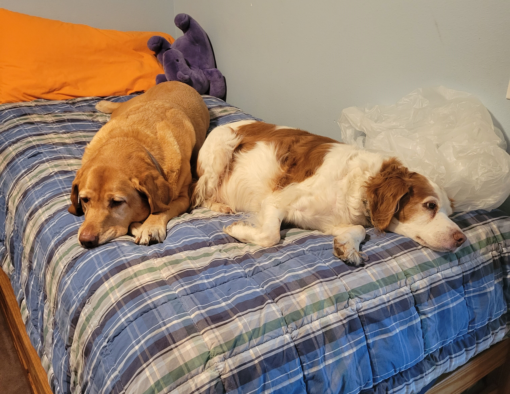
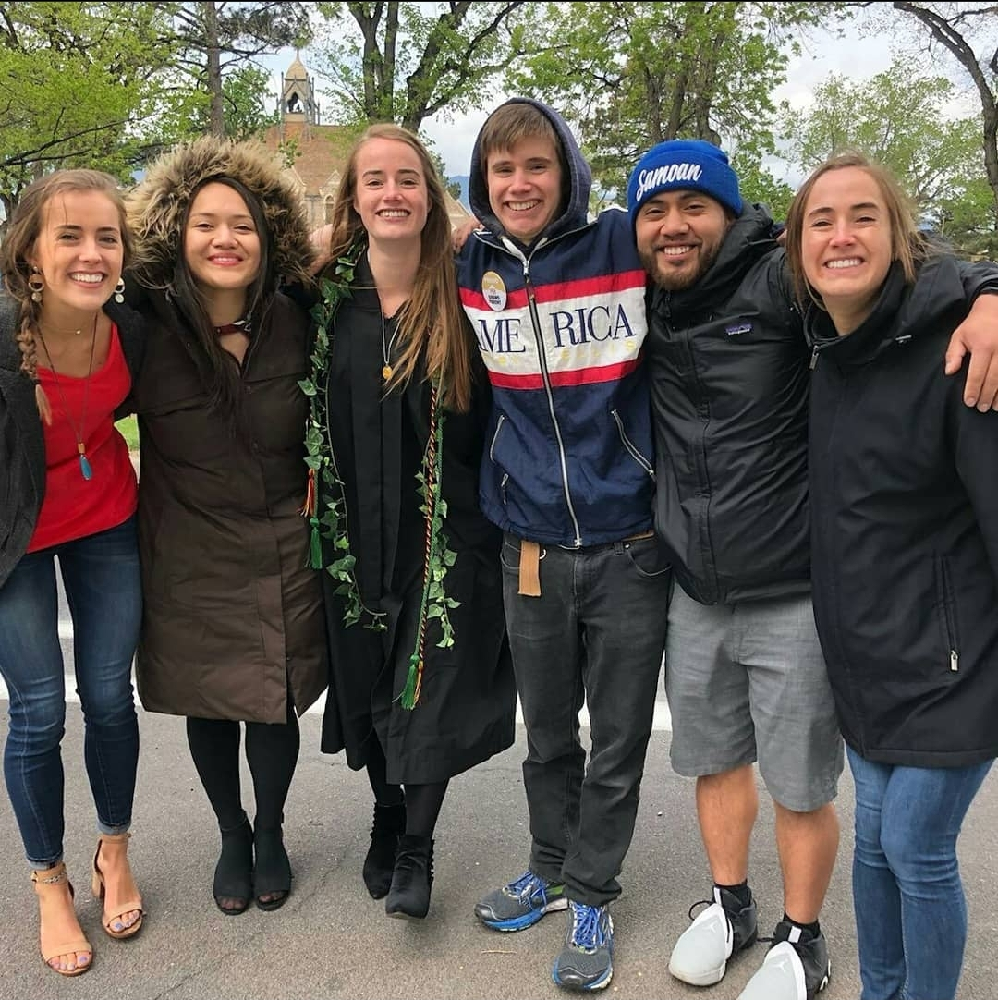

```{r setup, include=FALSE}
knitr::opts_chunk$set(echo = TRUE)
```

# About My Fam

So I feel like you've read my bio a few times at this point so I've decided to give you a quick rundown of my family instead. 

## My Doggies

This is Nellie and Lucy:


{height=50%}

Nellie is the yellow lab (left) and Lucy is the brittany (right). We're all big fans. Nellie is ~~a moron~~ very special to us as she often forgets how large she is and will often take out unsuspecting guests at the dinner table when trying to beg for food. Lucy has aged a lot in the past year but used to be our little escape artist. She made frequent appearences on the town's facebook page for lost pets. [^1]

[^1]: Though she wasn't lost, just wandering what she sees as her territory.

## Human members

### Parents

This is mom and dad, otherwise known as Gretchen and Tony by most circles. Even though they met in DC, my mom's a ride-or-die West Coaster so is a little *perturbed* that her children keep moving East (sorry). I'm sure I could've picked a picture where my dad doesn't look so confused but oh well. He won't see this.


### Siblings

So I'm the second youngest of six kids:

{height=50%}


Below is a table of each sibling's information for reference:

```{r Fam, out.extra='angle=90'}

library(knitr)

Fam <- read.csv("Fam.csv")
Siblings <- data.frame(Fam)

kable(Siblings, caption = "Team Awesome")
```
