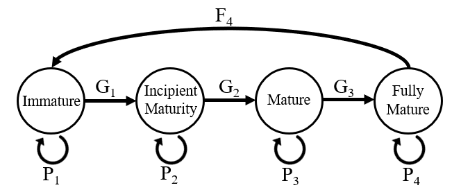
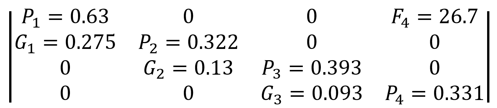

---
output:
  bookdown::pdf_document2:
    fig_caption: yes
    toc: no
    keep_tex: yes
  pdf_document:
    toc: no
  bookdown::html_document2:
    fig_caption: yes
    toc: no
  word_document: default
bibliography:
- Ch1_Citations.bib
- R_Citations.bib
csl: apa_1.csl
header-includes: \usepackage{setspace}\doublespacing \usepackage{lineno} \usepackage{placeins}
---

\begin{center}
	
\textbf{\Large Using mechanistic models to assess temporary closure strategies for small scale fisheries}
	
\textsc{Sophie Wulfing$^{1*}$, Ahilya Sudarshan Kadba$^{1}$, Mez Baker-Médard$^{2}$, and Easton R. White$^{1}$}
\vspace{3 mm}
\normalsize{\indent $^1$Department of Biological Sciences, University of New Hampshire, 03824, NH, USA \\ $^2$Department of Environmental Studies, Middlebury College, Middlebury, VT 05753\\}
$\text{*}$ Corresponding authors: Sophie Wulfing (SophieWulfing@gmail.com) and Dr. Easton White (Easton.White@unh.edu)
\end{center}

```{r setup, include=FALSE}
knitr::opts_chunk$set(echo = FALSE, warning = FALSE, message = FALSE, dev="cairo_pdf")
#knitr::write_bib look into
setwd("C:/Users/Sophi/Documents/GitHub/UNH_Docs/Proposal/Mtx_Model")

library(tinytex)
library(matlib)
library(ggplot2)
library(quadprog) #cite
library(gridtext)
library(popbio) #cite
library(knitr)
library(gridExtra)
library(RColorBrewer) 
#library(rPref) #Double check what this is doing. Maybe cite?
library(tidyr)
library(dplyr)
library(ggpubr)
library(bookdown)
library(kableExtra)
library(Rage)


# #Raw data n supplemental. ASK
# in-stage bar graph goes in paper
# in stage management scenarios will definitely be supplemental
# Check out ecological modelling journal
# Write about stable stage cause I don't think you do
# Citations! Also check ahilya table
# APPENDIX!
# MAKE FIG CAPS FOR EVERYTHING AND EDIT FIGS.


observedData <- as.matrix(data.frame(read.csv("RaberinaryBenbow2012Calcs.csv")))
observedStageMatrix <- observedData[1:13, 2:5]
```

```{r, include=FALSE}
options(tinytex.verbose = TRUE)
```

```{r FXNoverallsurvive}
survivability <- function(increase){
    #Calculate survivability for each stage and increase by x%
    NewMtx <- (A * increase) + A
    
    for(i in 1:ncol(NewMtx)-1){
      if(sum(NewMtx[,i]) > 1 | NewMtx[4,4] > 1){
        return(NA)
      }}
    return(NewMtx)
}


#This is stupid but it just forces R to stop writing things as complex numbers
f <- function(x) {
   if (all(Im(z <- zapsmall(x))==0)) as.numeric(z) else x
}

real_check <- function(mtx){
  if(sum(mtx[,1]) > 1 | sum(mtx[,2]) > 1 | sum(mtx[,3]) > 1 | mtx[4,4] > 1){
    return(NA)
  }
  else{return(mtx)}
}

```

```{r FXNmatrixprint, results = 'asis'}
write_matex <- function(x) {
  begin <- "$$\\begin{bmatrix}"
  end <- "\\end{bmatrix}$$"
  X <-
    apply(x, 1, function(x) {
      paste(
        paste(x, collapse = "&"),
        "\\\\"
      )
    })
  writeLines(c(begin, X, end))
}

```

\newpage

\linenumbers

# ABSTRACT
Mechanistic models are particularly useful for understanding life history metrics and population dynamics in data deficient species. Data deficiency is a relevant issue in small scale fisheries as they are generally under studied and underrepresented in global fishing datasets. As overfishing remains a global issue, especially in small-scale fisheries, one commonly utilized conservation method is temporary closures. The blue octopus (*Octopus cyanea*) fishery off the southwest coast of Madagascar is one such system that uses temporary closures to conserve an understudied species. This fishery is a key economic resource for the local community as blue octopus catch is sold by local fishers to international and local export markets and is a major component of fisher income. To  better understand the biology and assess the sustainability of blue octopus, we parameterize a Levkovitch population matrix model using existing catch data. In this study, we calculate various life history metrics such as time in each stage, stable stage distribution, reproductive value, per stage survivability, and show that this population was in a decline of 1.8% per month at the time of data collection. To sustain the existing population of blue octopus, our model indicates that the fishery would need to close for at least three months annually when the data was collected. Increasing the length of closure is predicted to significantly increase the octopus population at these sites. We show that if implemented correctly, temporary closures could be used to restore this population. The local communities of Madagascar have implemented various fishing restrictions to ensure sustainable fishing since the time of data collection, indicating a need for further research into the current effectiveness of these fishing closures. Therefore, our study is not intended as a stock assessment, but provides insight into the biology of blue octopus as well as demonstrate how temporary closures can be an effective conservation strategy due to the wide range of implementation options.  

 Keywords: *Octopus Cyanea*, matrix model, small scale fisheries, Madagascar, temporary closures

# INTRODUCTION
Mechanistic models in ecology explicitly account for species life histories, behavioral, or other mechanisms to describe how a population or community may change over time [@andreModellingClimatechangeinducedNonlinear2010; @briggs-gonzalezLifeHistoriesConservation2016]. Biological processes are therefore hypothesized in the model, and each parameter represents these mechanisms and can be measured independently of the data collected. This differs from statistical or phenomenological models, which instead use estimations of relevant parameters to explain the data itself. Mechanistic models can be important in situations without existing long-term data, when future conditions may not be similar to the past, and when different scenarios or actions need to be assessed [@crouseStageBasedPopulationModel1987; @nowlisShortLongtermEffects2000; @gharouniSensitivityInvasionSpeed2015]. Thus, mechanistic models play a critical role in studying the biology of cryptic species, and making informed conservation decisions, such as the management of small-scale fisheries.

Worldwide, 32 million fishers make their livelihood in small-scale fisheries, a subsector in which 90 to 95% of fish is distributed for local consumption. These marine products are a vital source of nutrition for these communities [@theworldbankHIDDENHARVESTTheGlobal2012]. The southwest region of Madagascar is one such area where subsistence fishing is an essential component to the diet and income of the local community. The ocean environment off the southwest coast of Madagascar is home to a wide variety of marine life, as extensive tidal flats, seagrass beds, and coral reefs are all prominent biomes in the area. In fact, Madagascar has been calculated as a country that would benefit greatly from marine conservation given its economic reliance on marine harvests and the fact that it is a refuge to many marine species [@larocheReefFisheriesSurrounding1997]. In the early 2000’s, however, Madagascar's octopus fishery began to move from local, subsistence fishing to also selling catch to export markets [@humberSeasonalClosuresNoTake2006]. There is evidence that up to 75% of all fish caught in select villages is now sold to outside entities for international export [@baker-medardGenderingMarineConservation2017].

Locally-Managed Marine Areas (LMMAs) are defined as coastal and near-shore fisheries in which resources are managed almost entirely by local communities and fishery stakeholders that live in the region. Because management is conducted by those directly affected by the fishery, goals typically include maintaining the livelihood and economic and cultural goals of the local community along with environmental goals [@govanStatusPotentialLocallymanaged2010]. LMMAs have grown in popularity among conservationists in small scale fisheries due to this empowerment of local fishers. Because of this, LMMAs tend to have greater local participation and compliance from stakeholders when compared to top-down regulation from governing bodies [@katikiroChallengesFacingLocal2015]. LMMAs have been shown to improve both fisheries and fisher livelihoods in Kenya [@kawakaDevelopingLocallyManaged2017], Pacific Islands [@govanStatusPotentialLocallymanaged2010], and in Madagascar [@mayolMadagascarNascentLocally2013]. In Madagascar, the use of LMMAs has increased significantly since 2004, and fishers in the country have seen significant improvements to fish stocks as well as have experienced economic benefits since [@benbowManagingMadagascarOctopus2011; @gilchristReefFishBiomass2020]. In order to protect fishing resources, Madagascar has instituted various conservation programs such as bans on certain types of fishing gear, implemented seasonal fishing regulations, and criminalized the harvest of endangered species. However, these strategies proved ineffective in execution and in their conservation goals [@humberSeasonalClosuresNoTake2006]. Both the government and nongovernmental organizations have since pledged to drastically increase the number of regions dedicated as Marine Protected Areas through temporary fishing closures [@cinnerInstitutionsCommunitybasedManagement2009; @oliverPositiveCatchEconomic2015; @baker-medardGenderingMarineConservation2017].


One commonly used conservation strategy in LMMAs in Madagascar are seasonal closures. These types of reserves have a long history of use and have been seen to successfully rehabilitate stocks [@campEvaluatingShortOpenings2015; @gnanalingamFlexibilityTemporaryFisheries2015]. For example, seasonal closures have been shown to be an effective conservation strategy in increasing biomass the Atlantic sea scallop (*Placopecten magellanicus*) fishery in the United States [@bethoneyComparisonDropCamera2019], restored natural trophic interactions in coral reef fisheries in Kenya [@mcclanahanResponseCoralReef2008], and successfully restored the striped marlin (*Kajikia audax*) stocks in Baja California [@jensenLocalManagementHighly2010]. This method is flexible, logistically simple for fishers and managers to understand, and mitigates the financial loss from the fishery that can be seen with permanent closures [@nowlisShortLongtermEffects2000; @humberSeasonalClosuresNoTake2006; @cohenSustainingSmallscaleFisheries2013; @campEvaluatingShortOpenings2015; @gnanalingamFlexibilityTemporaryFisheries2015; @oliverPositiveCatchEconomic2015]. However, seasonal closures are not always effective in their goal of replenishing stocks and this can depend on a wide range of factors. Ecological considerations about the life history of the target species, Allee effects, and changes to community structure and species interactions all play a role in how well the seasonal closure will protect the fishery [@russNaturalFishingExperiments1998; @cohenSustainingSmallscaleFisheries2013; @gnanalingamFlexibilityTemporaryFisheries2015; @gilchristReefFishBiomass2020; @grorud-colvertMPAGuideFramework2021]. Further, the characteristics of the fishery itself has been seen to influence fishery recovery. Fishing method, where the effort will be redistributed to, and fishing activity upon reopening have all been factors in negating the recovery made during the closure [@hiddinkPredictingEffectsArea2006; @humberSeasonalClosuresNoTake2006; @cohenSustainingSmallscaleFisheries2013]. Therefore, assessments of each seasonal closure is essential to insuring that they are effective in replenishing fish stocks. Mechanistic modeling allows us to simulate different fishery scenarios and assess how populations will respond to these changes in fishing pressure.

Octopus are a vital part of many ocean ecosystems and, compared to other fisheries, have a unique life history that can lead to distinct and variable population dynamics. Cephalopods act as both predators and prey in an ecosystem [@rodhouseRoleConsumers1996; @santosAssessingImportanceCephalopods2001a; @vaseAcetesKeystoneSpecies2021], situating them in a key role in food webs. Further, their abundance varies drastically with a wide range of ocean conditions including sea surface and bottom temperature, salinity, currents, and sediment type [@catalanSpatialTemporalChanges2006; @ibanezZoogeographicPatternsPelagic2019; @vannieuwenhoveCrypticDiversityLimited2019]. Compared to other exploited marine organisms, octopus have a short lifespan coupled with a fast reproduction rate and high fecundity which makes their populations extremely sensitive to changes in fishing pressure as seen in 2003, when marine resources in Madagascar first began to globalize and octopus became the most economically important fishery in Andavadoaka [@langley20042005CensusAndavadoaka2005; @humberSeasonalClosuresNoTake2006]. This has since added significant fishing pressure to Madagascar’s blue octopus populations and yield from this fishery subsequently decreased in regions of this island such as the southwest Andavadoaka region [@humberSeasonalClosuresNoTake2006]. However, this population has the ability to quickly bounce back when temporary are introduced into their habitat [@humberSeasonalClosuresNoTake2006; @katsanevakisSeasonalPopulationDynamics2006; @benbowLessonsLearntExperimental2014]. But, once fishing resumes, populations can suddenly and rapidly decline which has been attributed to heavy fishing pressure in the area right after reopening [@humberSeasonalClosuresNoTake2006; @benbowLessonsLearntExperimental2014]. Octopus are therefore extremely sensitive to both protection and harvest levels, and understanding their biology and how these volatile population dynamics will react to changes in fishing pressure is a key component to effective conservation of this resource.

*Octopus cyanea*, or blue octopus, is the most abundant cephalopod species in the western Indian Ocean and is caught in about 95% of local landings in Madagascar [@humberSeasonalClosuresNoTake2006; @oliverPositiveCatchEconomic2015]. Like other cephalopod species, very little is known about their life history including natural death rate, larval survivability, and how much time this species remains in each stage of maturity. Further, age is difficult to determine from size alone as they have variable growth rates up to maturity [@wellsObservationsFeedingGrowth1970; @heukelemGrowthBioenergeticsLifespan1976; @herwigUsingAgeBasedLife2012; @raberinaryReproductiveCycleOctopus2012]. The *O. cyanea* that live in the southwest region of Madagascar have been shown to be genetically distinct from those outside of the Mozambique Channel [@vannieuwenhoveCrypticDiversityLimited2019]. This is because the ocean currents in the Channel are comprised primarily of eddies with very little through-flow across the Channel [@schottMonsoonCirculationIndian2001; @lutjeharmsDiscontinuousNatureMozambique2012; @hanckeSurfaceDrifterTrajectories2014]. As larval dispersion is primarily controlled by ocean currents, and *O. cyanea* does not migrate across long distances, this shows that the *O. cyanea* in the Mozambique Channel where the data was collected can be considered a distinct population [@vannieuwenhoveCrypticDiversityLimited2019].

Size limits have been shown to be effective methods of conservation of species like *Octopus cyanea* that are harvested before maturity, and are restrictions that are easy to understand and implement in small scale fisheries [@nowlisShortLongtermEffects2000]. However, even though this is a conservation strategy often implemented in octopus fisheries, it has been shown to be less effective than institution an overall cap on fishing effort, such as effort rotation or limiting the number if fishers [@emeryManagementIssuesOptions2016]. To protect this species, size limits have been imposed on blue octopus catch in Madagascar, but these regulations are difficult in practice, as the fishing method used to harvest octopus involves spearing the octopus's den and extracting the octopus from the den. Blue octopus therefore typically die before size can be assessed, so octopus too small for market sale are typically harvested for household consumption [@humberSeasonalClosuresNoTake2006]. Further, the relationship between size and maturity stage is not strongly correlated [@raberinaryReproductiveCycleOctopus2012] and as a result, size restrictions wouldn't necessarily protect individuals ready to reproduce and would be difficult to implement in the field both due to the biology of *O. cyanea* and the characteristics of this small scale fishery. Therefore, temporary closures have been shown to be a more practical method of octopus conservation in that they can replenish stocks while maintaining fisher income [@benbowLessonsLearntExperimental2014]. Temporary closures provide many options for their duration and intensity (in other words, how much fishing can occur during a closure). However, this requires a deeper understanding of the biology and population characteristics of *O. cyanea* in this fishery in order to be properly instituted. Instituting effective temporary closures in octopus fisheries can be difficult due to their short lifespan, high mortality, and sensitivity to environmental conditions [@catalanSpatialTemporalChanges2006; @emeryManagementIssuesOptions2016; @ibanezZoogeographicPatternsPelagic2019; @vannieuwenhoveCrypticDiversityLimited2019]. Lack of field data and difficulty of enforcement has also been a challenge in octopus fisheries, especially in Madagascar [@emeryManagementIssuesOptions2016; @benbowLessonsLearntExperimental2014]. This indicates that a thorough understanding of the life history of *O. cyanea* and the harvest methods employed by fishers is necessary to enact meaningful fishing restrictions. Following dozens of experimental closures in the region ranging from six weeks to 7 months, the western Madagascar region currently institutes a yearly closure of six weeks from December 15 to January 31. These closures do not completely restrict octopus fishing, but instead institute an area where fishing is not allowed which takes up about 25% of the fishery's spatial extent. Therefore, some octopus harvest does occur even during a closure [@ainaManagementOctopusFishery2009; @langley20042005CensusAndavadoaka2005; @humberSeasonalClosuresNoTake2006; @benbowManagingMadagascarOctopus2011; @westermanRoleWomenCommunitybased2014; @oliverPositiveCatchEconomic2015; @rocliffeScalingSuccessOctopus2015; @rocliffeBlueVenturesReport2016].

In this paper, we have three goals: 1) we will fit a Levkovitch matrix to the limited available data on *Octopus cyanea* populations in southwestern Madagascar, 2) as well as create a theoretical estimation of the species’ life history traits in different stages of its development and 3)  determine the frequency and length in which these temporary closures should take place to maximize population health of the fishery and maximizing catch for the local community, and show how temporary closures can be an effective conservation strategy as well as demonstrate the numerous options available when deciding the length and intensity of closures. This study is not meant to be a current stock assessment of this fishery as local communities have taken numerous steps to conserve blue octopus since the time of data collection.

(ref:lifegraphs) A graph representing the life history of *O. Cyanea* and the subsequent Lefkovitch Matrix where i corresponds with each of the stages of maturity (Immature, Incipient Mature, Mature, and Fully Mature individuals, respectively). $P_i$ corresponds to probability of surviving and staying within a stage. $G_i$ is the probability of surviving and growing to the next stage. $F_i$ is the reproductive output of stage i.


```{r LifeGraph, echo = FALSE, fig.show="hold", out.width="45%", results = "asis", fig.cap = '(ref:lifegraphs) \\label{LifeGraph}'}


knitr::include_graphics("MtxGeneric.png")

```

# METHODS

As *Octopus cyanea* has an extended larval phase and there is no existing data on the age structure of this population of octopus, we use a stage-based population matrix, otherwise known as a Lefkovitch matrix [@caswell2001matrix]. Here, the life history of the study organism is grouped by stages (Figure \ref{LifeGraph}), where each unit of the matrix represents a distinct period of the organism’s life where it is subject to different environments, pressures, or physical attributes that would alter the survival and reproductive output at that phase, but the amount of time between each stage is variable. This would simply create different inputs for the probability of remaining in the same stage, and the growth and fecundity inputs can be based on available data. Lefkovitch matrices have not yet been applied to *O. cyanea* populations and therefore could be a useful methodology to understand the dynamics of this population in the western Indian Ocean to better inform management strategies.

## Data
To inform our model, we use data collected by @raberinaryReproductiveCycleOctopus2012 from landings ranging from the villages of Ampasilava in the south to Andragnombala in the north which spans about 30 kilometers of coastline. These villages are located along the Mozambique channel, where a lack of through current and prevalence of eddies results in a genetically distinct population of *O. cyanea* [@vannieuwenhoveCrypticDiversityLimited2019]. In these villages, fishers usually fish along both reef flats and deeper barrier reefs. Fishers bring catch onshore either for household consumption or to sell to buyers for international export. This study collected landing data from February 2005 to February 2006 through daily surveying fishers as they landed onshore within a two hour window. They separated each octopus into five age classes: immature, incipient maturity, maturity, full maturity, and post laying. In this paper we omit stage five, post laying, from this model as blue octopus only brood once, and stage five individuals therefore do not contribute to population growth. They recorded octopus weight, weight and length of gonads, sex, and a visual assessment of maturity class. A subsample of octopus were also collected for octopus length, and laboratory assessment of gonads for a confirmation of maturity class. They gathered this data on a total of 3,253 octopuses, and for the purposes of this study, we model from the 1,578 females collected. Despite there being no standardization for catch effort being available for this dataset, no other maturity stage study has been conducted on this population of *O. cyanea* and is therefore the best available data to fit a Lefkovitch matrix. As there is no previous estimate of the natural death rate of this population, the Lefkovitch matrix, survivability estimates and growth rate calculations for this model also includes the influence of fishing pressure. This data is reported in the appendix.

```{r QuadProg, echo = FALSE}
#Make Z
z <- matrix(t(observedStageMatrix[2:11,]), ncol = 1, nrow = 40, byrow = TRUE)
#z

#Make M
m <- matrix(, nrow = nrow(z) , ncol = 8)
for(i in 1:(nrow(observedStageMatrix)-3)){
  m[(4 * (i-1) + 1):(4 * i),] <- matrix(c(observedStageMatrix[i,1], 0, 0, 0, 0, 0, observedStageMatrix[i,4], 0,
                                          0, observedStageMatrix[i,1], observedStageMatrix[i,2], 0, 0, 0, 0, 0,
                                          0, 0, 0, observedStageMatrix[i,2], observedStageMatrix[i,3], 0, 0, 0,
                                          0, 0, 0, 0, 0, observedStageMatrix[i,3], 0, observedStageMatrix[i,4]),
                                        nrow = 4, byrow = TRUE)
  #m
}

#Make C
c <- matrix(c(diag(8) * (-1), 
              1, 1, 0, 0, 0, 0, 0, 0,
              0, 0, 1, 1, 0, 0, 0, 0,
              0, 0, 0, 0, 1, 1, 0, 0,
              0, 0, 0, 0, 0, 0, 0, 1), nrow = 12, ncol = 8, byrow = TRUE)
#c
#Make b
b <- matrix(c(rep(0,8), rep(1,4)), nrow = 12, ncol = 1, byrow = TRUE)

#Make P
#p <- matrix(, nrow = 8, ncol = 1, byrow = TRUE) #vector(p1, g1, p2, g2, p3, g3, f4, p4)

#Make mtx G and vector x
g <- t(m) %*% m
f_t <- -(t(-z) %*% m)

qp <- solve.QP(Dmat = g, dvec = f_t, Amat = -t(c), bvec = -t(b))#, factorized = FALSE)


A <- matrix(c(qp$solution[1], 0, 0, qp$solution[7],
                 qp$solution[2], qp$solution[3], 0, 0,
                 0, qp$solution[4], qp$solution[5], 0,
                 0, 0, qp$solution[6], qp$solution[8]), byrow = TRUE, nrow = 4, ncol = 4)
#A
```

```{r WriteMtxRounded, results = 'asis', echo = FALSE, out.width="100%", fig.cap = "Stage-based population matrix calculated using Wood's quadratic programming method and parameterized using data from Raberinary and Benbow (2012). \\label{WriteMtxRounded}"}

A_round <- matrix( , byrow = TRUE, nrow = 4, ncol = 4)

for (i in 1:length(A)){
  A_round[i] <- round(A[i], 3)
}

# A_round <- matrix(-1*c(qp_round[1], 0, 0, qp_round[7],
#               qp_round[2], qp_round[3], 0, 0,
#               0, qp_round[4], qp_round[5], 0,
#               0, 0, qp_round[6], qp_round[8]), byrow = TRUE, nrow = 4, ncol = 4)

round_A <- matrix(A_round, 4, 4)

round_A[1] <- paste0("P1 = ", round_A[1])
round_A[13] <- paste0("F4 = ", round_A[13])
round_A[2] <- paste0("G1 = ", round_A[2])
round_A[6] <- paste0("P2 = ", round_A[6])
round_A[7] <- paste0("G2 = ", round_A[7])
round_A[11] <- paste0("P3 = ", round_A[11])
round_A[12] <- paste0("G3 = ", round_A[12])
round_A[16] <- paste0("P4 = ", round_A[16])


#write_matex(round_A)
```

## Model Parameterization
In order to parameterize this model, we use Wood’s Quadratic Programming method [@caswell2001matrix]. Other methods required longer time series than were available to us, were extremely sensitive to noise in the data, or simply resulted in matrices that had no reasonable biological interpretation [@caswell2001matrix]. We estimate a preliminary stage-based matrix model (Figure  \ref{WriteMtxRounded}) based on Raberinary and Benbow (2012) data and calculated using the quadprog package in R [@quadprog]. Model accuracy is assessed by comparing life history values inferred from the matrix with existing literature on *O. cyanea* life history (Table \ref{LifeHistory}). As all of our values calculated from the matrix fall within the known attributes of this species, we are confident that this model gave an accurate mechanistic description for this population’s underlying dynamics.

## Model Analysis
Eigenvalues ($\lambda$) are calculated from the matrix and future populations can be predicted by multiplying an initial population vector to incrementally higher powers of our matrix where the power of the matrix corresponds to the time length of the projection. The initial population vector used is the blue octopus data collected in the final month of data collection from @raberinaryReproductiveCycleOctopus2012. This month of data is not included in the parameterization of the model as it occurred after a temporary closure that was being tested at the time. We perform sensitivity analysis on the population matrix and eigenvalues using the r package popbio [@popbio]. Further, as all of the parameters are scaled to a value between 0 and 1 except $F_4$, the different order of magnitude of these parameters have a lower proportional effect on the eigenvalue than $F_4$. To address this, we also conduct elasticity analysis using the popbio package [@popbio]. This allows us to identify the groups within this octopus population whose protection will most benefit population growth, essentially creating focus points of conservation. The results of sensitivity and elasticity analysis are included in the supplementary material. Other life history traits that can be calculated from this matrix are stable stage distribution, reproductive value of each stage, and per-stage survivability. We also use the R package Rage [@rage] to calculate the age in each stage, life expectancy and longevity, the age and probability of reaching maturity, and generation time of this population. We then used the Rage package in R to analyze various life history traits of this matrix, the output of which is included in the supplementary material.

Finally, we calculate the minimum survivability increase necessary per stage to result in an increase of the overall population. We do this by increasing the $P_i$ and $G_i$ parameters by increasing percentages in each stage i until the overall eigenvalue ($\lambda$) became greater than one.

## Management Scenarios
In order to determine optimal conservation strategies, we alter the survivability of *O. cyanea* by different rates from 0-10% survival increase of the species. Then, we simulate different closure scenarios for each survival increase by altering the length of annual closures by month using the final month of data collected by @raberinaryReproductiveCycleOctopus2012 as the initial population vector, this is multiplied to higher powers of the original matrix during months that are simulated to be "open fishing" and then when a closure was simulated, the matrix with increased survival was multiplied to the population for that month. We simulated these different scenarios in order to analyze all combinations of conservation strategies that result in stable *O. cyanea* populations.  

```{r LifeHistory, results = 'asis', echo = FALSE}

ages <- data.frame(matrix(data = NA, nrow = 4, ncol = 3))
colnames(ages) <- c("Stage", "Duration_New", "SD")
for(i in 1:nrow(A)){
  ages$Stage[i] <- i
  ages$Duration_New[i] <- 1/(1-A[i,i])
  ages$SD[i] <- sqrt(A[i,i]/(1-A[i,i])^2)
}

Life <- read.csv("OcyaneaLifeHistory.csv")

LifeHistory <- Life[,1:2]
LifeHistory$New <- c(NA, NA, ages[,2], NA, NA )
LifeHistory$Var <- c(NA, NA, ages[,3], NA, NA )

colnames(LifeHistory) <- c("Stage", "Existing Estimate", "Estimate from Lefkovitch Matrix", "SD")

#LifeHistory

#Nowcombine LifeHistory[1:2]


knitr::kable(LifeHistory, format = "latex", booktabs = TRUE, caption = "(ref:lifehistory) \\label{LifeHistory}", col.names = c("Stage", "Existing Estimated Duration", "Estimate from Lekfovitch Matrix (Months)", "Standard Deviation of Estimate (Months)")) %>%
  column_spec(2:4, width = "4.5cm") %>%
  kable_styling(latex_options="scale_down")

```


(ref:lifehistory) Existing research and information on the per-stage duration of *O. cyanea*. All existing estimates are from @heukelemGrowthLifeSpan1973, @heukelemGrowthBioenergeticsLifespan1976, @guardArtisanalFisheryOctopus2003, @humberSeasonalClosuresNoTake2006, @ainaManagementOctopusFishery2009. Note: @heukelemGrowthBioenergeticsLifespan1976 estimate the time to maturity to be 10-13 months (i.e. stages 1-3 combined). Equations used to estimate metrics from this Lefkovitch Matrix are outlined in @barotStageclassifiedMatrixModels2002.


# RESULTS

The resulting eigenvalue of our matrix is 0.982, indicating a population decline of 1.8% per month with fishing pressure included (Figure \ref{projection}). The stable stage distribution (Table \ref{lifetable}) shows that 65% of the makeup of this population is immature individuals, while actively breeding individuals (fully mature) only make up less than 1% of the naturally occurring population. However, the reproductive output per stage (Table \ref{lifetable}) shows that on average, an individual in this fully mature population is expected to have 41 times the number of offspring as those in stage 1. Larval survivability of 0.0001328 is calculated by dividing our estimated number of larvae surviving back to stage 1 ($F_4$) by 201,000 - the average estimated reproductive output of *O. cyanea* by [@guardBiologyFisheriesStatus2009]. The life expectancy of this population is calculated by the Rage package to be 4.06 months with a standard deviation of 2.42 months. The calculated age of maturity is 6.82 months with probability of reaching maturation of 0.022. The longevity of this population (the amount of months for only 1% of the population to remain) is 12 months with a generation time of 7.38 months.

Changing the survivability of each stage (Figure \ref{stages}) shows that immature individuals (Stage 1) would need the smallest amount (5%) of survival increase in order to result in overall population growth. Stage 4, on the other hand, requires a survivability increase of 25% in order to create a viable population.

Our analysis of different closure scenarios (Figure \ref{closures}) indicates closures two months in length or shorter will be ineffective in ensuring a stable population, regardless of how much these closures decreased the death rate of the species. Further, as our baseline growth rate is close to stable (-0.0184), it took a maximum of a 7.5% increase in the survivability of the population to ensure a sustainable population when utilizing three month closures. This analysis (Figure \ref{closures}) provides all the possible combinations of increased survival rates and frequency of closures that will result in a stable population. Suggested changes in overall survivability range from 2-7.5%, and the ranges of frequencies of closures span from permanent closure (every month) to once every three months.

(ref:projections) Projection of *O. cyanea* population based off of our calculated Lefkovitch matrix through the present. This does not reflect actual populations of blue octopus over time, but the predictions from our model given no action is taken to relieve fishing pressure.

```{r projection, fig.cap = "(ref:projections) \\label{projection}"}
pop <- observedStageMatrix[13,]
N <- list()


#72 mo projection
for (i in 1:216){
     N[[1]] <- pop
    N[[i+1]] <- A %*% N[[i]]
 }

modeled_data <- t(as.data.frame(do.call(cbind, N)))
colnames(modeled_data) <- c("Stage_1", "Stage_2", "Stage_3", "Stage_4")
modeled_data <- cbind(modeled_data, month = 0:216)

#write.csv(modeled_data, "testing.csv",row.names = TRUE)
modeled_data <- data.frame(modeled_data)

ggplot(modeled_data) + 
  geom_line(aes(y = Stage_1, x = month, color = "Stage 1", linetype = "Stage 1"), size = .75) + 
  geom_line(aes(y = Stage_2, x = month, color = "Stage 2", linetype = "Stage 2"), size = .75) +
  geom_line(aes(y = Stage_3, x = month, color = "Stage 3", linetype = "Stage 3"), size = .75) + 
  geom_line(aes(y = Stage_4, x = month, color = "Stage 4", linetype = "Stage 4"), size = .75) +
  scale_color_manual(name = "", values = c("Stage 1" = "#004949",
                                                "Stage 2" = "#009292",
                                                "Stage 3" = "#db6d00",
                                                "Stage 4" = "#920000")) +
  scale_linetype_manual(name = "", values = c("Stage 1" = 3,
                                                "Stage 2" = 4,
                                                "Stage 3" = 5,
                                                "Stage 4" = 1)) +
  #ggtitle("Ten year population projection") + #paste0(i, " month projection")) +
  xlab("Year") +
  ylab("No. Individuals") +
  scale_x_continuous(breaks = seq(0, 216, 24), label = seq(2006, 2024, 2)) +
  theme_bw() +
  theme(panel.border = element_blank(), panel.grid.major = element_blank(), panel.grid.minor = element_blank(), axis.line = element_line(colour = "black"))

```

```{r lifetable, results = 'asis', echo = FALSE}
#eigenvecors and vals
A_eigen <- eigen(A)
#A_eigen

#Intrinsic Rate of Increast (r): lambda = e^r
r <- log(A_eigen$values[1])
#r

#stable stage dist
A_stable_stage <-as.numeric(A_eigen$vectors[,1]/sum(A_eigen$vectors[,1]))
#A_stable_stage

#reproductive value
A_repro_value <- as.numeric(eigen(t(A))$vectors[,1]/eigen(t(A))$vectors[1,1])
#A_repro_value

#mean reproductive value- is the avg no offspring?
#A_repro_value %*% A_stable_stage

#. Vandermeer (1975, 1978)
lifetable <- data.frame(matrix(ncol = 3, nrow = 4))
#x <- c("Stage", "Stable Stage Distribution (Dominant Eigenvector)", "Reproductive Value (Left Eigenvector)")
#colnames(lifetable) <- x
#colnames(lifetable) <- stringr::str_replace_all(colnames(lifetable), "\\n", "<br>")
lifetable[1:4,1] <- c("1 Immature", "2 Incipient Maturity", "3 Mature", "4 Fully Mature")
lifetable[1:4,2] <- round(A_stable_stage,3)
lifetable[1:4,3] <- round(A_repro_value,3)
colnames(lifetable) <- c("Stage", "Stable", "Repro")

surviveTable <- data.frame(matrix(ncol = 2, nrow = 5))
y <- c("Stage", "Survivability")
colnames(surviveTable) <- y

surviveTable[1:5,1] <- c("1 Immature", "2 Incipient Maturity", "3 Mature", "4 Fully Mature", "Larval")

for(i in 1:3){
  surviveTable[i,2] <- sum(A[,i])
}
surviveTable[4,2] <- A[4,4]
surviveTable[5,2] <- A[1,4]/((375000+27000)/2)

lifetable1 <- left_join(lifetable, surviveTable, by = 'Stage')

#colnames(lifetable) <- stringr::str_replace_all(colnames(lifetable), "\\n", "<br>")

  knitr::kable(lifetable1, format = "latex", booktabs = TRUE, caption = "(ref:lifetablecap) \\label{lifetable}", col.names = c("Stage", "Stable Stage Distribution (Dominant Eigenvector)", "Reproductive Value (Left Eigenvector)", "Survivability")) %>%
  column_spec(2:3, width = "4.5cm") %>%
  kable_styling(latex_options="scale_down")

```

(ref:lifetablecap) Stable stage distribution and reproductive value of each stage of this blue octopus population matrix given in Figure \ref{WriteMtxRounded}. The survivability (i.e. the proportion of individuals who survive from stage i to stage i+1) in each stage includes death rate from fishing. Stages 1-4 survivability were calculated by summing up the proportion of individuals surviving and staying within a stage every month ($P_i$) and the proportion of individuals surviving and growing every month ($G_i$). Larval survivability of 0.0001328 was calculated by dividing our estimated number of larvae surviving back to stage 1 ($F_4$) by the average estimated reproductive output of *O. cyanea*.

```{r stages, echo = FALSE, fig.cap = "(ref:stagesurvive) \\label{stages}"}

rates <- c(0, 0, 0, 0, 0)

for(i in 1:(length(rates)-1)){
  #First need to do the stage 4 and larval differently
  if(i == 4){
    incr <- 0.01
    testMtx <- A
    testMtx[4,4] <- A[4,4] + A[4,4] * incr
    while(f(eigen(testMtx)$values[1]) < 1){
      incr <- incr + 0.01
      testMtx[4,4] <- A[4,4] + A[4,4] * incr
    }
    rates[4] <- incr
    
    incr <- 0.01
    testMtx <- A
    testMtx[1,4] <- A[1,4] + A[1,4] * incr
    while(f(eigen(testMtx)$values[1]) < 1){
      incr <- incr + 0.01
      testMtx[1,4] <- A[1,4] + A[1,4] * incr
    }
    rates[5] <- incr
  
  }
  else{
  incr <- 0.01
  testMtx <- A
  testMtx[,i] <- A[,i] + A[,i] * incr
  while(f(eigen(testMtx)$values[1]) < 1){
    incr <- incr + 0.01
    testMtx[,i] <- A[,i] + A[,i] * incr
  }
  rates[i] <- incr
  }}

rates_percent <- rates * 100

stage_break <- data.frame(matrix(data = (c("1", "2", "3", "4", "Larval", as.numeric(rates_percent))), nrow = 5, ncol = 2))
colnames(stage_break) <- c("Stage", "Percent")
stage_break$Percent <- as.numeric(stage_break$Percent)

stage_break$Stage <- factor(stage_break$Stage , levels = c("Larval", "1", "2", "3", "4"))

# barplot(rates_percent, xlab = "Stage", ylab = "Percent survival increase",
#         names.arg=c("1", "2", "3", "4", "Larval"))

colorlist <- c( "#CC79A7", "#004949", "#009292", "#db6d00", "#920000")

ggplot(stage_break, aes(x = Stage, y = Percent, fill = Stage)) +
  ylab("Percent survival increase") +
  geom_bar(stat="identity")+
  ylim(0,30) +
  scale_fill_manual(values = c("Larval" =  "#CC79A7",
                               "1" = "#004949",
                               "2" = "#009292",
                               "3" = "#db6d00",
                               "4" = "#920000")) +
  theme_bw() +
  theme(panel.border = element_blank(), panel.grid.major = element_blank(), panel.grid.minor = element_blank(), axis.line = element_line(colour = "black"))

```

(ref:stagesurvive) Minimum percent of per-stage survivability change needed to create population increase. Each stage was increased by higher percentages until the eigenvalue of the overall system became greater than zero.

```{r closurescalcs}
#Calculates new rates based on vectors of % change and frequencies of restrictions
p <- list()
modeled_data <- data.frame(matrix(ncol=8,nrow=0, dimnames=list(NULL, c("Stage_1", "Stage_2", "Stage_3", "Stage_4", "month", "pop", "Frequency", "PercentChange"))))
percentage <-rates <- c(seq(0, .1, .01)) # c(0.01, 0.05, 0.1, 0.15) 
freqs <- c(seq(1, 12)) #c(1, 2, 3, 4, 6, 12) 
#par(mfrow = c(6,4))
for(i in 1:length(freqs)){
  for(j in 1:length(percentage)){
    pop <- observedStageMatrix[13,]
    N <- list()
    for (k in 1:120){
      if(k %% 12 %in% c(seq(1, freqs[i]))){
      N[[1]] <- pop
      N[[k+1]] <- survivability(percentage[j]) %*% N[[k]]
      }
    else{
       N[[1]] <- pop
      N[[k+1]] <- A %*% N[[k]]
      }}
   
  
  new_data <- t(as.data.frame(do.call(cbind, N)))
  colnames(new_data) <- c("Stage_1", "Stage_2", "Stage_3", "Stage_4")
  new_data <- data.frame(cbind(new_data, month = 0:120, pop = rowSums(new_data[,1:4]), Frequency = freqs[i], PercentChange = percentage[j]))
  modeled_data <- rbind(modeled_data, new_data)
  }}


# Sources: https://www.webpages.uidaho.edu/wlf448/stochgro.pdf
# https://esajournals.onlinelibrary.wiley.com/doi/10.2307/1943004
```

```{r closures, fig.cap = "Analysis of different management scenarios. The black line separates the scenarios that succeed in sustaining the population from the scenarios that don't. Green and white squares indicate theoretically successful management scenarios where red refers to the strategies that will not result in overall population growth. \\label{closures}"}

#### CALCULATE GROWTH RATE BASED ON LAST POP-FIRST POP/FIRST POP FOR EACH FREQ/PERCENT COMBINATION
growthRate <- modeled_data %>%
  select(month, pop, Frequency, PercentChange) %>%
  filter(month == 0 | month == 120) %>%
  pivot_wider(names_from = month, values_from = pop) %>%
  rename(month_0 = 3,
         month_120 = 4) %>%
  mutate(Mu_New = log(month_120/month_0)/120) %>% #See Crouse paper. From Nt = N0e^(rt)
  mutate(lambda_new = exp(Mu_New)) %>%
  select(Frequency, PercentChange, Mu_New, lambda_new)

  

#### COPY PARETTO GRAPH FROM OTHER ANALYSIS
paretospagheto <- growthRate %>% 
  filter(lambda_new >= 1) %>%
  group_by(Frequency) %>%
  filter(lambda_new == min(lambda_new))

paretospagheto$Frequency <- paretospagheto$Frequency - 0.5
paretospagheto$PercentChange <- paretospagheto$PercentChange - 0.005

mult_format <- function() {
     function(x) format(100*x,digits = 2) 
}

#Continuous Colors
ggplot(growthRate, aes(Frequency, PercentChange, fill = lambda_new)) + geom_tile(width=1) +
  scale_fill_gradient2(
  low = "red",
  mid = "white",
  high = "green",
  #limits = c(1, max(growthRate$lambda_new)),
  midpoint = 1,
  space = "Lab",
  na.value = "grey50") +
  scale_x_continuous(name = "Length of closure (months)", expand=c(0,0), breaks = c(1, 3, 6, 9, 12)) +
  scale_y_continuous(name = "Percent change in survival", expand=c(0,0), labels = mult_format()) +
  labs(fill = "Eigenvalue") +
  geom_segment(aes(x = 2.5, y = .075, xend = 2.5, yend = 0.105), size = .5, color = "#5A5A5A") +
  geom_segment(aes(x = 11.5, y = .015, xend = 12.5, yend = 0.015), size = .5, color = "#5A5A5A") +
  geom_step(data = paretospagheto , aes(x=Frequency, y=PercentChange), size = .5, color = "#5A5A5A") +
  geom_text(x=8, y=.07, label="Population Increasing") +
  geom_text(x=3.5, y=.015, label="Population Decreasing")


```

# DISCUSSION

Our calculated growth rate of -0.0184 and resulting population projection supports previous reports of overfishing at the time of data collection [@humberSeasonalClosuresNoTake2006; @benbowLessonsLearntExperimental2014]. Matrix population models will converge or diverge based on their dominant eigenvalue, regardless of the initial population inputted in the model. Therefore, we can still conclude that the population at this time was in an overall decline, despite not knowing the exact number of individuals in this population. Decline in population presents an economic issue for individual fishers as their catch will become less lucrative and a recovery of this population has been shown result in economic gains from fishers in this community [@humberSeasonalClosuresNoTake2006; @benbowLessonsLearntExperimental2014; @oliverPositiveCatchEconomic2015].

Our model provides other information about the life history of this population as well, beyond its overall growth rate. As each column in the matrix represents a proportion of individuals within a stage either growing or staying within a stage (with the exception of the $F_4$ parameter), it also shows a per-stage survivability estimate (Table \ref{lifetable}) and stage duration (Table \ref{LifeHistory}), life history parameters on which there has been no previous research. However, as the immature stage has a high survivability of 90.4% and a longer duration than the other stages of 2.7 months, this could indicate that although the fishing method employed in this region does not distinguish by octopus size, fishers may not be bringing this smaller catch to landing due to size limits preventing them from selling immature individuals [@humberSeasonalClosuresNoTake2006]. Therefore, this challenges our assumption of the data being properly stratified by size. Further, as *O. Cyanea* have an approximately one to two month larval stage [@guardArtisanalFisheryOctopus2003], the fecundity parameter does not indicate the overall reproductive output of mature individuals, but the number of hatched offspring that will survive its larval stage and back the immature stage. This gives an estimation for larval survivability as female octopus have a fecundity ranging between 27,000 and 375,000 eggs [@guardBiologyFisheriesStatus2009], our model indicates that only an average of 26.7 individuals will survive back into immaturity, which indicates a survivability of 0.0001328. There is no other larval survivability estimation that currently exists for this species, which would be a useful further study as this could indicate a recruitment rate for this population. Further, an average lifespan of 4.06 months and an age of maturation of 6.82 months indicates that most individuals die before reaching maturation.


According to our model, any closure less than three months will not be effective in conserving blue octopus stocks, but the strictness of the closure (i.e. allowing some limited fishing) can be altered depending on how frequently these restricted fishing periods are implemented. This is similar to other studies on temporary closures in this fishery as @oliverPositiveCatchEconomic2015 showed that extending the regional closure beyond the conventional six weeks increased octopus catch. Further, a 2-3 month closure was suggested for this area in 2011 in order to maximize catch-per unit effort [@benbowManagingMadagascarOctopus2011]. @benbowLessonsLearntExperimental2014 demonstrated that a 20 week closure had similar positive effects on octopus catch when compared to a seven month closure, yet resulted in less strain on fisheries management investment than the longer seven month closure. There is no previous literature on the per-stage survivability of *Octopus cyanea*, particularly in this region. The overall natural mortality rate of this population has been estimated to range between from 0.0127 per week (0.0552 per month) to 0.0498 per week (0.2164 per month) [@roa-uretaStockAssessmentOctopus2022]. However, this was not included in our model of fishery closures as these closures do not cover the full spatial extent of the fishery [@oliverPositiveCatchEconomic2015], and some fishing continues during this time, meaning some fishing mortality exists during closures. Instead, we compared closures to their overall effect on the *O. cyanea* mortality rate. Therefore, the changes to survivability suggested by our analysis is in relation to their overall death rate not fishing rate, indicating a need for further research on the spatial structure of this population. Our analysis of different closure scenarios suggests a range of the simplest actions needed in order to ensure stability of this population, and show how the relationship between closure lengths and their effect on mortality rates can result in multiple different temporary closures that can successfully conserve a fishery. As there are many combinations of survivability increase and frequency of closure suggested by the analysis will result in stable *O. cyanea* populations, the specific strategy chosen should be decided based on which is most convenient and economically feasible to the local fisher community of southwest Madagascar. Among conservationists, there is a growing understanding that decision making is best left to those directly involved with resource extraction and implementing fishing restrictions upon a community without understanding their cultural practices can have detrimental effects upon the community, as well as be less effective in actually protecting natural resources [@humberSeasonalClosuresNoTake2006; @baker-medardGenderingMarineConservation2017]. 

When implemented deliberately, establishing periodic closures is an effective and commonly-used strategy in sustainable fishing practices [@humberSeasonalClosuresNoTake2006; @oliverPositiveCatchEconomic2015]. As Madagascar has been committed to protecting its marine natural resources through increasing the number of marine parks, this study serves to highlight some of the available strategies to make population predictions and conservation strategies with limited data sources [@westlundMarineProtectedAreas2017]. Implementing fishing restrictions without regard for social norms can undermine cultural practices and in turn be detrimental to both the people and fishery, and halts the dissemination of traditional ecological knowledge [@okafor-yarwoodSurvivalRichestNot2022]. For this reason, both the Madagascar government and scientific community has found a new emphasis on studying the complex social structures within the community in question in order to more effectively conserve resources along with peoples’ livelihoods [@billeIntegratedCoastalManagement2002; @baker-medardClassedConservationSocioeconomic2021]. This has been shown to increase participation in conservation practices, therefore making them more effective. 

The mechanistic methods used in this study allowed us to gain a baseline understanding of the growth rate and mortality of this population despite the limited data used to parameterize the model. Limitations of this study include the data collection process as this model is only parameterized using one year of data. Although this is not enough data to conduct a full stock assessment, this speaks to the utility of mechanistic modeling, where we are able to estimate population patterns and other life history traits despite this lack of data. A future study that repeats this method of data collection could rerun this same model with the updated data, and make further conclusions about the status of this fishery today. Even though data collections occurred daily within a two-hour window, catch was not standardized by effort and therefore there could be catch fluctuations between months that are not captured in the data. Further, as stage 1 had a high survival rate yet low duration, this challenges the assumption that the octopus caught are an accurate ratio of the octopus at each stage in the wild. Another shortcoming of this study is that the only available stage data for this species and region was collected in 2006, and the community of southwest Madagascar has implemented several strategies since that time to improve the sustainability of their fish stocks in the region [@humberSeasonalClosuresNoTake2006; @raberinaryReproductiveCycleOctopus2012]. Due to the time of data collection, this study does not reflect the current status of *Octopus cyanea*, nor should the findings of this study be implemented in current management decisions. Instead, this study outlines what biological parameters can be estimated from limited data using mechanistic modeling and show how temporary closures are not only an effective method of conservation, but also provide communities with options for effective management and these should be selected based off of the needs of stakeholders. As the community of southwest Madagascar has been involved in deciding when closures should occur and their lengths, this study serves to show the various options available [@benbowManagingMadagascarOctopus2011].

Finally, as we are using a Lefkovitch matrix to simulate population fluctuations, these models inherently make simplifying assumptions about the biology of the study species. For example, these models assume that all individuals within a stage are subject to the same growth and mortality rates. As this study uses data collected from a large geographic range [@raberinaryReproductiveCycleOctopus2012], different individuals nesting in different regions may be subject to different selective pressures. Studies on the spatial variability of this population could better inform both our model and the greater understanding of how fishing mortality of this population compares to its natural mortality. Further, this population of blue octopus has been shown to exhibit spatial variability depending on their life stage. Younger individuals tend to live in the shallow inner zone of the reef and larger individuals, who are more able to withstand stronger currents, move to deeper waters for more suitable habitats for nesting [@raberinaryPeriodePontePoulpe2007]. Parameters were not extracted from a distribution curve, so adding this to future research could further help explain the uncertainty in octopus dynamics and better model the high variability in populations. Despite these limitations, the data provided is the best data available for fitting a Lefkovitch matrix to this species. Future extensions of this work could include exploring the dynamics of both sexes in the population [@gerberTwosexMatrixModels2014] as male octopus have different growth rates and spatial dynamics [@heukelemGrowthBioenergeticsLifespan1976]. Further, a better understanding of the seasonal breeding dynamics of this population of blue octopus could give better insight into the health of this fishery [@whiteSeasonalityEcologyProgress2020]. Cephalopod juveniles (a key life stage in understanding future population dynamics) often have two seasonal peaks per year, indicating biannual spawning periods [@humberSeasonalClosuresNoTake2006; @katsanevakisSeasonalPopulationDynamics2006]. This is related to seasonal fluctuations in temperature, as cephalopod growth is related to environmental temperature [@domainGrowthOctopusVulgaris2000]. However, this relationship is subject to a lot of variation [@heukelemGrowthBioenergeticsLifespan1976; @herwigUsingAgeBasedLife2012]. Further, as Madagascar is a tropical climate, this trend may be different in our region of study, as suggested by @raberinaryReproductiveCycleOctopus2012, where all life stages of O. cyanea were observed year round, suggesting continuous breeding. A better understanding the seasonality of this population could further inform when closures should take place.

With a short generation time, cephalopod species respond more quickly to new management strategies. A more contemporary study on the status of the octopus fishery of southwest Madagascar will paint a more accurate picture of how this population is faring under the current fishing pressure.As a population with highly variable population dynamics, continuous monitoring of landings, fishing effort, and where catch is found is extremely valuable in understanding the status of *Octopus cyanea* in Madagascar, as well as to provide a more informed stock assessment on which to base management decisions. Similar data has been collected by Blue Ventures on this fishery since 2015 and shows there has been an improvement to this fishery since 2006 due to local efforts. However, an analysis of this data indicates that overfishing is still occurring [@roa-uretaStockAssessmentOctopus2022]. Further, this collection effort does not include maturity data which would improve the analysis of this study through incorporation of multiple years of catch data [@roa-uretaStockAssessmentOctopus2022]. Finally, as the people of southwestern Madagascar are actively taking steps to conserve the health of their fisheries, we hope that studies such as these can serve to facilitate the understanding of what options are available when choosing how and when to impose fishing restrictions.

*Acknowledgements* - The authors would like to thank the National Science Foundation for the funding on this project [grant number 1923707]. We would also like to thank Dr. Sophie Benbow for not only collecting the data on which paper was written, but also her help in contextualizing research and answering questions about data collection.

*Data Availability* - All supplemental material and code for this project are available at https://github.com/swulfing/OCyanea. All data used to parameterize this model was collected in @raberinaryReproductiveCycleOctopus2012

\newpage

**References**
