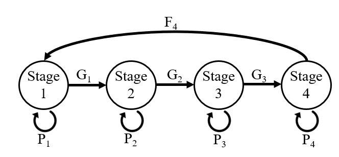
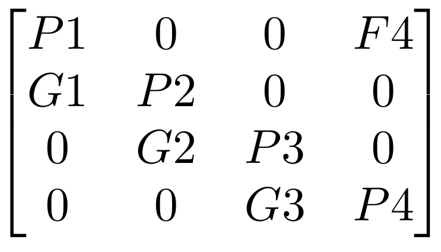
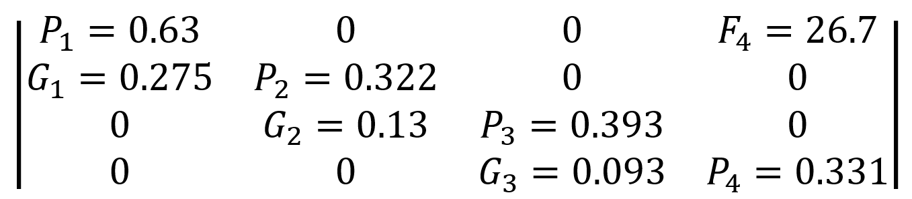

```{r setup, include=FALSE}
knitr::opts_chunk$set(echo = FALSE, warning = FALSE, message = FALSE, dev="cairo_pdf")
#knitr::write_bib look into
setwd("C:/Users/sophi/Documents/GitHub/UNH_Docs/Proposal/Mtx_Model")

library(tinytex)
library(matlib)
library(ggplot2)
library(quadprog) #cite
library(gridtext)
library(popbio) #cite
library(knitr)
library(gridExtra)
library(RColorBrewer) 
#library(rPref) #Double check what this is doing. Maybe cite?
library(tidyr)
library(dplyr)
library(ggpubr)
library(bookdown)
library(kableExtra)
library(Rage)


# #Raw data n supplemental. ASK
# in-stage bar graph goes in paper
# in stage management scenarios will definitely be supplemental
# Check out ecological modelling journal
# Write about stable stage cause I don't think you do
# Citations! Also check ahilya table
# APPENDIX!
# MAKE FIG CAPS FOR EVERYTHING AND EDIT FIGS.


observedData <- as.matrix(data.frame(read.csv("RaberinaryBenbow2012Calcs.csv")))
observedStageMatrix <- observedData[1:13, 2:5]
```

```{r, include=FALSE}
options(tinytex.verbose = TRUE)
```

```{r FXNoverallsurvive}
survivability <- function(increase){
    #Calculate survivability for each staege and increase by x%
    NewMtx <- (A * increase) + A
    
    for(i in 1:ncol(NewMtx)-1){
      if(sum(NewMtx[,i]) > 1 | NewMtx[4,4] > 1){
        return(NA)
      }}
    return(NewMtx)
}


#This is stupid but it just forces R to stop writing things as complex numbers
f <- function(x) {
   if (all(Im(z <- zapsmall(x))==0)) as.numeric(z) else x
}

real_check <- function(mtx){
  if(sum(mtx[,1]) > 1 | sum(mtx[,2]) > 1 | sum(mtx[,3]) > 1 | mtx[4,4] > 1){
    return(NA)
  }
  else{return(mtx)}
}

```

```{r FXNmatrixprint, results = 'asis'}
write_matex <- function(x) {
  begin <- "$$\\begin{bmatrix}"
  end <- "\\end{bmatrix}$$"
  X <-
    apply(x, 1, function(x) {
      paste(
        paste(x, collapse = "&"),
        "\\\\"
      )
    })
  writeLines(c(begin, X, end))
}

```
\linenumbers

# ABSTRACT
Mechanistic models are particularly useful for understanding and predicting population dynamics in data deficient species. Data deficiency is a relevant issue in small scale fisheries as they are generally under studied and underrepresented in global fishing datasets. As overfishing remains a global issue, especially in small-scale fisheries, one commonly utilized conservation method is temporary closures. The *Octopus cyanea* (blue octopus) fishery off the southwest coast of Madagascar is one such system that utilizes these closures, yet lacks sufficient data collection specific to this species to assess the viability of the population. This fishery is a key economic resource for the local community as blue octopus catch is sold by local fishers to international export markets adn is a major component of fisher income. To assess the sustainability of blue octopus, we parameterize a Levkovitch population matrix model using existing catch data. In this study, we show that this population was in a decline of 1.8% per month at the time of data collection. We also assessed the effects of different temporary closures and which of these management strategies would result in a sustainable population of blue octopus. To sustain the existing population of blue octopus, our model indicates that the fishery would need to close at least once every five months for one month. Increasing the frequencies of closure are predicted to significantly increase the octopus population at these sites. We show that if implemented correctly, temporary closures could be utilized to restore this population. Since this data was collected, the local communities of Madagascar have implemented various fishing restrictions to ensure sustainable fishing, indicating a need for further research into the effectiveness of these fishing closures. Therefore, our study provides insight into the underlying population dynamics of this fishery and provides survivability estimates of this species.  

 

# INTRODUCTION
Mechanistic models in ecology explicitly account for species life histories, behavioral, or other mechanisms to describe how a population or community may change over time [@andreModellingClimatechangeinducedNonlinear2010; @briggs-gonzalezLifeHistoriesConservation2016]. This is in contrast to statistical models that may be focused on correlating a response variable with different covariates and less focus on underlying mechanisms. Mechanistic models are important in situations without existing long-term data, when future conditions may not be similar to the past, and when different scenarios or actions need to be assessed [@crouseStageBasedPopulationModel1987; @nowlisShortLongtermEffects2000; @gharouniSensitivityInvasionSpeed2015]. Thus, mechanistic models play a critical role in making informed conservation decisions, such as the management of small-scale fisheries.

Worldwide, 32 million fishers make their livelihood in small-scale fisheries, a subsector in which 90 to 95% of fish is distributed for local consumption. These marine products are a vital source of nutrition for these communities [@HIDDENHARVESTTheGlobal2012]. The southwest region of Madagascar is one such area where subsistence fishing is an essential component to the diet and income of the local community. The ocean environments off the southwest coast of Madagascar are home to a wide variety of marine life, as sand beds, seagrass beds and coral reefs are all prominent biomes in the area. Increased urbanization in the region has led to higher fishing pressure which has in turn led to a decline in fish catch and biomass [@larocheReefFisheriesSurrounding1997]. In fact, Madagascar has been calculated to be among the top countries for potential successful preservation based on the potential economic benefits and success of harvest regulation [@macneilGlobalStatusConservation2020], especially in the western region of the country [@larocheReefFisheriesSurrounding1997]. In the early 2000’s, however, Madagascar began to move from local, subsistence fishing to selling catch to export markets [@humberSeasonalClosuresNoTake2006], and there is evidence that up to 75% of all fish caught is now sold to outside entities for international export [@baker-medardGenderingMarineConservation2017].

In order to protect fishing resources, Madagascar has instituted various conservation programs. Marine Protected Areas (MPAs) are regions in the ocean identified as being biologically important and fishing protections are therefore enforced. Before their establishment in Madagascar, governmental bodies had bans on certain types of fishing gear, implemented seasonal fishing regulations, and criminalized the harvest of endangered species. However, these strategies proved ineffective in execution and in their conservation goals [@humberSeasonalClosuresNoTake2006]. Both the government and nongovernmental organizations have since pledged to drastically increase the number of regions dedicated as MPAs through temporary fishing closures [@cinnerInstitutionsCommunitybasedManagement2009; @oliverPositiveCatchEconomic2015; @baker-medardGenderingMarineConservation2017].

One such class of MPAs that are currently being used in Madagascar are temporary closures. Temporary closures have a long history of use and have been seen to successfully rehabilitate stocks [@campEvaluatingShortOpenings2015; @gnanalingamFlexibilityTemporaryFisheries2015]. This method is flexible, logistically simple for fishers and enforcers to understand, and mitigates the financial loss from the fishery that can be seen with permanent closures [@nowlisShortLongtermEffects2000; @humberSeasonalClosuresNoTake2006; @cohenSustainingSmallscaleFisheries2013; @campEvaluatingShortOpenings2015; @gnanalingamFlexibilityTemporaryFisheries2015; @oliverPositiveCatchEconomic2015]. However, they are not always effective in their goal of replenishing stocks and this can depend on a wide range of factors. Ecological considerations about the life history of the target species, Allee effects, and changes to community structure and species interactions all play a role in how well the temporary closure will protect the fishery [@russNaturalFishingExperiments1998; @cohenSustainingSmallscaleFisheries2013; @gnanalingamFlexibilityTemporaryFisheries2015; @gilchristReefFishBiomass2020; @grorud-colvertMPAGuideFramework2021]. Further, the characteristics of the fishery itself has been seen to influence fishery recovery. Fishing method, where the effort will be redistributed to, and fishing activity upon reopening have all been factors in negating the recovery made during the closure [@hiddinkPredictingEffectsArea2006; @humberSeasonalClosuresNoTake2006; @cohenSustainingSmallscaleFisheries2013]. Therefore, assessments of each temporary closure is essential to insuring that they are effective in replenishing fish stocks.

Since 2003, when this marine resources in Madagascar first began to globalize, cephalopods have become one of the largest classes of exports [@humberSeasonalClosuresNoTake2006; @ainaMANAGEMENTOCTOPUSFISHERY2009; @barnes-mautheTotalEconomicValue2013]. This has since added significant fishing pressure to Madagascar’s cephalopod populations and yield from this fishery has decreased in the southwest Andavadoaka region [@humberSeasonalClosuresNoTake2006]. Cephalopods are a vital part of many ocean ecosystems and, compared to other fisheries, have a unique life history that can lead to distinct and variable population dynamics. Cephalopods act as both predators and prey in an ecosystem [@rodhouseRoleConsumers1996; @santosAssessingImportanceCephalopods2001a; @vaseAcetesKeystoneSpecies2021], situating them in a key role in food webs. They also provide rich nutrition and bioactive compounds to the oceanic microbial community [@fitahiaHighResolutionMassSpectrometry2018]. Further, their abundance varies drastically with a wide range of ocean conditions including sea surface and bottom temperature, salinity, currents, and sediment type [@catalanSpatialTemporalChanges2006; @ibanezZoogeographicPatternsPelagic2019; @vannieuwenhoveCrypticDiversityLimited2019]. Compared to other exploited marine organisms, cephalopods have a short lifespan coupled with a fast reproduction rate and high fecundity. This explains their population’s ability to quickly bounce back when short term MPAs are introduced into their habitat [@humberSeasonalClosuresNoTake2006; @katsanevakisSeasonalPopulationDynamics2006; @benbowLessonsLearntExperimental2014]. However, once fishing resumes, populations suddenly and rapidly decline although in some examples, this could be attributed to heavy fishing pressure in the area right after reopening [@humberSeasonalClosuresNoTake2006]. Cephalopods are therefore extremely sensitive to both protection and harvest levels, and understanding how these volatile population dynamics will react to changes in fishing pressure is a key component to effective conservation of this resource.

*Octopus cyanea*, or blue octopus, is the most abundant cephalopod species in the western Indian Ocean and is caught in about 95% of local landings [@humberSeasonalClosuresNoTake2006; @oliverPositiveCatchEconomic2015]. Like other cephalopod species, very little is known about their life history including natural death rate, larval survivability, and how much time this species remains in each stage of maturity. Further, age is difficult to determine from size alone as they have variable growth rates up to maturity [@wellsObservationsFeedingGrowth1970; @heukelemGrowthBioenergeticsLifespan1976; @herwigUsingAgeBasedLife2012; @raberinaryReproductiveCycleOctopus2012]. Size limits have been shown to be the most effective method of conservation for cephalopods in general as it ensures individuals will breed before being harvested [@nowlisShortLongtermEffects2000; @emeryManagementIssuesOptions2016]. To protect this species, size limits have been imposed on blue octopus catch in Madagascar, but these regulations are difficult in practice, as the fishing method used to harvest octopus involves spearing the octopus's den and extracting the octopus from the den. Blue octopus therefore typically die before size can be assessed [@humberSeasonalClosuresNoTake2006]. Further, the relationship between size and maturity stage is not strongly correlated [@raberinaryReproductiveCycleOctopus2012] and as a result, size restrictions wouldn't necessarily protect individuals ready to reproduce and would be difficult to implement in the field. Therefore, temporary closures have been shown to be a more practical method of blue octopus conservation in Madagascar [@benbowLessonsLearntExperimental2014], however this requires a deeper understanding of the characteristics of *Octopus cyanea* in this fishery in order to be properly instituted. Instituting effective temporary closures in octopus fisheries can be difficult due to their short lifespan, high mortality, and sensitivity to environmental conditions [@catalanSpatialTemporalChanges2006; @emeryManagementIssuesOptions2016; @ibanezZoogeographicPatternsPelagic2019; @vannieuwenhoveCrypticDiversityLimited2019]. Lack of field data and difficulty of enforcement has also been a challenge in octopus fisheries, especially in Madagascar [@emeryManagementIssuesOptions2016; @benbowLessonsLearntExperimental2014]. This indicates that a thorough understanding of the life history of *O. cyanea* and the harvest methods employed by fishers is necessary to enact meaningful fishing restrictions. Currently, the octopus fishery in this region of madagascar is closed for the three months between June and August on a yearly basis [@benbowManagingMadagascarOctopus2011; @westermanRoleWomenCommunitybased2014] which was decided in 2011. In this paper, we will also assess how this duration of closure will affect *Octoups cyanea* stocks.

As *O. cyanea* has an extended larval phase and there is no existing data on the age structure of this population of octopus, we will use a stage-based population matrix, otherwise known as a Lefkovitch matrix [@caswell2001matrix]. Here, the life history of the study organism is grouped by stages (figure \ref{LifeGraph}), where each unit of the matrix represents a distinct period of the organism’s life where it is subject to different environments, pressures, or physical attributes that would alter the survival and reproductive output at that phase, but the amount of time between each stage is variable. This would simply create different inputs for the probability of remaining in the same stage, and the growth and fecundity inputs can be based on available data. Lefkovitch matrices have not yet been applied to *Octopus cyanea* populations and therefore could be a useful methodology to understand the dynamics of this population in the western Indian Ocean to better inform management strategies.

In this paper, we have four goals: 1) we will fit a Levkovitch matrix to the limited available data on *Octopus cyanea* populations in southwestern Madagascar, 2) as well as create a theoretical estimation of the species’ life history traits in different stages of its development and 3)  determine the frequency and length in which these temporary closures should take place to maximize population health of the fishery and maximizing catch for the local community.

(ref:lifegraphs) A graph representing the life history of *O. Cyanea* and the subsequent Lefkivitch Matrix where i corresponds with each of the stages of maturity (Immature, Incipient Mature, Mature, and Fully Mature individuals, respectively). $P_i$ corresponds to probability of surviving and staying within a stage. $G_i$ is the probability of surviving and growing to the next stage. $F_i$ is the reproductive output of stage i.


```{r LifeGraph, echo = FALSE, fig.show="hold", out.width="45%", results = "asis", fig.cap = '(ref:lifegraphs) \\label{LifeGraph}'}




```

# METHODS

## Data
To inform our model, we used data collected by Raberinary and Benbow (2012) from landings ranging from the villages of Ampasilava in the south to Andragnombala in the north which spans about 30 kilometers of coastline. This study collected landing data from February 2005 to February 2006 through daily surveying fishers as they landed onshore within a two hour window. They separated each octopus into five age classes: immature, incipient maturity, maturity, full maturity, and post laying. In this paper we ommitted stage five, post laying, from this model as blue octopus only brood once, and stage five individuals therefore do not contribute to population growth. They recorded octopus weight, weight and length of gonads, sex, and a visual assessment of maturity class. A subsample of octopus were also collected for octopus length, and laboratory assessment of gonads for a confirmation of maturity class. They gathered this data on a total of 3253 octopuses, and for the purposes of this study, we will be modeling from the 1578 females collected. Despite there being no standardization for catch effort being available for this dataset, no other maturity stage study has been conducted on this population of *O. cyanea* and is therefore the best available data to fit a Lefkovitch matrix. As there is no previous estimate of the natural death rate of this population, the Lefkovitch matrix, survivability estimates and growth rate calculations for this model will also inlude the influence of fishing pressure. This data is reported in the appendix.

```{r QuadProg, echo = FALSE}
#Make Z
z <- matrix(t(observedStageMatrix[2:11,]), ncol = 1, nrow = 40, byrow = TRUE)
#z

#Make M
m <- matrix(, nrow = nrow(z) , ncol = 8)
for(i in 1:(nrow(observedStageMatrix)-3)){
  m[(4 * (i-1) + 1):(4 * i),] <- matrix(c(observedStageMatrix[i,1], 0, 0, 0, 0, 0, observedStageMatrix[i,4], 0,
                                          0, observedStageMatrix[i,1], observedStageMatrix[i,2], 0, 0, 0, 0, 0,
                                          0, 0, 0, observedStageMatrix[i,2], observedStageMatrix[i,3], 0, 0, 0,
                                          0, 0, 0, 0, 0, observedStageMatrix[i,3], 0, observedStageMatrix[i,4]),
                                        nrow = 4, byrow = TRUE)
  #m
}

#Make C
c <- matrix(c(diag(8) * (-1), 
              1, 1, 0, 0, 0, 0, 0, 0,
              0, 0, 1, 1, 0, 0, 0, 0,
              0, 0, 0, 0, 1, 1, 0, 0,
              0, 0, 0, 0, 0, 0, 0, 1), nrow = 12, ncol = 8, byrow = TRUE)
#c
#Make b
b <- matrix(c(rep(0,8), rep(1,4)), nrow = 12, ncol = 1, byrow = TRUE)

#Make P
#p <- matrix(, nrow = 8, ncol = 1, byrow = TRUE) #vector(p1, g1, p2, g2, p3, g3, f4, p4)

#Make mtx G and vector x
g <- t(m) %*% m
f_t <- -(t(-z) %*% m)

qp <- solve.QP(Dmat = g, dvec = f_t, Amat = -t(c), bvec = -t(b))#, factorized = FALSE)


A <- matrix(c(qp$solution[1], 0, 0, qp$solution[7],
                 qp$solution[2], qp$solution[3], 0, 0,
                 0, qp$solution[4], qp$solution[5], 0,
                 0, 0, qp$solution[6], qp$solution[8]), byrow = TRUE, nrow = 4, ncol = 4)
#A
```

```{r WriteMtxRounded, results = 'asis', echo = FALSE, out.width="100%", fig.cap = "Stage-based population matrix calculated using Wood's quadratic programming method and parameterized using data from Raberinary and Benbow (2012). \\label{WriteMtxRounded}"}

A_round <- matrix( , byrow = TRUE, nrow = 4, ncol = 4)

for (i in 1:length(A)){
  A_round[i] <- round(A[i], 3)
}

# A_round <- matrix(-1*c(qp_round[1], 0, 0, qp_round[7],
#               qp_round[2], qp_round[3], 0, 0,
#               0, qp_round[4], qp_round[5], 0,
#               0, 0, qp_round[6], qp_round[8]), byrow = TRUE, nrow = 4, ncol = 4)

round_A <- matrix(A_round, 4, 4)

round_A[1] <- paste0("P1 = ", round_A[1])
round_A[13] <- paste0("F4 = ", round_A[13])
round_A[2] <- paste0("G1 = ", round_A[2])
round_A[6] <- paste0("P2 = ", round_A[6])
round_A[7] <- paste0("G2 = ", round_A[7])
round_A[11] <- paste0("P3 = ", round_A[11])
round_A[12] <- paste0("G3 = ", round_A[12])
round_A[16] <- paste0("P4 = ", round_A[16])


#write_matex(round_A)
```

## Model Parameterization
In order to parameterize this model, we used Wood’s Quadratic Programming method [@caswell2001matrix]. Other methods required longer time series than were available to us, were extremely sensitive to noise in the data, or simply resulted in matrices that had no reasonable biological interpretation [@caswell2001matrix]. Figure \ref{WriteMtxRounded} shows a preliminary stage-based matrix model based on Raberinary and Benbow (2012) data and calculated using the quadprog package in R [@quadprog]. Model accuracy was assessed by comparing life history values inferred from the matrix with existing literature on *O. cyanea* life history (Table \ref{LifeHistory}). As all of our values calculated from the matrix fell within the known attributes of this species, we were confident that this model gave an accurate mechanistic description for this population’s underlying dynamics.

## Model Analysis
Eigenvalues ($\lambda$) were then calculated from the matrix and future populations can be predicted by multiplying a population vector to incrementally higher powers of our matrix where the power of the matrix corresponds to the time length of the projection. We performed sensitivity analysis on the population matrix and eigenvalues using the r package popbio [@popbio]. Further, as all of the parameters are scaled to a value between 0 and 1 except $F_4$, a unit change in these parameters will have a greater proportional effect on the eigenvalue than $F_4$. To address this, we also conducted elasticity analysis using the popbio package [@popbio]. This will allow us to identify the groups within this octopus population whose protection will most benefit population growth, essentially creating focus points of conservation. Other life history traits that can be calculated from this matrix are stable stage distribution, reproductive value of each stage, and per-stage survivability. We will also use the R package Rage [@rage] to calculate the age in each stage, life expectancy and longevity, the age and probability of reaching maturity, and generation time of this population. We then used the rage package in R to analyze various life history traits of this matrix, the output of which is included in the supplementary material.

Finally, we calculated the minimum survivability increase necessary per stage to result in an increase of the overall population. We did this by increasing the $P_i$ and $G_i$ parameters by increasing percentages in each stage i until the overall eigenvalue ($\lambda$) became greater than one.

## Management Scenarios
In order to determine optimal conservation strategies, we altered the survivability of *O. cyanea* by different rates from 0-10% survival increase of the species. Then, we simulated different closure scenarios for each survival increase, by altering the length of annual closures by month. We then multiplied higher powers of the original matrix uring months that were simulated to be "open fishing" and then when a closure was simulated, the matrix with increased survival was multiplied to the population for that month. We simulated these different scenarios in order to analyze all combinations of conservation strategies that result in stable *O. cyanea* populations including the three month closure that is currently being instituted.  

```{r LifeHistory, results = 'asis', echo = FALSE}

ages <- data.frame(matrix(data = NA, nrow = 4, ncol = 3))
colnames(ages) <- c("Stage", "Duration_New", "Variance")
for(i in 1:nrow(A)){
  ages$Stage[i] <- i
  ages$Duration_New[i] <- 1/(1-A[i,i])
  ages$Variance[i] <- A[i,i]/(1-A[i,i])^2
}

Life <- read.csv("OcyaneaLifeHistory.csv")

LifeHistory <- Life[,1:2]
LifeHistory$New <- c(NA, NA, ages[,2], NA, NA )
LifeHistory$Var <- c(NA, NA, ages[,3], NA, NA )

colnames(LifeHistory) <- c("Stage", "Existing Estimate", "Estimate from Lefkovitch Matrix", "Variance")

#LifeHistory

#Nowcombine LifeHistory[1:2]


knitr::kable(LifeHistory, format = "latex", booktabs = TRUE, caption = "(ref:lifehistory) \\label{LifeHistory}") #%>%
  #kable_styling(latex_options="scale_down")

```


(ref:lifehistory) Existing research and information on the per-stage lifespan of *O. Cyanea*. All existing estimates are from @heukelemGrowthBioenergeticsLifespan1976, @heukelemDISSERTATIONSUBMITTEDGRADUATE, @guardArtisanalFisheryOctopus2003, @humberSeasonalClosuresNoTake2006, @ainaMANAGEMENTOCTOPUSFISHERY2009. Note: Heukelem and Fred (1976) estimate the time to maturity to be 10-13 months (i.e. stages 1-3 combined).


# RESULTS

The resulting eigenvalue of our matrix was 0.982, indicating a population decline of 1.8% per month with fishing pressure included (Figure \ref{projection}). Sensitivity analysis (Figure \ref{sensitivity}) showed that within each stage, the growth parameters ($G_1$ - $G_3$) had the largest effect on this growthrate compared to the parameters indicating staying within a stage ($P_1$-$P_4$). However, as all the parameters represent proportions of individuals in a stage and must necessarily be between 0 and 1 with the exception of the $F_4$ parameter, elasticity analysis provides an interpretation that weights all stages equally. The result of this analysis shows that percent changes in the fecundity metric can be as beneficial to the overall population growth as changes in the G parameters (Figure \ref{elasticity}). Further, this analysis indicates that of all the stages, stage 1 has the most overall influence on the overall population growth. The stable stage distribution (Table \ref{lifetable}) shows that 65% of the makeup of this population is immature individuals, while actively breeding individuals (fully mature) only make up less than 1% of the naturally occurring population. However, the reproductive output per stage (Table \ref{lifetable}) shows that on average, an individual in this fully mature population is expected to have 41 times the number of offspring as those in stage 1. The life expectancy of this population was calculated by the Rage package to be 4.06 months with a variance of 5.87 months. The calculated age of maturity is 6.82 months with probability of reaching maturation of 0.022. The longevity of this population (the amount of months for only 1% of the population to remain) is 12 months with a generation time of 7.38 months.

Changing the survivability of each stage (Figure \ref{stages}) showed that immature individuals (Stage 1) would need the smallest amount (5%) of survival increase in order to result in overall population growth. Stage 4, on the other hand, would require a survivability increase of 25% in order to create a viable population.

Our analysis of different closure scenarios (Figure \ref{closures}) indicates closures two months in length or shorter will be ineffective in ensuring a stable population, regardless of how much these closures decreased the deathrate of the species. Further, as our baseline growth rate was close to stable (-0.0184), it took a maximum of a 7.5% increase in the survivability of the population to ensure a sustainable population when utilizing three month closures. This analysis (Figure \ref{closures}) provides all the possible combinations of increased survival rates and frequency of closures that will result in a stable population. Suggested changes in overall survivability range from 2-7.5%, and the ranges of frequencies of closures span from permanent closure (every month) to once every three months.

(ref:projections) Ten-year projection of *O. cyanea* population based off of our calculated Lefkovitch matrix. 

```{r projection, fig.cap = "(ref:projections) \\label{projection}"}
pop <- observedStageMatrix[13,]
N <- list()


#72 mo projection
for (i in 1:120){
     N[[1]] <- pop
    N[[i+1]] <- A %*% N[[i]]
 }

modeled_data <- t(as.data.frame(do.call(cbind, N)))
colnames(modeled_data) <- c("Stage_1", "Stage_2", "Stage_3", "Stage_4")
modeled_data <- cbind(modeled_data, month = 0:120)

#write.csv(modeled_data, "testing.csv",row.names = TRUE)
modeled_data <- data.frame(modeled_data)

ggplot(modeled_data) + 
  geom_line(aes(y = Stage_1, x = month, color = "Stage 1", linetype = "Stage 1"), size = .75) + 
  geom_line(aes(y = Stage_2, x = month, color = "Stage 2", linetype = "Stage 2"), size = .75) +
  geom_line(aes(y = Stage_3, x = month, color = "Stage 3", linetype = "Stage 3"), size = .75) + 
  geom_line(aes(y = Stage_4, x = month, color = "Stage 4", linetype = "Stage 4"), size = .75) +
  scale_color_manual(name = "", values = c("Stage 1" = "#004949",
                                                "Stage 2" = "#009292",
                                                "Stage 3" = "#db6d00",
                                                "Stage 4" = "#920000")) +
  scale_linetype_manual(name = "", values = c("Stage 1" = 3,
                                                "Stage 2" = 4,
                                                "Stage 3" = 5,
                                                "Stage 4" = 1)) +
  #ggtitle("Ten year population projection") + #paste0(i, " month projection")) +
  xlab("Year") +
  ylab("No. Individuals") +
  scale_x_continuous(breaks = seq(0, 120, 12), label = seq(2006, 2016)) +
  theme_bw() +
  theme(panel.border = element_blank(), panel.grid.major = element_blank(), panel.grid.minor = element_blank(), axis.line = element_line(colour = "black"))

```

```{r lifetable, results = 'asis', echo = FALSE}
#eigenvecors and vals
A_eigen <- eigen(A)
#A_eigen

#Intrinsic Rate of Increast (r): lambda = e^r
r <- log(A_eigen$values[1])
#r

#stable stage dist
A_stable_stage <-as.numeric(A_eigen$vectors[,1]/sum(A_eigen$vectors[,1]))
#A_stable_stage

#reproductive value
A_repro_value <- as.numeric(eigen(t(A))$vectors[,1]/eigen(t(A))$vectors[1,1])
#A_repro_value

#mean reproductive value- is the avg no offspring?
#A_repro_value %*% A_stable_stage

#. Vandermeer (1975, 1978)
lifetable <- data.frame(matrix(ncol = 3, nrow = 4))
#x <- c("Stage", "Stable Stage Distribution (Dominant Eigenvector)", "Reproductive Value (Left Eigenvector)")
#colnames(lifetable) <- x
#colnames(lifetable) <- stringr::str_replace_all(colnames(lifetable), "\\n", "<br>")
lifetable[1:4,1] <- c("1 Immature", "2 Incipient Maturity", "3 Mature", "4 Fully Mature")
lifetable[1:4,2] <- round(A_stable_stage,3)
lifetable[1:4,3] <- round(A_repro_value,3)

#colnames(lifetable) <- stringr::str_replace_all(colnames(lifetable), "\\n", "<br>")

  knitr::kable(lifetable, format = "latex", booktabs = TRUE, caption = "(ref:lifetablecap) \\label{lifetable}", col.names = c("Stage", "Stable Stage Distribution (Dominant Eigenvector)", "Reproductive Value (Left Eigenvector)")) %>%
  column_spec(2:3, width = "4.5cm") %>%
  kable_styling(latex_options="scale_down")

```

(ref:lifetablecap) Stable stage distribution and reproductive value of each stage of this blue octopus population matrix given in Figure \ref{WriteMtxRounded}

``` {r survivabilityEst, echo = FALSE, results = 'asis'}

surviveTable <- data.frame(matrix(ncol = 2, nrow = 5))
y <- c("Stage", "Survivability")
colnames(surviveTable) <- y

surviveTable[1:5,1] <- c("1 Immature", "2 Incipient Maturity", "3 Mature", "4 Fully Mature", "Larval")

for(i in 1:3){
  surviveTable[i,2] <- sum(A[,i])
}
surviveTable[4,2] <- A[4,4]
surviveTable[5,2] <- A[1,4]/((375000+27000)/2)

  knitr::kable(surviveTable, format = "latex", booktabs = TRUE, caption = "(ref:surviveTable) \\label{survivabilityEst}") #%>%
  #kable_styling(latex_options="scale_down")

```

(ref:surviveTable) The survivability (i.e. the proportion of individuals who survive from stage i to stage i+1) in each stage with deathrate from fishing included. Stages 1-4 were calculated by summing up the proportion of individuals surviving and staying within a stage every month ($P_i$) and the proportion of individuals surviving and growing every month ($G_i$). Larval survivability was calculated  by dividing our estimated number of larvae surviving back to stage 1 ($F_4$) by 201,000 - the average estimated reproductive output of *O. cyanea* by [@guardBiologyFisheriesStatus2009].

```{r sensitivity, fig.cap = "(ref:sensitive) \\label{sensitivity}"}

cols <- hcl.colors(1000, palette = "Greens 3", alpha = NULL, rev = TRUE, fixup = TRUE)#, end = .85)

sens <- sensitivity(A)

for(i in 1:length(A)){
  if(A[i] == 0){
    sens[i] <-  NA
  }
}

## IMAGE plot with smaller boxes
image2(sens, mar=c(1,3.5,5,1), box.offset=.1, border="gray70",col = c("white", cols[150:850]), text.cex = 2)
 

## MATPLOT
# matplot2(sens, log='y', type='b', yaxt='n', ltitle="Fate",
#  ylab=expression(paste("Sensitivity of ",lambda)),
#  main="Sensitivity matrix using matplot2")
# pwrs <- -4:1
#  #axis(2, 10^pwrs, parse(text=paste("10^", pwrs, sep = "")), las=1)


#https://rdrr.io/cran/popbio/man/sensitivity.html

#
```

(ref:sensitive) Sensitivity analysis of our matrix model - the change in the eigenvalue ($\lambda$) as a result of a unit change of each parameter in the model.

```{r elasticity, fig.cap = "(ref:elastic) \\label{elasticity}"}

cols <- hcl.colors(1000, palette = "Greens 3", alpha = NULL, rev = TRUE, fixup = TRUE)#, end = .85)

elas <- elasticity(A)

for(i in 1:length(A)){
  if(A[i] == 0){
    elas[i] <-  NA
  }
}

image2(elas, mar=c(1,3.5,5,1), border="gray70", col = c("white", cols[150:850]), text.cex = 2 )

# # Summed elasticities for teasel.
# # fertility in last column, stasis P on diagonal, and growth in bottom-left triangle
# c(F=sum(elas[,4]), P=sum(diag(elas)), G=sum(elas[row(elas)>col(elas)]))
# 
# elas <- elasticity(tortoise[["med.high"]])
# image2(elas, mar=c(1,3.5,5,1),  log=FALSE)
#  title("Tortoise elasticity matrix", line=2.5)
# # Summed elasticities for tortoise (see example 9.4)
# # fertility in top row, stasis on diagonal, and growth on subdiagonal
# c(F=sum(elas[1,]), P=sum(diag(elas)), G=sum(elas[row(elas)==col(elas)+1]))

#https://rdrr.io/cran/popbio/man/elasticity.html
```

(ref:elastic) Elasticity analysis of our matrix model - the change in the eigenvalue ($\lambda$) as a result of a proportional change of each paramter in the model.

```{r stages, echo = FALSE, fig.cap = "(ref:stagesurvive) \\label{stages}"}

rates <- c(0, 0, 0, 0, 0)

for(i in 1:(length(rates)-1)){
  #First need to do the stage 4 and larval differently
  if(i == 4){
    incr <- 0.01
    testMtx <- A
    testMtx[4,4] <- A[4,4] + A[4,4] * incr
    while(f(eigen(testMtx)$values[1]) < 1){
      incr <- incr + 0.01
      testMtx[4,4] <- A[4,4] + A[4,4] * incr
    }
    rates[4] <- incr
    
    incr <- 0.01
    testMtx <- A
    testMtx[1,4] <- A[1,4] + A[1,4] * incr
    while(f(eigen(testMtx)$values[1]) < 1){
      incr <- incr + 0.01
      testMtx[1,4] <- A[1,4] + A[1,4] * incr
    }
    rates[5] <- incr
  
  }
  else{
  incr <- 0.01
  testMtx <- A
  testMtx[,i] <- A[,i] + A[,i] * incr
  while(f(eigen(testMtx)$values[1]) < 1){
    incr <- incr + 0.01
    testMtx[,i] <- A[,i] + A[,i] * incr
  }
  rates[i] <- incr
  }}

rates_percent <- rates * 100

barplot(rates_percent, xlab = "Stage", ylab = "Percent survival increase",
        names.arg=c("1", "2", "3", "4", "Larval"))

#rates  

```

(ref:stagesurvive) Minimum percent of per-stage survivability change needed to create population increase.

```{r closurescalcs}
#Calculates new rates based on vectors of % chagne and frequencies of restrictions
p <- list()
modeled_data <- data.frame(matrix(ncol=8,nrow=0, dimnames=list(NULL, c("Stage_1", "Stage_2", "Stage_3", "Stage_4", "month", "pop", "Frequency", "PercentChange"))))
percentage <-rates <- c(seq(0, .1, .01)) # c(0.01, 0.05, 0.1, 0.15) 
freqs <- c(seq(1, 12)) #c(1, 2, 3, 4, 6, 12) 
#par(mfrow = c(6,4))
for(i in 1:length(freqs)){
  for(j in 1:length(percentage)){
    pop <- observedStageMatrix[13,]
    N <- list()
    for (k in 1:120){
      if(k %% 12 %in% c(seq(1, freqs[i]))){
      N[[1]] <- pop
      N[[k+1]] <- survivability(percentage[j]) %*% N[[k]]
      }
    else{
       N[[1]] <- pop
      N[[k+1]] <- A %*% N[[k]]
      }}
   
  
  new_data <- t(as.data.frame(do.call(cbind, N)))
  colnames(new_data) <- c("Stage_1", "Stage_2", "Stage_3", "Stage_4")
  new_data <- data.frame(cbind(new_data, month = 0:120, pop = rowSums(new_data[,1:4]), Frequency = freqs[i], PercentChange = percentage[j]))
  modeled_data <- rbind(modeled_data, new_data)
  }}


# Sources: https://www.webpages.uidaho.edu/wlf448/stochgro.pdf
# https://esajournals.onlinelibrary.wiley.com/doi/10.2307/1943004
```

```{r closures, fig.cap = "Analysis of different management scenarios. The black line separates the scenarios that succeed in sustaining the population from the scenarios that don't. Green and white squares indicate theoretically successful management scenarios where red refers to the strategies that will not result in overall population growth. \\label{closures}"}

#### CALCULATE GROWTH RATE BASED ON LAST POP-FIRST POP/FIRST POP FOR EACH FREQ/PERCENT COMBINATION
growthRate <- modeled_data %>%
  select(month, pop, Frequency, PercentChange) %>%
  filter(month == 0 | month == 120) %>%
  pivot_wider(names_from = month, values_from = pop) %>%
  rename(month_0 = 3,
         month_120 = 4) %>%
  mutate(Mu_New = log(month_120/month_0)/120) %>% #See Crouse paper. From Nt = N0e^(rt)
  mutate(lambda_new = exp(Mu_New)) %>%
  select(Frequency, PercentChange, Mu_New, lambda_new)

  

#### COPY PARETTO GRAPH FROM OTHER ANALYSIS
paretospagheto <- growthRate %>% 
  filter(lambda_new >= 1) %>%
  group_by(Frequency) %>%
  filter(lambda_new == min(lambda_new))

paretospagheto$Frequency <- paretospagheto$Frequency - 0.5
paretospagheto$PercentChange <- paretospagheto$PercentChange - 0.005


#Continuous Colors
ggplot(growthRate, aes(Frequency, PercentChange, fill = lambda_new)) + geom_tile(width=1) +
  scale_fill_gradient2(
  low = "red",
  mid = "white",
  high = "green",
  #limits = c(1, max(growthRate$lambda_new)),
  midpoint = 1,
  space = "Lab",
  na.value = "grey50") +
  scale_x_continuous(name = "Length of closure (months)", expand=c(0,0), breaks = c(1, 3, 6, 9, 12)) +
  scale_y_continuous(name = "Percent change in survival", expand=c(0,0)) +
  labs(fill = "Eigenvalue") +
  geom_segment(aes(x = 2.5, y = .075, xend = 2.5, yend = 0.105), size = .5, color = "#5A5A5A") +
  geom_segment(aes(x = 11.5, y = .015, xend = 12.5, yend = 0.015), size = .5, color = "#5A5A5A") +
  geom_step(data = paretospagheto , aes(x=Frequency, y=PercentChange), size = .5, color = "#5A5A5A") 


#####PLOTTING ALL RATES
#   #write.csv(modeled_data, "testing.csv",row.names = TRUE)
# 
#   #plot(modeled_data$pop, type = "o")  
# ggplot(modeled_data, aes(y = pop, x = month)) +
#   geom_line(size = 1.5) +
#   #ggtitle()+#paste0("Surv rate: ", iteration[i,2], " Freq: Close once every ", iteration[i,1], " months" )) + #paste0(i, " month projection")) +
#   xlab("Year") +
#   ylab("Total Pop") +
#   ylim(0,1000) +
#   scale_x_continuous(breaks = seq(0, 120, 120), label = c(2006, 2016)) +
#   facet_grid(Frequency ~ PercentChange)

```

# DISCUSSION

Our calculated growth rate of -0.0184 and resulting population projection further supports previous reports of overfishing [@humberSeasonalClosuresNoTake2006; @benbowLessonsLearntExperimental2014] and indicate a need for an assessment of possible action toward more sustainable practices. Decline in population presents an economical issue for individual fishers as their catch will become less lucrative and a recovery of this population will also result in economic gains from fishers in this community [@humberSeasonalClosuresNoTake2006; @benbowLessonsLearntExperimental2014; @oliverPositiveCatchEconomic2015]. Our model infers other information about the life history of this population as well, beyond its overall growth rate. As each column in the matrix represents a proportion of individuals within a stage either growing or staying within a stage (with the exception of the $F_4$ parameter), it also implies a per-stage survivability estimate (Table \ref{survivabilityEst}) and stage duration (MAKE AND INSERT FIG HERE OF STAGE DURATION), life history parameters on which there has been no previous research. However, as the immature stage has a high survivability of 90.4% and a longer duration than the other stages of 2.7 months, this could indicate that although the fishing method employed in this region does not distinguish by octopus size, fishers may not be bringing this smaller catch to landing due to size limits preventing them from selling immature individuals [@humberSeasonalClosuresNoTake2006]. Therefore, challenging our assumption of the data being properly stratified by size. Further, as O. Cyanea have an approximately one month larval stage [@guardArtisanalFisheryOctopus2003], the fecundity parameter does not indicate the overall reproductive output of mature individuals, but the number of hatched offspring that will survive its larval stage and back the immature stage. This gives an estimation for larval survivability as female octopus have a fecundity ranging between 27,000 and 375,000 eggs [@guardBiologyFisheriesStatus2009], our model indicates that only an average of 26.7 individuals will survive back into immaturity. There is no other larval survivability estimation that currently exists for this species, which would be a useful further study as this could indicate a recruitment rate for this population. Further, an average lifespan of 4.06 months and an age of maturation of 6.82 months indicates that most individuals die before reaching maturation.

Elasticity analysis shows that targeting of both the growth and reproductive parameters would have equal effect on the overall population growth, with the most influential parameter being the survival of stage 1 individuals. The sensitivity and elasticity analysis could potentially have conservation implications as they indicate which stages will have the greatest effect on the population if they are targeted for preservation practices. Previous research has indicated that catch size limits are very effective in preserving stocks of species with rapid growth and high death rates, but this is only if individuals do not enter the fishery until they have reached maturity [@nowlisShortLongtermEffects2000]. However, as the fishing method employed by the local people does not discriminate based on stage, this is not an applicable suggestion for conservation practices. For this reason, even though our analysis of different stage survivabilities indicates that conserving immature individuals would be an effective tool for fostering population growth, this is not a realistic management practice in this fishery.

Based on our calculations of growth rate over different closure scenarios, we suggest implementing closures for at least every three months, but the strictness of the closure (i.e. allowing some limited fishing) can be altered depending on how frequent these restricted fishing periods are implemented. There is no literature on the survivability of *O. cyanea* throughout their lifetime, particularly in this region. Therefore, the changes to survivability suggested by our analysis is in relation to their overall death rate not fishing rate, indicating a need for further research on the natural mortality rate of *O. cyanea* before concluding if the three month closure is effective in sustaining fish stocks. Three month closures began to be implemented in the region in 2011 as this length of time was shown to improve octopus yeild and had limited negative effects on fisher income (Benbow and Harris 2011). As we don't have a current assessment of *Octopus cyanea* stocks in this fishery, this indicates a need to assess how effective these closures are in preserving the blue octopus of this region. Our analysis of different closure scenarios suggests a range of the simplest actions needed in order to ensure stability of this population. As all combinations of survivability increase and frequency of closure suggested by the analysis will result in stable *O. cyanea* populations, the specific strategy chosen should be decided based on which is most convenient and economically feasible to the local fisher community of southwest Madagascar. Among conservationists, there is a growing understanding that decision making is best left to those directly involved with resource extraction and implementing fishing restrictions upon a community without understanding their cultural practices can have detrimental effects upon the community, as well as be less effective in actually protecting natural resources [@humberSeasonalClosuresNoTake2006; @baker-medardGenderingMarineConservation2017]. 

When implemented deliberately, establishing periodic closures is an effective and commonly-used strategy when implementing sustainable fishing practices [@humberSeasonalClosuresNoTake2006; @oliverPositiveCatchEconomic2015]. As Madagascar has been committed to protecting its marine natural resources through increasing the number of marine parks, this study serves to highlight some of the available strategies to make population predictions and conservation strategies with limited data sources [@westlundMarineProtectedAreas2017]. Implementing fishing restrictions without regard for social norms can undermine cultural practices and in turn be detrimental to both the people and fishery, and halts the dissemination of traditional ecological knowledge [@okafor-yarwoodSurvivalRichestNot2022]. For this reason, both the Madagascar government and scientific community has found a new emphasis on studying the complex social structures within the community in question in order to more effectively preserve resources along with peoples’ livelihoods [@billeIntegratedCoastalManagement2002; @baker-medardClassedConservationSocioeconomic2021]. This has been shown to increase participation in conservation practices, therefore making them more effective. 

The mechanistic methods utilized in this study allowed us to gain a baseline understanding of the growth rate and mortality of this population despite the limited data used to parameterize the model. Limitations of this study include the data collection process as even though daily collections occurred daily within a two-hour window, catch was not standardized by effort and therefore there could be catch fluctuations between months that are not captured in the data. As stage 1 had a high survival rate yet low duration, this challenges the assumption that the octopus caught are an accurate ratio of the octopus at each stage in the wild. Further, matrix population models will converge or diverge based on their dominant eigenvalue, regardless of the initial population inputted in the model. Therefore, we can still conclude that the population at this time was in an overall decline, despite not knowing the exact number of individuals in this population. Another shortcoming of this study is that the only available stage data for this species and region was collected in 2006, and the community of southwest Madagascar has implemented several strategies since that time to improve the sustainability of their fish stocks in the region [@humberSeasonalClosuresNoTake2006; @raberinaryReproductiveCycleOctopus2012]. Due to the time of data collection, this study does not reflect the current status of *Octopus cyanea*, but outlines the underlying population dynamics and serves to indicate the need for a more current assessment of *O. cyanea* stocks in the region. Finally, as we are using a Lefkovitch matrix to simulate population fluctuations, these models inherently make simplifying assumptions about the biology of the study species. For example, these models assume that all individuals within a stage are subject to the same growth and mortality rates. As this study uses data collected from a large geographic range [@raberinaryReproductiveCycleOctopus2012], different individuals nesting in different regions may be subject to different selective pressures. Further, this population of blue octoups has been shown to exibit spatial variability depending on their life stage. Younger individuals tend to live in the shallow inner zone of the reef and larger individuals, who are more able to withstand stronger currents, move to deeper waters for more suitable habitats for nesting [@raberinaryPERIODEPONTEPOULPE2007]. Despite these limitations, the data provided is the best data available for fitting a Lefkovitch matrix to this species.

As cephalopod species tend to react faster to easing fishing pressure, a study of other fished species in the region is necessary to understand the effectiveness of temporary closures. This study also highlights the need for further research into the life history patterns of *Octopus cyanea*. Specifically, studies on the natural mortality rate of this species, both in the larval and benthic stages, could better inform both our model and the greater understanding of how populations of this species grow. Further, a more contemporary study on the status of the octopus fishery of southwest Madagascar will paint a more accurate picture of how this population is faring under the current fishing pressure. These studies can also be used to build off of this one as more in depth data collection could be used to add spatial variability to our model, where we then can evaluate the accuracy of the assumption that every individual within a stage is subject to the same selective pressure. Finally, as the people of southwestern Madagascar are actively taking steps to preserve the health of their fisheries, we hope that studies such as these can serve to facilitate informed decision making when choosing how and when to impose fishing restrictions.

\newpage
