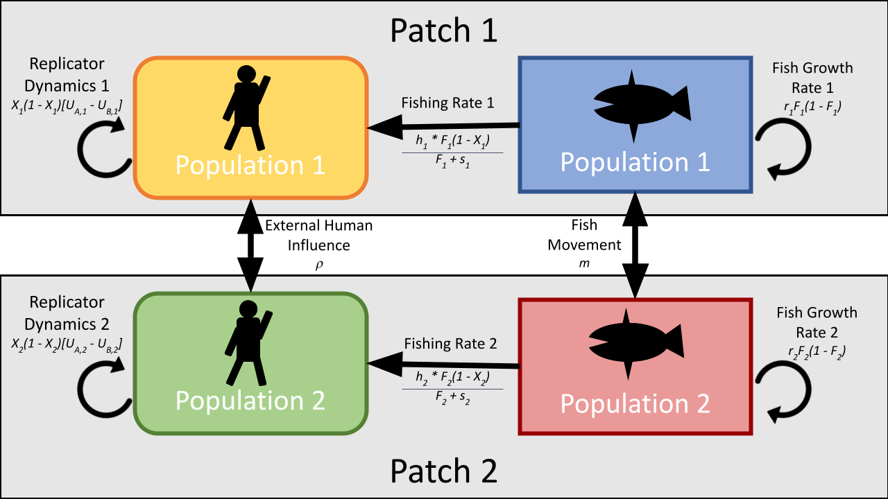

```{r setup, include=FALSE, warning = FALSE}
knitr::opts_chunk$set(echo = FALSE, warning = FALSE, message = FALSE)

setwd("C:/Users/Sophi/Documents/GitHub/UNH_Docs/Proposal/Soc_Ecol_Model")

library(deSolve)
library(tidyverse)
library(ggplot2)
library(gridExtra)
library(kableExtra)
library(ggpubr)
library(grid)


#Nest try h = .25
params_list <- data.frame(r_1 = 0.16, s_1 = 0.8, h_1 = .25, k_1 = 0.17, w_1 = 1.44, c_1 = 0.5, d_1 = 0.3, m_1 = 0, rho_1 = 0,
                          r_2 = 0.16, s_2 = 0.8, h_2 = .25, k_2 = 0.17, w_2 = 1.44, c_2 = 0.5, d_2 = 0.3, m_2 = 0, rho_2 = 0)

# #WORKED - MINIMUM GROWTH RATE USED IN THAMPI
# params_list <- data.frame(r_1 = 0.16, s_1 = 0.8, h_1 = 0.5, k_1 = 0.17, w_1 = 1.44, c_1 = 0.6, d_1 = 0.3, m_1 = 0, rho_1 = 0,
#                           r_2 = 0.16, s_2 = 0.8, h_2 = 0.5, k_2 = 0.17, w_2 = 1.44, c_2 = 0.6, d_2 = 0.3, m_2 = 0, rho_2 = 0)

#Extensions of Bauch Default but with my params I want changed. Goal: get this to oscillate
# params_list <- data.frame(r_1 = 0.35, s_1 = 0.8, h_1 = 0.5, k_1 = 0.17, w_1 = 1, c_1 = 1.68, d_1 = 0.3, m_1 = 0, rho_1 = 0,
#                           r_2 = 0.35, s_2 = 0.8, h_2 = 0.5, k_2 = 0.17, w_2 = 1, c_2 = 1.68, d_2 = 0.3, m_2 = 0, rho_2 = 0)


#Extension of Bauch Default
# params_list <- data.frame(r_1 = 0.06, s_1 = 0.8, h_1 = 0.1, k_1 = 0.17, w_1 = 1, c_1 = 0.6, d_1 = 0.3, m_1 = 0, rho_1 = 0,
#                           r_2 = 0.06, s_2 = 0.8, h_2 = 0.1, k_2 = 0.17, w_2 = 1, c_2 = 0.6, d_2 = 0.3, m_2 = 0, rho_2 = 0)


xstart <- c(F_1 = 0.406, F_2 = 0.406, X_1 = .24, X_2 = .24)
timespan <- seq(from = 0, to = 1000, by = 1)

```

```{r Conceptual, echo = FALSE, results = "asis", fig.cap = '(ref:conceptual) \\label{Conceptual}', out.width = "100%"}



```
(ref:conceptual) A conceptual representation of our model as a two-patch extension of @bauchEarlyWarningSignals2016. Here, each fish population ($F_i$) in each patch $i$ increase through natural growth and movement of fish into the patch. Fish populations are decreased through emigration out of the patch and fishing mortality. The number of fishers ($X_i$) in each patch $i$ change in response to fish population levels, the cost of stopping fishing activity, and the opinions of those in the patch and those in the other patch.

```{r paramtable, results = 'asis', echo = FALSE}

giveparams <- data.frame(matrix(, nrow = 9, ncol = 4))
colnames(giveparams) <- c("Parameter", "Population_1", "Population_2", "Def")

giveparams$Parameter <- c("r", "s", "h", "k", "w", "c", "d", "m", "rho")
giveparams$Population_1 <- c(params_list[1:9])
giveparams$Population_2 <- c(params_list[10:18])

giveparams$Def <- c("Fish net growth",
                    "Supply and demand",
                    "Harvesting efficiency",
                    "Social learning rate",
                    "Conservation cost",
                    "Rarity valuation",
                    "Social norm strength (within pop)",
                    "Fish movement (from opposite patch)",
                    "Social norm strength (opposite pop)")

knitr::kable(giveparams, format = "latex", booktabs = TRUE, caption = "Parameter values used in this analysis. Taken from Bauch et al appendix where oscillations are observed. DOUBLE CHECK THAT")

```

```{r, include=FALSE}
options(tinytex.verbose = TRUE)
```

```{r Bauch.Coupled, fig.cap = "New Model with default paramters given in Bauch et al. Demonstrating homogenous populations.", warning = FALSE}


##Maybe see what proportion of people can actually be fishing in this system to make it sustainable

Bauch.Coupled <- function (t, y, params) {
  ## first extract the state variables
  F_1 <- y[1] #Fish Pop var
  F_2 <- y[2] #Fish Pop var
  X_1 <- y[3] #conservationist var
  X_2 <- y[4] #conservationist var

  #TT <- y[5]
  
  ## now extract the parameters
  r_1 <- params["r_1"] # Net growth/fecundity
  s_1 <- params["s_1"] # supply and demand
  h_1 <- params["h_1"] # Harvesting efficiency
  k_1 <- params["k_1"] # Social learning rate
  w_1 <- params["w_1"] # conservation costs
  c_1 <- params["c_1"] # rarity valuation param
  d_1 <- params["d_1"] # social norm strength
  m_1 <- params["m_1"] # Inflow of fish from pop 2 to pop 1
  rho_1 <- params["rho_1"] # Influence of pop 2 on pop 1
  
  r_2 <- params["r_2"] # Net growth/fecundity
  s_2 <- params["s_2"] # supply and demand
  h_2 <- params["h_2"] # Harvesting efficiency
  k_2 <- params["k_2"] # Social learning rate
  w_2 <- params["w_2"] # conservation costs
  c_2 <- params["c_2"] # rarity valuation param
  d_2 <- params["d_2"] # social norm strength 
  m_2 <- params["m_2"] # Inflow of fish from pop 1 to pop 2
  rho_2 <- params["rho_2"] # Influence of pop 1 on pop 2
  
  ## now code the model equations
  dF_1dt <-  r_1 * F_1 * (1-F_1) - (h_1 * F_1 * (1-X_1))/(F_1+s_1) - m_2 * F_1 + m_1 * F_2
  dF_2dt <-  r_2 * F_2 * (1-F_2) - (h_2 * F_2 * (1-X_2))/(F_2+s_2) - m_1 * F_2 + m_2 * F_1
  
  dX_1dt <- k_1 * X_1 * (1-X_1) *(1/(F_1 + c_1) - w_1 + d_1*(2*X_1 - 1) + rho_1 * (2*X_2 - 1))
  dX_2dt <- k_2 * X_2 * (1-X_2) *(1/(F_2 + c_2) - w_2 + d_2*(2*X_2 - 1) + rho_2 * (2*X_1 - 1))
  
  ## combine results into a single vector
  dydt <- c(dF_1dt, dF_2dt, dX_1dt, dX_2dt)
  ## return result as a list!
  
  list(dydt)
}

params_Bauch2 <- params_list

times <- timespan
xstart <- c(F_1 = 0.406, F_2 = 0.406, X_1 = .24, X_2 = .24)

ode(
  func=Bauch.Coupled,
  y=xstart,
  times=times,
  parms=params_Bauch2
) %>%
  as.data.frame() -> out_Coupled

out_Coupled %>%
  gather(variable,value,-time) %>%
  ggplot(aes(x=time,y=value,color=variable))+
  geom_line(size=1)+
  theme_classic()+
  labs(x='Time (Year)',y='Population') +
  theme(legend.title=element_blank()) +
  scale_colour_discrete(labels=c(expression('F'[1]), expression('F'[2]), expression('X'[1]), expression('X'[2])))


```

# MOVEMENT

```{r movement, warning = FALSE, fig.cap="Showing that movement only matters when there is asymmetry. This can be asymmetry in other params. When this is the case, high movement dampens oscillatory effects"}

mparams <- c(0.01, 0.05, 0.1)
plotList <- list()
k <- 0
titlesList <- c("a)", "b)", "c)", "d)", "e)", "f)")

for(i in 1:length(mparams)){
  k <- k+1
  params_Default <- params_list
  params_Default[8] <- mparams[i]
  params_Default[17] <- mparams[i]

  
   times <- timespan
    xstart <- c(F_1 = 0.406, F_2 = 0.406, X_1 = .24, X_2 = .24)

    ode(
      func=Bauch.Coupled,
      y=xstart,
      times=times,
      parms=params_Default
    ) %>%
      as.data.frame() -> out_Diff

    p <- out_Diff %>%
      gather(variable,value,-time) %>%
      ggplot(aes(x=time,y=value,color=variable))+
      geom_line(size=1)+
      theme_classic()+
      labs(x='Time (yr)',y='Population') +
      #theme(legend.position = "none") +
      ggtitle(titlesList[k])
    plotList[[k]] <- p
  
}

for(i in 1:length(mparams)){
  k <- k+1
  params_Default <- params_list
  params_Default[8] <- mparams[i]
  #params_Default[17] <- mparams[i]

  
   times <- timespan
    xstart <- c(F_1 = 0.406, F_2 = 0.406, X_1 = .24, X_2 = .24)

    ode(
      func=Bauch.Coupled,
      y=xstart,
      times=times,
      parms=params_Default
    ) %>%
      as.data.frame() -> out_Diff
    
    if(k == 6){
      p <- out_Diff %>%
      gather(variable,value,-time) %>%
      ggplot(aes(x=time,y=value,color=variable))+
      geom_line(size=1)+
      theme_classic()+
      labs(x='Time (yr)',y='Population') +
      scale_color_discrete(name = "Variable", labels=c(expression('F'[1]), expression('F'[2]), expression('X'[1]), expression('X'[2])))#theme(legend.position = "none") +
      ggtitle(titlesList[k])
    plotList[[k]] <- p
    
    }else{
      p <- out_Diff %>%
        gather(variable,value,-time) %>%
        ggplot(aes(x=time,y=value,color=variable))+
        geom_line(size=1)+
        theme_classic()+
        labs(x='Time (yr)',y='Population') +
        #theme(legend.position = "none") +
        ggtitle(titlesList[k])
      plotList[[k]] <- p
    }
  
}


#  ggarrange(plotList[[1]], plotList[[4]], plotList[[2]], plotList[[5]], plotList[[3]], plotList[[6]], ncol = 2, nrow = 3, common.legend = TRUE, legend = "right")
  #grid.arrange(grobs = c(plotList[1:3], plotList[4:6]), ncol = 2, as.table = FALSE, legend = "right", common.legend = TRUE)
  #grid.arrange(grobs = c(gg_list1, gg_list2), ncol = 2, as.table = FALSE)
  

#function to extract the legend of a ggplot; source:
#https://github.com/hadley/ggplot2/wiki/Share-a-legend-between-two-ggplot2-graphs

get_legend<-function(a.gplot){
  tmp <- ggplot_gtable(ggplot_build(a.gplot))
  leg <- which(sapply(tmp$grobs, function(x) x$name) == "guide-box")
  legend <- tmp$grobs[[leg]]
  return(legend)}
#arranging the legend and plots in a grid:

p_legend <- get_legend(plotList[[6]])

grid.arrange(arrangeGrob(plotList[[1]] + theme(legend.position="none"),
                         plotList[[4]] + theme(legend.position="none"),
                         plotList[[2]] + theme(legend.position="none"),
                         plotList[[5]] + theme(legend.position="none"),
                         plotList[[3]] + theme(legend.position="none"),
                         plotList[[6]] + theme(legend.position="none"), nrow=3), 
             p_legend, 
             ncol=2,widths=c(2, 0.3))

```

```{r fxnBifCurve}

#Taken from: https://www.r-bloggers.com/2010/06/r-tools-for-dynamical-systems-bifurcation-plot-in-r%C2%A0for%C2%A0system%C2%A0of%C2%A0odes/


#To avoid confusion, x1 -> x, x2 -> y, f1 -> f, f2 -> g
# Bauch.Coupled <- function (Time, State, Pars) {
#   with(as.list(c(State, Pars)), {
#     dfdt <-  r_1 * f * (1-f) - (h_1 * f * (1-x))/(f+s_1) - m_2 * f + m_1 * g
#     dgdt <-  r_2 * g * (1-g) - (h_2 * g * (1-y))/(g+s_2) - m_1 * g + m_2 * f
#   
#     dxdt <- k_1 * x * (1-x) *(1/(f + c_1) - w_1 + d_1*(2*x - 1) + rho_1 * (2*y - 1))
#     dydt <- k_2 * y * (1-y) *(1/(g + c_2) - w_2 + d_2*(2*y - 1) + rho_2 * (2*x - 1))
#     
#     return(list(c(df, dg, dx, dy)))
#   })
# }

bifCurve <- function(parameter, variable, paramrange, paramletter, paramno, variableletter, variableno){
  
  n <- 100 # number of simulations
  param.name <- parameter # choose parameter to perturb
  param.seq <- seq(0,paramrange,length = 50) # choose range of parameters
  Pars <- c(r_1 = 0.16, s_1 = 0.8, h_1 = .25, k_1 = 0.17, w_1 = 1.44, c_1 = 0.5, d_1 = 0.3, m_1 = 0, rho_1 = 0,
          r_2 = 0.16, s_2 = 0.8, h_2 = .25, k_2 = 0.17, w_2 = 1.44, c_2 = 0.5, d_2 = 0.3, m_2 = 0, rho_2 = 0)
  Time <- seq(0, 10, length = n)
  State <- c(F_1 = 0.406, F_2 = 0.406, X_1 = .24, X_2 = .24)
  
  param.index <- which(param.name == names(Pars))
  out <- list()
  for (i in 1:length(param.seq))
    out[[i]] <- matrix(0, n, length(State))
  for (i in 1:length(param.seq)) {
    # set params
    Pars.loop <- Pars
    Pars.loop[param.index] <- param.seq[i]
    # converge
    init <- ode(State, Time, Bauch.Coupled, Pars.loop)
    # get converged points
    out[[i]] <- ode(init[n,-1], Time, Bauch.Coupled, Pars.loop)[,-1]
  }
  
  xl <- bquote(Parameter ~ .(paramletter)[.(paramno)])
  yl <- bquote(Variable ~ .(variableletter)[.(variableno)])
  
  range.lim <- lapply(out, function(x) apply(x, 2, range))
  range.lim <- apply(do.call("rbind", range.lim), 2, range)
  plot.variable <- variable # choose which variable to show
  plot(0, 0, pch = "", xlab = xl, ylab =  yl, #xlab = param.name, ylab = plot.variable, #make axis.titles
       xlim = range(param.seq), ylim = range.lim[,plot.variable])
  for (i in 1:length(param.seq)) {
    points(rep(param.seq[i], n), out[[i]][,plot.variable])
  }
}
```

<!-- (ref:mbifcurve) , fig.cap = '(ref:mbifcurve) \\label{mBifCurve}' -->

```{r mBifCurve, results = 'asis', echo = FALSE, fig.show = "hold", out.width = "50%", fig.cap = 'Bifurcation curves of fish pops in response to changes in m1 paramter. Shows how high m parameters eliminates oscillations.'}

#Below is for calcualting all of the bifurcation curves. We're only going to look at m vs the two F's
# BifParams <- c("rho_1", "rho_2", "m_1", "m_2") 
# BifVars <- c("F_1", "F_2","X_1", "X_2")
# plotList <- list()
# 
# for(k in 1:length(BifParams)){
#   for(g in 1:length(BifVars)){
#   #plotList[[g]] <- bifCurve(BifParams[g], BifVars[k], 1)
#   bifCurve(BifParams[g], BifVars[k], 1)
#   }
#   # do.call("grid.arrange", c(plotList, ncol=2))
#   # plotList <- list()
# }

bifCurve("m_1", "F_1", 1, 'm', 1, 'F', 1)

bifCurve("m_1", "F_2", 1, 'm', 1, 'F', 2)

```

# SOCIAL INFLUENCE STUFF

(ref:influenceasym) This shows the difference between a pop 1 listening to themselves vs. other pop. Looking at red line (which is fish in pop 1), this demonstrates that a portfolio effect can smooth over variation in dynamics. See how red line levels out when rho is high but with a low d. high d and low rho results in high fluctuations in stocks

```{r influenceAsym, warning = FALSE, fig.cap = '(ref:influenceasym) \\label{influenceAsym}'}

rhoparams <- c(0, 0.05, 0.1, 0.5)
dparams <- c(0, 0.05, 0.1, 0.5)
plotList <- list()
k <- 0

for(i in 1:length(dparams)){
  params_Default <- params_list
  params_Default[7] <- dparams[i]
  #params_Default[16] <- dparams[i]
  
  for(j in 1:length(rhoparams)){
    k <- k+1
    #params_Default[9] <- rhoparams[j]
    params_Default[18] <- rhoparams[j]
  
   times <- timespan
    xstart <- c(F_1 = 0.406, F_2 = 0.406, X_1 = .24, X_2 = .24)

    ode(
      func=Bauch.Coupled,
      y=xstart,
      times=times,
      parms=params_Default
    ) %>%
      as.data.frame() -> out_Diff

    p <- out_Diff %>%
      gather(variable,value,-time) %>%
      ggplot(aes(x=time,y=value,color=variable))+
      geom_line(size=1)+
      theme_classic()+
      labs(x='Time (yr)',y='Population') +
      theme(legend.position = "none") +
      ggtitle(paste("d = ", params_Default[7], "rho = ", params_Default[18])) +
      theme(plot.title = element_text(size=7))
    plotList[[k]] <- p
  }
}

  
  do.call("grid.arrange", c(plotList, ncol=4))

```


# SCENARIOS

(ref:dispersionparamtable) Parameter values used to simulate sustainable fishing practices in patch 1 and overfishing in patch 2.

```{r DispersionParamTable, results = 'asis', echo = FALSE, fig.cap = '(ref:dispersionparamtable) \\label{DispersionParamTable}'}


# params_dispersal <- data.frame(r_1 = 0.40, s_1 = 0.8, h_1 = 0.25, k_1 = 1.014, w_1 = 0.2, c_1 = 1.5, d_1 = 0.5, m_1 = 0.2, rho_1 = 0.1,
#                                r_2 = 0.35, s_2 = 0.8, h_2 = 0.5, k_2 = 1.014, w_2 = 0.35, c_2 = 1.5, d_2 = 0.5, m_2 = 0.2, rho_2 = 0.5)

params_dispersal <- data.frame(r_1 = 0.40, s_1 = 0.8, h_1 = 0.25, k_1 = 1.014, w_1 = 0.2, c_1 = 1.5, d_1 = 0.5, m_1 = 0.2, rho_1 = 0.5,
                               r_2 = 0.35, s_2 = 0.8, h_2 = 0.5, k_2 = 1.014, w_2 = 0.35, c_2 = 1.5, d_2 = 0.5, m_2 = 0.2, rho_2 = 0.1)

starting_defaultparams <- c(F_1 = 0.406, F_2 = 0.406, X_1 = .24, X_2 = .24)

giveparams <- data.frame(matrix(, nrow = 9, ncol = 4))
colnames(giveparams) <- c("Parameter", "Population_1", "Population_2", "Definition")

giveparams$Parameter <- c("r", "s", "h", "k", "$\\omega$", "c", "d", "m", "$\\rho$")
giveparams$Population_1 <- c(params_dispersal[1:9])
giveparams$Population_2 <- c(params_dispersal[10:18])
colnames(giveparams) <- c("Parameter", "Population 1", "Population 2", "Definition")

giveparams$Definition <- c("Fish net growth",
                    "Supply and demand",
                    "Harvesting efficiency",
                    "Rate of sampling opinions or social interaction",
                    "Conservation cost",
                    "Rarity valuation",
                    "Strength of social influence (within population)",
                    "Fish movement (from opposite patch)",
                    "Strength of social influence (opposite population)")

knitr::kable(giveparams, format = "pandoc", booktabs = TRUE, caption = "(ref:dispersionparamtable) \\label{DispersionParamTable}")
```


(ref:dispersionscenario) Representation of the dynamics of both the fish populations ($F_i$) and human conservationists ($X_i$) in each patch with default parameters from table \ref{DispersionParamTable} after 1000 years. This just shows how the unsustainable fishing results in the whole thing collapsing

```{r DispersionScenario, fig.cap = '(ref:dispersionscenario) \\label{DispersionScenario}'}

ode(
  func=Bauch.Coupled,
  y=xstart,
  times=times,
  parms=params_dispersal
) %>%
  as.data.frame() -> out_dispersion

out_dispersion %>%
  gather(variable,value,-time) %>%
  ggplot(aes(x=time,y=value,color=variable))+
  geom_line(size=1)+
  theme_classic()+
  labs(x='Time (Year)',y='Population') +
  theme(legend.title=element_blank()) +
  scale_colour_discrete(labels=c(expression('F'[1]), expression('F'[2]), expression('X'[1]), expression('X'[2])))

#Social inequity scenario where rho_1 = 0.25 and h_1 = 1

```

```{r rhoExplore, cache = TRUE}

param_seq <- seq(0, 1, by = .01)
finalDynamics <- data.frame(matrix(, nrow = (length(param_seq)), ncol = 3))
colnames(finalDynamics) <- c("Parameter_New", "F1", "F2")
timespan <- seq(from = 0, to = 100, by = .1)

for(i in 1:length(param_seq)){
  #Run momdel with each new param combo
  
  # params_test <- params_dispersal  
  # params_test$m_1 <- param_seq[i]
  # params_test$m_2 <- param_seq[i]
  
  
  params_test <- params_dispersal
  params_test$rho_1 <- param_seq[i]
  params_test$rho_2 <- param_seq[i]
  
  finalDynamics$Parameter_New[i] <- param_seq[i]

  ode(
    func=Bauch.Coupled,
    y=starting_defaultparams,
    times=timespan,
    parms=params_test
  ) %>%
    as.data.frame() -> out_Coupled

  #Compile output into Dataframe
  finalDynamics$F1[i] <- out_Coupled[nrow(out_Coupled), 2]
  finalDynamics$F2[i] <- out_Coupled[nrow(out_Coupled), 3]

}

param_seq <- seq(0, 1, by = .01)
finalDynamics1 <- data.frame(matrix(, nrow = (length(param_seq)), ncol = 3))
colnames(finalDynamics1) <- c("Parameter_New", "F1", "F2")

for(i in 1:length(param_seq)){
  #Run momdel with each new param combo
  
  # params_test <- params_dispersal  
  # params_test$m_1 <- param_seq[i]
  # params_test$m_2 <- param_seq[i]
  
  
  params_test <- params_dispersal
  params_test$rho_1 <- param_seq[i]
  #params_test$rho_2 <- param_seq[i]
  
  finalDynamics1$Parameter_New[i] <- param_seq[i]

  ode(
    func=Bauch.Coupled,
    y=starting_defaultparams,
    times=timespan,
    parms=params_test
  ) %>%
    as.data.frame() -> out_Coupled

  #Compile output into Dataframe
  finalDynamics1$F1[i] <- out_Coupled[nrow(out_Coupled), 2]
  finalDynamics1$F2[i] <- out_Coupled[nrow(out_Coupled), 3]

}

param_seq <- seq(0, 1, by = .01)
finalDynamics2 <- data.frame(matrix(, nrow = (length(param_seq)), ncol = 3))
colnames(finalDynamics2) <- c("Parameter_New", "F1", "F2")

for(i in 1:length(param_seq)){
  #Run momdel with each new param combo
  
  # params_test <- params_dispersal  
  # params_test$m_1 <- param_seq[i]
  # params_test$m_2 <- param_seq[i]
  
  
  params_test <- params_dispersal
  #params_test$rho_1 <- param_seq[i]
  params_test$rho_2 <- param_seq[i]
  
  finalDynamics2$Parameter_New[i] <- param_seq[i]

  ode(
    func=Bauch.Coupled,
    y=starting_defaultparams,
    times=timespan,
    parms=params_test
  ) %>%
    as.data.frame() -> out_Coupled

  #Compile output into Dataframe
  finalDynamics2$F1[i] <- out_Coupled[nrow(out_Coupled), 2]
  finalDynamics2$F2[i] <- out_Coupled[nrow(out_Coupled), 3]

}

```

(ref:rhoexploregrapheach) Each rho individually. Ok so here's my confusion, above in \ref:influenceasym I say that incorporating new information will increase stability but here, as pop 2 (which is unsustainable) listens to pop 1 more, the whole thing crashes. Earlier we said this was because pop 1 is continuing to fish, so therefore encouraging pop 2 to fish more (looking at graph a)

```{r rhoExploreGraphEach, results = 'asis', echo = FALSE, fig.show = "hold", out.width = "50%", fig.cap = '(ref:rhoexploregrapheach) \\label{rhoExploreGraphEach}'}

patchcolors <- c("#0096FF", "#ff4040")

finalDynamics1_long <- gather(finalDynamics1, plot, Population, F1:F2, factor_key=TRUE)

finalDynamics1_long %>%
  ggplot(aes(Parameter_New, Population, color=plot)) +
  geom_line() +
  geom_point(alpha=0.5, size=1) +
  scale_color_manual(values = patchcolors) +
  ggtitle('a)') +
  labs(y="Final Fish Population", x="rho1 Value") +
  theme_classic() +  
  theme(legend.position = "none")

#Scatter plot

patchcolors <- c("#0096FF", "#ff4040")

finalDynamics2_long <- gather(finalDynamics2, plot, Population, F1:F2, factor_key=TRUE)

finalDynamics2_long %>%
  ggplot(aes(Parameter_New, Population, color=plot)) +
  geom_line() +
  geom_point(alpha=0.5, size=1) +
  ggtitle('b)') +
  labs(y="Final Fish Population", x="rho2 Value") +
  theme_classic() +
  theme(legend.title=element_blank()) +
  scale_colour_manual(values = patchcolors, labels=c(expression('F'[1]), expression('F'[2])))


```

(ref:rhoexploregraph) Final fish populations after 100 years in the two-patch fishing model where the $F_1$ population in patch 1 is fished sustainably but human population 1 has a lower social influence than humans in patch 2, where $F_2$ is being fished unsustainably. Both $\rho_1$ and $\rho_2$ were increased simultaneously.

```{r rhoExploreGraph, fig.cap = '(ref:rhoexploregraph) \\label{rhoExploreGraph}'}

patchcolors <- c("#0096FF", "#ff4040")

finalDynamics_long <- gather(finalDynamics, plot, Population, F1:F2, factor_key=TRUE)

finalDynamics_long %>%
  ggplot(aes(Parameter_New, Population, color=plot)) +
  geom_line() +
  geom_point(alpha=0.5, size=1) +
  scale_color_manual(values = patchcolors) +
  labs(y="Final Fish Population", x="\u03C1 Value") +
  theme_classic() +
  theme(legend.title=element_blank()) +
  scale_colour_manual(values = patchcolors, labels=c(expression('F'[1]), expression('F'[2])))


```

```{r mExplore, cache = TRUE}

param_seq <- seq(0, 1, by = .01)
finalDynamics1 <- data.frame(matrix(, nrow = (length(param_seq)), ncol = 3))
colnames(finalDynamics1) <- c("Parameter_New", "F1", "F2")
timespan <- seq(from = 0, to = 100, by = .1)

for(i in 1:length(param_seq)){
  #Run momdel with each new param combo
  
  params_test <- params_dispersal
  params_test$m_1 <- param_seq[i]
  
  finalDynamics1$Parameter_New[i] <- param_seq[i]

  ode(
    func=Bauch.Coupled,
    y=starting_defaultparams,
    times=timespan,
    parms=params_test
  ) %>%
    as.data.frame() -> out_Coupled

  #Compile output into Dataframe
  finalDynamics1$F1[i] <- out_Coupled[nrow(out_Coupled), 2]
  finalDynamics1$F2[i] <- out_Coupled[nrow(out_Coupled), 3]

}

finalDynamics2 <- data.frame(matrix(, nrow = (length(param_seq)), ncol = 3))
colnames(finalDynamics2) <- c("Parameter_New", "F1", "F2")

for(i in 1:length(param_seq)){
  #Run momdel with each new param combo
  
  params_test <- params_dispersal
  params_test$m_2 <- param_seq[i]
  
  finalDynamics2$Parameter_New[i] <- param_seq[i]

  ode(
    func=Bauch.Coupled,
    y=starting_defaultparams,
    times=timespan,
    parms=params_test
  ) %>%
    as.data.frame() -> out_Coupled

  #Compile output into Dataframe
  finalDynamics2$F1[i] <- out_Coupled[nrow(out_Coupled), 2]
  finalDynamics2$F2[i] <- out_Coupled[nrow(out_Coupled), 3]

}

finalDynamics3 <- data.frame(matrix(, nrow = (length(param_seq)), ncol = 3))
colnames(finalDynamics3) <- c("Parameter_New", "F1", "F2")

for(i in 1:length(param_seq)){
  #Run momdel with each new param combo
  
  params_test <- params_dispersal
  params_test$m_2 <- param_seq[i]
  
  finalDynamics3$Parameter_New[i] <- param_seq[i]

  ode(
    func=Bauch.Coupled,
    y=starting_defaultparams,
    times=timespan,
    parms=params_test
  ) %>%
    as.data.frame() -> out_Coupled

  #Compile output into Dataframe
  finalDynamics3$F1[i] <- out_Coupled[nrow(out_Coupled), 2]
  finalDynamics3$F2[i] <- out_Coupled[nrow(out_Coupled), 3]

}

```

(ref:mExploregraph)  Final fish populations after 100 years in the two-patch fishing model where patch 1 ($F_1$) is fished sustainably but human population 1 has a lower social influence than patch 2, where $F_2$ is being fished unsustainably. a) shows how increases in fish movement into patch 1 ($m_1$) affect final populations and b) shows how increases in fish movement into patch 2 ($m_2$) affect final populations. More fish moving to sustainable patch (a). Will result in both grousps increasing fish. Showing how one patch CAN save whole system if enough fish are subject to their fishing. b) shows how if more fish move to unsustained patch, whole system will crash.

```{r mExploreGraph, results = 'asis', echo = FALSE, fig.show = "hold", out.width = "50%", fig.cap = '(ref:mExploregraph) \\label{mExploreGraph}'}

patchcolors <- c("#0096FF", "#ff4040")

finalDynamics1_long <- gather(finalDynamics1, plot, Population, F1:F2, factor_key=TRUE)

finalDynamics1_long %>%
  ggplot(aes(Parameter_New, Population, color=plot)) +
  geom_line() +
  geom_point(alpha=0.5, size=1) +
  scale_color_manual(values = patchcolors) +
  ggtitle('a)') +
  labs(y="Final Fish Population", x="m1 Value") +
  theme_classic() +  
  theme(legend.position = "none")

#Scatter plot

patchcolors <- c("#0096FF", "#ff4040")

finalDynamics2_long <- gather(finalDynamics2, plot, Population, F1:F2, factor_key=TRUE)

finalDynamics2_long %>%
  ggplot(aes(Parameter_New, Population, color=plot)) +
  geom_line() +
  geom_point(alpha=0.5, size=1) +
  ggtitle('b)') +
  labs(y="Final Fish Population", x="m2 Value") +
  theme_classic() +
  theme(legend.title=element_blank()) +
  scale_colour_manual(values = patchcolors, labels=c(expression('F'[1]), expression('F'[2])))

# finalDynamics2_long %>%
#   ggplot(aes(Parameter_New, Population, color=plot)) +
#   geom_line() +
#   geom_point(alpha=0.5, size=1) +
#   ggtitle('b)') +
#   labs(y="Final Population", x="m Value") +
#   theme_classic() +
#   theme(legend.title=element_blank()) +
#   scale_colour_discrete(labels=c(expression('F'[1]), expression('F'[2])))


```

(ref:mExploregraphboth)  Both ms changing. Increasing both ms results in fishery crashes. Probably due to more fish entering F2 to be overfished more?

```{r mExploreGraphBoth, fig.cap = '(ref:mExploregraphboth) \\label{mExploreGraphBoth}' }

patchcolors <- c("#0096FF", "#ff4040")

finalDynamics3_long <- gather(finalDynamics3, plot, Population, F1:F2, factor_key=TRUE)

finalDynamics3_long %>%
  ggplot(aes(Parameter_New, Population, color=plot)) +
  geom_line() +
  geom_point(alpha=0.5, size=1) +
  scale_color_manual(values = patchcolors) +
  ggtitle('a)') +
  labs(y="Final Fish Population", x="m Value") +
  theme_classic() +  
  theme(legend.position = "none")


```

# APPENDIX STUFF
```{r influenceBoth, warning = FALSE, fig.cap = "This is just demonstrating that with symmetry in conditions, d and rho actually have the same affect. APPENDIX MATERIAL"}

timespan <- seq(from = 0, to = 1000, by = 1)

rhoparams <- c(0.01, 0.05, 0.1, 0.5)
dparams <- c(0.01, 0.05, 0.1, 0.5)
plotList <- list()
k <- 0

for(i in 1:length(dparams)){
  params_Default <- params_list
  params_Default[7] <- dparams[i]
  params_Default[16] <- dparams[i]
  
  for(j in 1:length(rhoparams)){
    k <- k+1
    params_Default[9] <- rhoparams[j]
    params_Default[18] <- rhoparams[j]
  
   times <- timespan
    xstart <- c(F_1 = 0.406, F_2 = 0.406, X_1 = .24, X_2 = .24)

    ode(
      func=Bauch.Coupled,
      y=xstart,
      times=times,
      parms=params_Default
    ) %>%
      as.data.frame() -> out_Diff

    p <- out_Diff %>%
      gather(variable,value,-time) %>%
      ggplot(aes(x=time,y=value,color=variable))+
      geom_line(size=1)+
      theme_classic()+
      labs(x='time (yr)',y='pop') +
      theme(legend.position = "none") +
      ggtitle(paste("d = ", params_Default[7], "rho = ", params_Default[9])) +
      theme(plot.title = element_text(size=7))
    plotList[[k]] <- p
  }
}

  
  do.call("grid.arrange", c(plotList, ncol=4))

```
 Essentially shows that with symmetry, d and rho act similarly. When one or the other is strong, you get delayed cycles (i.e. delayed reactions to pressure)
