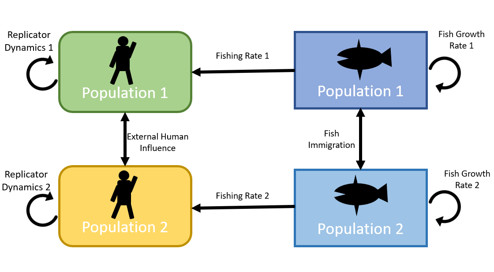

```{r setup, include=FALSE}
knitr::opts_chunk$set(echo = FALSE, warning = FALSE, message = FALSE, dev="cairo_pdf")

library(deSolve)
library(tidyverse)
library(ggplot2)
library(gridExtra)
library(kableExtra)
#library(ODEsensitivity)
library(FME)


#knitr::write_bib look into
setwd("C:/Users/sophi/Documents/GitHub/UNH_Docs/Proposal/Soc_Ecol_Model")

```

```{r, include=FALSE}
options(tinytex.verbose = TRUE)
```
\linenumbers

# ABSTRACT

NEED ABSTRACT

# INTRODUCTION

The study of social ecological models is a growing field in ecology as they treat human harvest as a variable as opposed to a set parameter. This allows for the study of how human decision making can change in response to environmental factors and in turn, change how humans interact with resources and profits. As human societies grow increasingly intricate and interconnected, these models can help us to analyze how our social structures can influence the environment around us [@liuCoupledHumanNatural2007]. These models provide important insight not only into how human decision making can influence the ecological processes but it can also show hidden processes, reveal regime shifts that would otherwise be hidden, and identify vulnerabilities of systems that don’t exist within the purely social or ecological models [@liuCoupledHumanNatural2007; @youngSolvingCrisisOcean2007; @ladeRegimeShiftsSocialecological2013]. Socio ecological models have even showed different dynamics at different scales and different amounts of human connectivity [@cummingNewDirectionsUnderstanding2017]. They can also be utilized in systems where data is difficult to collect, as parameters can be changed in order to analyze different hypothetical scenarios. Socio-ecological models can also inform effective policy decisions. Conservation plans often do not reach their conservation goals, and these setbacks are often attributed to a lack of stakeholder participation. This can be due to an emergence of conflict for stakeholders, where the conservation plan in place directly hinders their practices, therefore deterring them from participating in the restorative efforts. Socio-ecological models can identify where these areas of potential conflict can arise, compromises that can be made in the system, and alternative conservation practices that encourages participation from all stakeholder groups [@banSocialEcologicalApproach2013]. Further, as these models are simulations of human and environmental interactions, they allow flexibility in that they can be adapted to fit the specific system of study and improve place-based management practices [@youngSolvingCrisisOcean2007; @liuCoupledHumanNatural2007; @felipe-luciaConceptualizingEcosystemServices2022]

Due to their adaptability, socio-ecological models can use a wide range of strategies to represent human decision making. One such method is replicator dynamics, which model human decision making where an individual makes conservation decisions based on weighing the perceived benefits of conservation with the costs as well as the social pressure to conform to the group stance on conservation. Individuals will therefore "replicate" the behavior of their peers by changing their harvest practices based on the opinion of the majority [@bauchEvolutionaryGameTheory2012]. They have been used to show how social learning is a key component to vaccination uptake public health, and preexisting social norma can actually suppress vaccine uptake despite frequent disease outbreaks [@bauchEvolutionaryGameTheory2012; @orabyInfluenceSocialNorms2014]. They can also have conservation application as well as their application to pest invasion models have shown ways to simultaneously mitigate pest outbreaks and the cost to address them in the timber industry [@barlowModellingInteractionsForest2014]. Further, land use changes have been modeled to have completely different dynamics when human decision making was added to these models [@innesImpactHumanenvironmentInteractions2013].

PARAGRAPH ON THE EFFECT OF SOCIAL HEIRARCHIES ON DECISION MAKING - SEE SOURCES IN BARNES MAUTHER 2013. LOTS OF GOOD JUSTIFICATION FOR WHY YOU WOULD WANT TO STUDY THIS - NON HOMOGENEITY IN SOCIAL GROUPS

Below: BRING UP THAMPI, KHALIFA 2014 REPDYNAMICS IN NON-UNIFORM INTERACTIONS. ALSO TRAGEDY OF THE COMMONS IN MURRAY MASS 2015

Small scale fisheries are a particularly relevant system to apply replicator dynamics to fishing practices and policies are often made by communal decision makers. MAYBE MORE ABOUT HOW PEOPLE ARE MORE DIRECTLY RELIANT ON SSFS AND WILL THEREFORE HAVE STRONGER RESPONSES AND STRONGER SOCIAL STRUCTURES. Due to tight social structures, community decision making, and strong reliance on the environment, small scale fisheries are systems that are well represented by socio ecological models and replicator dynamics. Conservation efforts in small scale fisheries have often been unsuccessful, especially when the social and economic components of the industry have been ignored FIND SOURCE. However, even when human interactions and decision making have been considered, socio-ecological models have often treated individuals in human societies homogeneous. As human societies are often complex and hierarchical, this simplifying assumption that everyone interacts with the environment and within their community equally can lead to lack of participation in conservation by some groups within a community [@barnes-mautheTotalEconomicValue2013; @cummingNewDirectionsUnderstanding2017]. Mismanagement of fisheries have even been shown to exacerbate these inequalities (Mcpherson et al 2001 DOUBLE CHECK. IN BARNES MAUTHE, [@cinnerComanagementCoralReef2012]. Further, the specific dynamics of the fishery in question have been shown to be an important component to models, as models with multiple patches can actually mitigate overfishing if there is a high migratory ability of the harvested species [@cressmanReplicatorEquationOther2014] DOUBLE CHECK A COUPEL CRESSMANS.

Instituting effective conservation strategies can be especially difficult if the organism being protected has a migratory pattern that crosses over multiple SOMETHING such as country borders or JURISDICTIONS OR SOMETHING.  Borders can also create challenges when gathering population data that requires extensive fieldwork [@cozziAfricanWildDog2020, @hebblewhiteWolvesBordersTransboundary2020]. The fragmentation of management can also result in a mismatch of conservation strategies that become ineffective when these management BODIES do not coordinate efforts [@siddonsBordersBarriersChallenges2017]. Research on the importance of coordinated research efforts has been conducted on many species of terrestrial animals with large RANGES and have consistently shown that cooperation among government bodies is essential to protecting population health of highly migratory species or species whose native ranges expand across multiple countries [@plumptreTransboundaryConservationGreater2007; @gervasiCompensatoryImmigrationCounteracts2015; @meisingsetSpatialMismatchManagement2018]. Because fish are generally highly migratory, this issue is especially relevant in international waters or waters where different government bodies share jurisdiction [@mchichDynamicsFishStock2000]. In fact, human activities beyond fishing, such as pollution or development activity, has been shown to affect FISHING IN OTHER PLACES [@siddonsBordersBarriersChallenges2017] ( AND FIND POLLUTION ONE). For this reason, research on two patch fishing models is a commonly used method as it allows for WHATEVER. Previous research on two-patch fishing models has shown that movement rates between patches can effect population stability when there is different fishing pressures in each patch [@mchichDynamicsFishStock2000; caiMODELINGANALYSISHARVESTING2008]. Economic output can also be maximized in multi-patch fishing models as high dispersal can result in a higher overall yield of the system than the yield of each patch combined [@augerIncreaseMaximumSustainable2022]. High dispersal across patches is commonly found to be an essential COMPONENT to maximizing population health and economic gain from fishing [@freedmanMathematicalModelsPopulation1977; @moellerECONOMICALLYOPTIMALMARINE2015; @augerIncreaseMaximumSustainable2022]. Two patch models help us to understand better the population dynamics of fish species who face different pressures in each patch and have even resolved conflicts between fishing groups [@mchichDynamicsFishStock2000]. However, no previous research has combined two patch fishing models with a human REPLICATOR DYNAMICS WITH SOCIAL HIERARCHY in order to SOMETHING ABOUT SELF RESOLVING CONFLICTS. 

In this study, we couple a human-decision replicator dynamics model with social hierarchies with a two-patch fishing model in order to understand how decision making. The objectives of this study are: 1) to compare the output of this model with that of previous replicator dynamics studies without spatial or social heirarchical componenets, 2) Find the effects of social heirarchies in decision making and how that effects fishing dynamics 3) determine the significance of fish dispersal in our two patch model.

# METHODS

```{r Conceptual, echo = FALSE, results = "asis", fig.cap = '(ref:conceptual) \\label{Conceptual}'}



```

(ref:conceptual) A conceptual representation of our model.

## Model Construction

We build on the work of @bauchEarlyWarningSignals2016 by extending their approach to a two-patch model via the conceptual representation in figure \ref{LifeGraph}. The fish population models are as follows:

$\frac{dF_1}{dt} = r_1F_1(1-F_1)-\frac{h_1*F_1}{F_1 + s_1} -i_2F_1 + i_1F_2$

$\frac{dF_2}{dt} = r_2F_2(1-F_2)-\frac{h_2*F_2}{F_2 + s_2} -i_1F_2 + i_2F_1$

Where the change in fish populations is dependent on r, the net population growth of each patch, and both populations follow logistic growth. The second term: $\frac{h*F}{F + s}$, denotes fish lost to human activity. h is the harvesting efficiency of the respective human population and s controls the supply and demand of the fishery. Because we are now working with a two-patch model, the i parameter denotes the immigration out of each patch and into the other. In this study, we are assuming a closed population between the two patches. Therefore, fish move directly from patch to patch and do not disperse elsewhere.

For the model of human activity and opinion, we used replicator dynamics from evolutionary game theory to simulate societal influence on an individual’s opinion. Social dynamics are represented by the proportion of conservationists in a population (X) and the proportion of harvesters (1-X). These two groups interact with one another using the term (X)(1-X) which simulates individuals “sampling” other individuals in the population. If one opinion dominates in the population (i.e. X >> (1-X) or (1-X) >> X), the rate of changing opinions will be slow as the power of societal pressure makes it challenging for the other opinion to gain traction. However, if X and (1-X) are close, the rate of change in opinion will be high as society has a split opinion on conservation vs harvest. In this model, each person holds an opinion (conservation or harvest) by weighing the benefits of conservation ($U_A$) against the benefits of harvest ($U_B$). This gives the replicator equation:

$X(1-X)[U_A - U_B]$

$X(1-X)[\Delta U]$


As individuals “sample” others in their group, they can switch from A to B if $U_B$ > $U_A$ and vice versa. In our model, we adapt $U_A$ from Bauch 2016 with the added influence of the other population's opinion. $U_A$ is therefore given by:

$U_{A,1} = \frac{1}{(F_1 + c_1)} + d_1X_1 + \rho_1 X_2$

$U_{A,2} = \frac{1}{(F_2 + c_2)} + d_2X_2 + \rho_2 X_1$

Where $\frac{1}{(F + c)}$ represents the perceived rarity of fish populations within a patch. As F and c (the rarity valuation parameter) decrease, this term will increase, therefore adding to the perceived benefit of protecting fish populations. d refers to the social influence that each population has on itself, and as an individual encounters a conservationist (X), the social benefit of also being a conservationist is shown in d. $\rho$ has this similar effect, but denotes the social effect on the opposite population on decision making. Individuals in each population are receiving information about the conservation practices of the other, and the influence that this has on each population is encapsulated by $\rho$.

$U_B$ (the perceived benefits of harvest) is:

$U_{B,1} = \omega_1 + d_1(1-X_1) + \rho_1(1-X_2)$

$U_{B,2} = \omega_2 + d_2(1-X_2) + \rho_2(1-X_1)$

Where $\omega$ is the cost of conservation (i.e. revenue lost by not fishing) where now, d is the social benefit of swithcing to harvesting (1-X) and $\rho_1$ is the other population's ability to change the opinion of an individual to be a harvester.

Plugging equations $U_A$ and $U_B$ into the replicator equation gives:

$\frac{dX_1}{dt} =  k_1X_1(1-X_1) [\frac{1}{F_1+c_1} - \omega_1 + d_1(2X_1 - 1) + \rho_1(2X_2 - 1)]$

$\frac{dX_2}{dt} = k_2X_2(1-X_2)  [\frac{1}{F_2+c_2} - \omega_2 + d_2(2X_2 - 1) +  \rho_2(2X_1 - 1)]$

Where specifics of the derivation are outlined in the appendix. Coupling the fish population and human opinion models gives:

$\frac{dF_1}{dt} = r_1F_1(1-F_1)-\frac{h_1*F_1(1-X_1)}{F_1 + s_1} -i_2F_1 + i_1F_2$

$\frac{dF_2}{dt} = r_2F_2(1-F_2)-\frac{h_2*F_2(1-X_2)}{F_2 + s_2} -i_1F_2 + i_2F_1$

$\frac{dX_1}{dt} =  k_1X_1(1-X_1) [\frac{1}{F_1+c_1} - \omega_1 + d_1(2X_1 - 1) + \rho_1(2X_2 - 1)]$

$\frac{dX_2}{dt} = k_2X_2(1-X_2)  [\frac{1}{F_2+c_2} - \omega_2 + d_2(2X_2 - 1) +  \rho_2(2X_1 - 1)]$

Where the fishing pressure is now a function of the number of harvesters in a population ($\frac{hF(1-X)}{F + s}$). Further, the opinion of each population will shift based on the perceived fish stock health of their respective patch weighed against the costs and benefits of conservation. As fish stocks decrease, individuals will sway more toward conservation, thereby relieving this fishing pressure. However, we now have an external influence in this model: the opinions of people in the other population. The strength of this external influence is $\rho$, and in this study, we plan to simulate inequalities in human societies with this parameter.

## Fish Parameters

For our basic analysis, we chose to model a two-patch fishery where the harvested fish species has a mid-range growth rate and regularly diffuses across the two patches. From the human side, the two groups of fishers have the same social influence on one another, representing a non-hierarchical social structure. The default fish growth rate of both patches is 0.35 fish per year.  For the harvesting efficiency, we chose a maximal fishing rate of 0.5. These numbers were adapted from a coral reef fishing model @thampiSocioecologicalDynamicsCaribbean2018 where r = 0.35 and h = 0.5 are the mid-level growth rate and max fishing rates analyzed by this paper. For the emigration and immigration parameters, we chose 0.2 for each as these are the values used in the two-patch fishing model described in @caiMODELINGANALYSISHARVESTING2008. We used the s parameter described in the @bauchEarlyWarningSignals2016 model of s = 0.8.

## Human Parameters

The rate at which humans interact with one another is described by the parameter k. In our default model, we used k = 1.014 as adapted from the @thampiSocioecologicalDynamicsCaribbean2018default model. We used the default rarity valuation parameter c from @thampiSocioecologicalDynamicsCaribbean2018 where c = 1.68. The cost of conservation default parameter is $\omega$ = 0.35 from @bauchEarlyWarningSignals2016. Further, as our default model will have no human social hierarchy, we d = $\rho$ = 0.5 for our social learning rate as adapted from @bauchEarlyWarningSignals2016 which models social decision making regarding deforestation.

```{r params_Default, echo = FALSE}

param_names <- c("r_1", "s_1", "h_1", "k_1", "w_1", "c_1", "d_1", "i_1", "rho_1",
                 "r_2", "s_2", "h_2", "k_2", "w_2", "c_2", "d_2", "i_2", "rho_2")

params_default <- data.frame(r_1 = 0.35, s_1 = 0.8, h_1 = 0.5, k_1 = 1.014, w_1 = 0.35, c_1 = 1.5, d_1 = 0.5, i_1 = 0.2, rho_1 = 0.5,
                             r_2 = 0.35, s_2 = 0.8, h_2 = 0.5, k_2 = 1.014, w_2 = 0.35, c_2 = 1.5, d_2 = 0.5, i_2 = 0.2, rho_2 = 0.5)

starting_defaultparams <- c(F_1 = 0.406, F_2 = 0.406, X_1 = .24, X_2 = .24)
timespan <- seq(from = 0, to = 100, by = .1)

```

## Analyses

Write this once you know

# RESULTS

First, we compared the dynamics of the uncoupled fish model with that of the socio-ecological model by setting the (1-X) variable to a set parameter. We found that fish populations remained stable as long as the proportion of the populations remained 50% or lower (figure \ref{uncoupledFishModel}a). NOTE: DO WE WANT TO HAVE ANOTHER FIGURE THAT SHOWS WHAT HAPPENS OVER 50%? This shows that given our default parameters, only half of individuals from each patch can fish at one time. However, if the distribution of fishers between patches was uneven, with one patch being fished sustainably and the other experiencing overfishing, both patches were able to recuperate stable population dynamics as the immigration parameter allowed for the overfished patch to benefit from fish coming from the other patch (figure \ref{uncoupledFishModel}b). Figure \ref{CoupledModel} shows our coupled socio-ecological model where replicator dynamics influence how many individuals are fishing. Here, the human population maintains fishing levels over 50% for each patch, thereby overfishing both patches.

(ref:fishUncoupled) Fish model uncoupled from social dynamics

```{r uncoupledFishModel, results = 'asis', echo = FALSE, fig.show = "hold", out.width = "50%", fig.cap = '(ref:fishUncoupled) \\label{uncoupledFishModel}'}

ModelNoSocial <- function (t, y, params) {
  ## first extract the state variables
  F_1 <- y[1] #Fish Pop var
  F_2 <- y[2] #Fish Pop var

  #TT <- y[5]
  
  ## now extract the parameters
  r_1 <- params["r_1"] # Net growth/fecundity
  s_1 <- params["s_1"] # supply and demand
  h_1 <- params["h_1"] # Harvesting efficiency
  prop_1 <- params["prop_1"]
 
  r_2 <- params["r_2"] # Net growth/fecundity
  s_2 <- params["s_2"] # supply and demand
  h_2 <- params["h_2"] # Harvesting efficiency
  prop_2 <- params["prop_2"]
  
  i_1 <- params["i_1"] # Inflow of fish from pop 2 to pop 1
  i_2 <- params["i_2"] # Inflow of fish from pop 1 to pop 2

  ## now code the model equations
  dF_1dt <-  r_1 * F_1 * (1-F_1) - (h_1 * F_1 * prop_1)/(F_1+s_1) - i_2 * F_1 + i_1 * F_2
  dF_2dt <-  r_2 * F_2 * (1-F_2) - (h_2 * F_2 * prop_2)/(F_2+s_2) - i_1 * F_2 + i_2 * F_1

  
  ## combine results into a single vector
  dydt <- c(dF_1dt, dF_2dt)
  ## return result as a list!
  
  list(dydt)
}

params_uncoupled1 <- data.frame(r_1 = params_default$r_1, s_1 = params_default$s_1, h_1 = params_default$h_1, i_1 = params_default$i_1,
                            r_2 = params_default$r_2, s_2 = params_default$s_2, h_2 = params_default$h_2, i_2 = params_default$i_2, prop_1 = .5, prop_2 = .5)

params_uncoupled2 <- data.frame(r_1 = params_default$r_1, s_1 = params_default$s_1, h_1 = params_default$h_1, i_1 = params_default$i_1,
                            r_2 = params_default$r_2, s_2 = params_default$s_2, h_2 = params_default$h_2, i_2 = params_default$i_2, prop_1 = .75, prop_2 = .25)

times <- timespan
xstart <- c(F_1 = 0.406, F_2 = 0.406) # See supplemental data for other starting params

ode(
  func=ModelNoSocial,
  y=xstart,
  times=times,
  parms=params_uncoupled1
) %>% as.data.frame() -> out_Uncoupled1

out_Uncoupled1 %>%
  gather(variable,value,-time) %>%
  ggplot(aes(x=time,y=value,color=variable))+
  geom_line(size=1)+
  theme_classic()+
  ggtitle('a)') +
  labs(x='time (yr)',y='pop') #theme(plot.title = element_text(vjust = - 10)) #Add if you need to adjust title

ode(
  func=ModelNoSocial,
  y=xstart,
  times=times,
  parms=params_uncoupled2
) %>% as.data.frame() -> out_Uncoupled2

out_Uncoupled2 %>%
  gather(variable,value,-time) %>%
  ggplot(aes(x=time,y=value,color=variable))+
  geom_line(size=1)+
  theme_classic()+
  ggtitle('b)') +
  labs(x='time (yr)',y='pop')


```

(ref:coupledmodel) Fish model uncoupled from social dynamics

```{r CoupledModel, fig.cap = '(ref:coupledmodel) \\label{CoupledModel}'}

Bauch.Coupled <- function (t, y, params) {
  ## first extract the state variables
  F_1 <- y[1] #Fish Pop var
  F_2 <- y[2] #Fish Pop var
  X_1 <- y[3] #conservationist var
  X_2 <- y[4] #conservationist var

  #TT <- y[5]
  
  ## now extract the parameters
  r_1 <- params["r_1"] # Net growth/fecundity
  s_1 <- params["s_1"] # supply and demand
  h_1 <- params["h_1"] # Harvesting efficiency
  k_1 <- params["k_1"] # Social learning rate
  w_1 <- params["w_1"] # conservation costs
  c_1 <- params["c_1"] # rarity valuation param
  d_1 <- params["d_1"] # social norm strength
  
  r_2 <- params["r_2"] # Net growth/fecundity
  s_2 <- params["s_2"] # supply and demand
  h_2 <- params["h_2"] # Harvesting efficiency
  k_2 <- params["k_2"] # Social learning rate
  w_2 <- params["w_2"] # conservation costs
  c_2 <- params["c_2"] # rarity valuation param
  d_2 <- params["d_2"] # social norm strength 
  
  i_1 <- params["i_1"] # Inflow of fish from pop 2 to pop 1
  i_2 <- params["i_2"] # Inflow of fish from pop 1 to pop 2
  rho_1 <- params["rho_1"] # Influence of pop 2 on pop 1
  rho_2 <- params["rho_2"] # Influence of pop 1 on pop 2
  
  ## now code the model equations
  dF_1dt <-  r_1 * F_1 * (1-F_1) - (h_1 * F_1 * (1-X_1))/(F_1+s_1) - i_2 * F_1 + i_1 * F_2
  dF_2dt <-  r_2 * F_2 * (1-F_2) - (h_2 * F_2 * (1-X_2))/(F_2+s_2) - i_1 * F_2 + i_2 * F_1
  
  dX_1dt <- k_1 * X_1 * (1-X_1) *(1/(F_1 + c_1) - w_1 + d_1*(2*X_1 - 1) + rho_1 * (2*X_2 - 1))
  dX_2dt <- k_2 * X_2 * (1-X_2) *(1/(F_2 + c_2) - w_2 + d_2*(2*X_2 - 1) + rho_2 * (2*X_1 - 1))
  
  ## combine results into a single vector
  dydt <- c(dF_1dt, dF_2dt, dX_1dt, dX_2dt)
  ## return result as a list!
  
  list(dydt)
}

params_Bauch2 <- params_default

times <- timespan
xstart <- starting_defaultparams # See supplemental data for other starting params

ode(
  func=Bauch.Coupled,
  y=xstart,
  times=times,
  parms=params_Bauch2
) %>%
  as.data.frame() -> out_Coupled

out_Coupled %>%
  gather(variable,value,-time) %>%
  ggplot(aes(x=time,y=value,color=variable))+
  geom_line(size=1)+
  theme_classic()+
  labs(x='time (yr)',y='pop')

```

Next, we altered the parameters to reflect sustainable fishing practices as shown in table \ref{SocParamTable} in order to create a healthy system (Figure \ref{SocialScenario}). Next, we simulated scenarios where one patch’s practices were so unsustainable that both patches began to move toward stock collapse (Figure \ref{SocialScenario_Unsustainable}). This is different than the uncoupled model, where unsustainable practices could be mitigated by immigration from the other patch of fish stock. Instead, because of the parameters used in this analysis, humans keep fishing despite lower yields due to their influence over one another. Therefore, in order to improve fishing conditions for both patches, we explored how changing human parameters can influence the dynamics of the whole system. We found, for example, that decreasing the rarity valuation parameter from 1.5 to 0.25 is sufficient to prevent population collapse (Figure \ref{SocialScenario_Revive}).
GET BAUCH MODEL 11 TO RUN AND THEN PUT THESE PARAMS THOUGH TO SEE WHICH ARE INFLUENCING

```{r SocParamTable, results = 'asis', echo = FALSE}

params_social <- params_default
params_social$r_1 <- 0.4
params_social$r_2 <- 0.4
params_social$w_1 <- 0.2
params_social$w_2 <- 0.2
params_social$h_1 <- 0.25
params_social$h_2 <- 0.25

# params_social$c_1 <- 0.25
# params_social$c_2 <- 0.25


giveparams <- data.frame(matrix(, nrow = 9, ncol = 4))
colnames(giveparams) <- c("Parameter", "Population_1", "Population_2", "Def")

giveparams$Parameter <- c("r", "s", "h", "k", "$\\omega$", "c", "d", "i", "$\\rho$")
giveparams$Population_1 <- c(params_social[1:9])
giveparams$Population_2 <- c(params_social[10:18])

giveparams$Def <- c("Fish net growth",
                    "Supply and demand",
                    "Harvesting efficiency",
                    "Social learning rate",
                    "Conservation cost",
                    "Rarity valuation",
                    "Social norm strength (within pop)",
                    "Fish immigration (from patch)",
                    "Social norm strength (opposite pop)")

knitr::kable(giveparams, format = "latex", booktabs = TRUE, caption = "(ref:socparamtable) \\label{SocParamTable}")

```

(ref:socparamtable) Parameters used to model a sustainable fishery

```{r SocialScenario, fig.cap =  '(ref:socialscenario) \\label{SocialScenario}'}


ode(
  func=Bauch.Coupled,
  y=xstart,
  times=times,
  parms=params_social
) %>%
  as.data.frame() -> out_social

out_social %>%
  gather(variable,value,-time) %>%
  ggplot(aes(x=time,y=value,color=variable))+
  geom_line(size=1)+
  theme_classic()+
  labs(x='time (yr)',y='pop')

#Social inequity scenario where rho_1 = 0.25 and h_1 = 1

```

(ref:socialscenario) Changing fish growth, conservation cost, and harvesting efficiency for sustainable practices

```{r SocialScenario_Unsustainable, fig.cap = '(ref:ss_unsustainable) \\label{SocialScenario_Unsustainable}'}

params_social$r_1 <- 0.4
params_social$r_2 <- 0.35
params_social$w_1 <- 0.2
params_social$w_2 <- 0.35
params_social$h_1 <- 0.25
params_social$h_2 <- 0.5

ode(
  func=Bauch.Coupled,
  y=xstart,
  times=times,
  parms=params_social
) %>%
  as.data.frame() -> out_social

out_social %>%
  gather(variable,value,-time) %>%
  ggplot(aes(x=time,y=value,color=variable))+
  geom_line(size=1)+
  theme_classic()+
  labs(x='time (yr)',y='pop')

#Social inequity scenario where rho_1 = 0.25 and h_1 = 1

```

(ref:ss_unsustainable) One group unsustainable practices scenario. Shows that one groups bad fishing can tank whole system  MAYBE PUT IN WHICH PARAMS CHANGED

```{r SocialScenario_Revive, fig.cap = '(ref:ss_revive) \\label{SocialScenario_Revive}'}

params_social$c_1 <- 0.25
params_social$c_2 <- 0.25

ode(
  func=Bauch.Coupled,
  y=xstart,
  times=times,
  parms=params_social
) %>%
  as.data.frame() -> out_social

out_social %>%
  gather(variable,value,-time) %>%
  ggplot(aes(x=time,y=value,color=variable))+
  geom_line(size=1)+
  theme_classic()+
  labs(x='time (yr)',y='pop')

#Social inequity scenario where rho_1 = 0.25 and h_1 = 1

```

(ref:ss_revive) changing the rarity valuation parameters can recover the system WRITE WHAT IT IS

Next, we tested our hypotheses that social hierarchy can change the system’s dynamics by running several scenarios and comparing the effect that changes in $\rho$ can have on the model. We found, contrary to our predictions, that social hierarchy tended to not have significant overall influences on the model. Table \ref{heirparamtable} shows the parameters used in this analysis. We found that due to a decrease in $\rho_1$, fishers in patch 1 exhibited more conservation practices for a longer amount of time (Figure \ref{HeirScenario}) yet still eventually overfished their patch. This is consistent with many other scenarios we ran, and shows that differences in $\rho_1$ vs $\rho_2$ has a lower influence on this model than other parameters. Further, as none of the scenarios we ran showed oscillations in the proportion of conservationists in each patch, this shows that the non-linear dynamics of the system become less significant as multiple patches to the model.

```{r heirparamtable, results = 'asis', echo = FALSE}

params_heir <- params_default
params_heir$h_2 <- 0.25
params_heir$k_1 <- 0.17
params_heir$i_1 <- 0.1
params_heir$i_2 <- 0.4
#params_heir$rho_1 <- .1


# params_social$c_1 <- 0.25
# params_social$c_2 <- 0.25


giveparams <- data.frame(matrix(, nrow = 9, ncol = 4))
colnames(giveparams) <- c("Parameter", "Population_1", "Population_2", "Def")

giveparams$Parameter <- c("r", "s", "h", "k", "$\\omega$", "c", "d", "i", "$\\rho$")
giveparams$Population_1 <- c(params_heir[1:9])
giveparams$Population_2 <- c(params_heir[10:18])

giveparams$Def <- c("Fish net growth",
                    "Supply and demand",
                    "Harvesting efficiency",
                    "Social learning rate",
                    "Conservation cost",
                    "Rarity valuation",
                    "Social norm strength (within pop)",
                    "Fish immigration (from patch)",
                    "Social norm strength (opposite pop)")

knitr::kable(giveparams, format = "pandoc", booktabs = TRUE, caption = "Default parameter values used in this analysis")

```

```{r HeirScenario, , results = 'asis', echo = FALSE, fig.show = "hold", out.width = "50%", fig.cap = '(ref:heirscenario) \\label{HeirScenario}'}

ode(
  func=Bauch.Coupled,
  y=xstart,
  times=seq(from = 0, to = 200, by = .1),
  parms=params_heir
) %>%
  as.data.frame() -> out_heir

out_heir %>%
  gather(variable,value,-time) %>%
  ggplot(aes(x=time,y=value,color=variable))+
  geom_line(size=1)+
  theme_classic()+
  ggtitle('a)') +
  labs(x='time (yr)',y='pop')


params_heir$rho_1 <- .1

ode(
  func=Bauch.Coupled,
  y=xstart,
  times=seq(from = 0, to = 200, by = .1),
  parms=params_heir
) %>%
  as.data.frame() -> out_heir

out_heir %>%
  gather(variable,value,-time) %>%
  ggplot(aes(x=time,y=value,color=variable))+
  geom_line(size=1)+
  theme_classic()+
  ggtitle('b)') +
  labs(x='time (yr)',y='pop')
```

(ref:heirscenario) blah

After finding that social influence is a less substantial parameter in this model, we tested how significant fish dispersion was in the system. We found that it has a huge overall effect on the system’s dynamics. Here, we modeled sustainable fishing in patch 1 and unsustainable fishing in patch 2 (Table \ref{dispersionparamtable}) with no dispersion (Figure \ref{DispersionScenario}) and very little dispersion (Figure \ref{DispersionScenario_Slow}). We found that even small amounts of dispersion are enough to recuperate crashed fish stocks in patch 2. On the other hand, no changes to d or rho could have the same effect. This shows that our immigration parameters have a significantly stronger influence than any social dynamics
DOULBE CHECKGOING OUT 200 YEARS 


```{r dispersionparamtable, results = 'asis', echo = FALSE}

params_dispersion <- params_default
params_dispersion$r_1 <- 0.4
#params_dispersion$r_2 <- 0.4
params_dispersion$w_1 <- 0.2
#params_dispersion$w_2 <- 0.2
params_dispersion$h_1 <- 0.25
#params_dispersion$h_2 <- 0.25
params_dispersion$i_1 <- 0
params_dispersion$i_2 <- 0

giveparams <- data.frame(matrix(, nrow = 9, ncol = 4))
colnames(giveparams) <- c("Parameter", "Population_1", "Population_2", "Def")

giveparams$Parameter <- c("r", "s", "h", "k", "$\\omega$", "c", "d", "i", "$\\rho$")
giveparams$Population_1 <- c(params_dispersion[1:9])
giveparams$Population_2 <- c(params_dispersion[10:18])

giveparams$Def <- c("Fish net growth",
                    "Supply and demand",
                    "Harvesting efficiency",
                    "Social learning rate",
                    "Conservation cost",
                    "Rarity valuation",
                    "Social norm strength (within pop)",
                    "Fish immigration (from patch)",
                    "Social norm strength (opposite pop)")

knitr::kable(giveparams, format = "pandoc", booktabs = TRUE, caption = "Default parameter values used in this analysis")

```

```{r DispersionScenario, fig.cap = '(ref:dispersionscenario) \\label{DispersionScenario}'}


ode(
  func=Bauch.Coupled,
  y=xstart,
  times=times,
  parms=params_dispersion
) %>%
  as.data.frame() -> out_dispersion

out_dispersion %>%
  gather(variable,value,-time) %>%
  ggplot(aes(x=time,y=value,color=variable))+
  geom_line(size=1)+
  theme_classic()+
  labs(x='time (yr)',y='pop')

#Social inequity scenario where rho_1 = 0.25 and h_1 = 1

```

(ref:dispersionscenario) no dispersion. Unsustainable practices in one patch

```{r DispersionScenario_Slow, fig.cap = '(ref:dispersionscenario_Slow) \\label{DispersionScenario_Slow}'}

params_dispersion$i_1 <- 0.1
params_dispersion$i_2 <- 0.1


ode(
  func=Bauch.Coupled,
  y=xstart,
  times=times,
  parms=params_dispersion
) %>%
  as.data.frame() -> out_dispersion

out_dispersion %>%
  gather(variable,value,-time) %>%
  ggplot(aes(x=time,y=value,color=variable))+
  geom_line(size=1)+
  theme_classic()+
  labs(x='time (yr)',y='pop')

#Social inequity scenario where rho_1 = 0.25 and h_1 = 1

```

(ref:dispersionscenario_Slow) Slow dispersion where $i$ = 0.1. Unsustainable practices in one patch. Note: no adjustment to rho or d could fix fishing scenario

In order to test how the rho parameter influences the model, we ran a series of parameter planes with each variable paired with changes in rho. We found that at no point, did rho have an effect on the sustainability of the fish population (Fig whatevs). This shows that the outside social influence in our model actually has little effect on fishing practices. ALSO D

INSERT PROP PARAM PLANE (lol when it starts working again) HERE TO SHOW NOT USEFUL

\newpage

Ok so it’s graphs like this that are super confusing. Why does patch 1 have 100% conservationists but 100%fish and vice versa?? In this graph rho = 0 so there should not be any outside influence.

```{r dispersionscenario_norho, fig.cap = "No social dynamics. Taking away rho doesn't really improve dynamics, but instead allows pop1 to take advantage of their sustainable fishing"}
params_dispersion <- params_default
params_dispersion$r_1 <- 0.4
#params_dispersion$r_2 <- 0.4
params_dispersion$w_1 <- 0.2
#params_dispersion$w_2 <- 0.2
params_dispersion$h_1 <- 0.25
#params_dispersion$h_2 <- 0.25
params_dispersion$rho_1 <- 0
params_dispersion$rho_2 <- 0
params_dispersion$i_1 <- 0
params_dispersion$i_2 <- 0


ode(
  func=Bauch.Coupled,
  y=xstart,
  times=times,
  parms=params_dispersion
) %>%
  as.data.frame() -> out_dispersion

out_dispersion %>%
  gather(variable,value,-time) %>%
  ggplot(aes(x=time,y=value,color=variable))+
  geom_line(size=1)+
  theme_classic()+
  labs(x='time (yr)',y='pop')

#Social inequity scenario where rho_1 = 0.25 and h_1 = 1

```

\newpage


