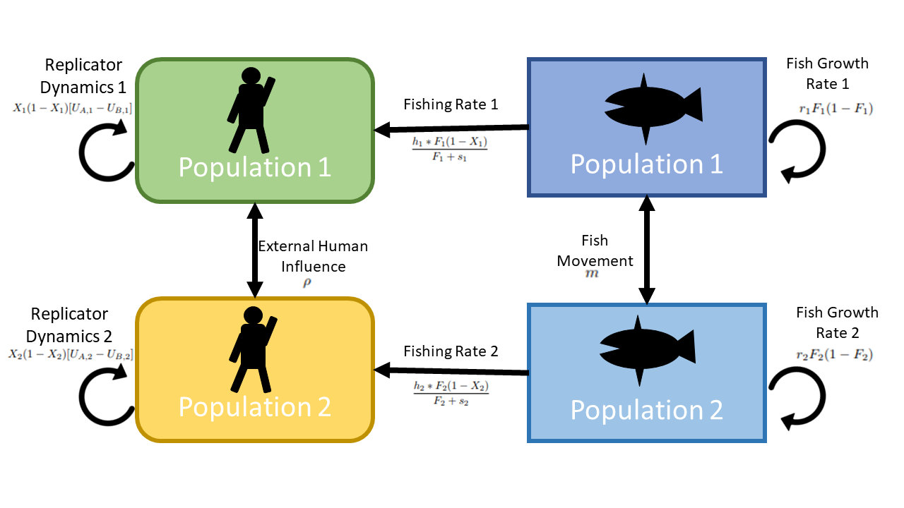

---
output:
  bookdown::pdf_document2:
    fig_caption: yes
    toc: no
  pdf_document:
    toc: no
  bookdown::html_document2:
    fig_caption: yes
    toc: no
  word_document: default
bibliography:
- Ch2_citations.bib
- R_Citations.bib
header-includes: \usepackage{setspace}\doublespacing \usepackage{lineno} \usepackage{placeins}
---

\setcounter{page}{27}

\begin{center}
	
\textbf{\Large Social-ecological models with social hierarchy and space applied to small scale fisheries}
	
\textsc{Sophie Wulfing$^{1*}$ and Easton R. White$^{1}$\\}
\vspace{3 mm}
\normalsize{\indent $^1$Department of Biological Sciences, University of New Hampshire, 03824, NH, USA\\}
$\text{*}$ Corresponding authors: Sophie Wulfing (SophieWulfing@gmail.com) and Dr. Easton White (Easton.White@unh.edu)
\end{center}

\newpage

```{r setup, include=FALSE}
knitr::opts_chunk$set(echo = FALSE, warning = FALSE, message = FALSE, dev="cairo_pdf", cache = TRUE)

library(deSolve)
library(tidyverse)
library(ggplot2)
library(gridExtra)
library(kableExtra)
library(FME)
library(ggpubr)

setwd("C:/Users/sophi/Documents/GitHub/UNH_Docs/Proposal/Soc_Ecol_Model")

```

```{r, include=FALSE}
options(tinytex.verbose = TRUE)
```
\linenumbers

# ABSTRACT

Socio-ecological models combine models of ecological systems with human social dynamics in order to better understand human interaction with the environment.  One such model of human behavior is replicator dynamics. Replicator dynamics are derived from evolutionary game theory and model how societal influence and financial costs can change opinions about resource extraction. Previous research on replicator dynamics have shown how evolving opinions on conservation can change how humans interact with their environment and therefore change population dynamics of the harvested species. However, these models have all assumed that human societies are homogeneous with no social structure. In this study, we develop a two-patch socio-ecological model with social hierarchy in order to study the effect that social inequity has on decision making. We also analyzed the spatial components of this two-patch model and observed the effect of fish movement on decision making and fish population dynamics. We found that, contrary to our hypothesis, social influences became less significant in our two patch model. Instead, we found that fish movement across patches was a major driver of changes to population dynamics. This indicates the importance of including spatial components to socio-ecological models. Further, this study highlights the importance of understanding species movements when making conservation decisions.

# INTRODUCTION

The study of social ecological models is a growing field in ecology as they treat human behavior as a variable as opposed to a set parameter. This allows for the study of how human decision making can change in response to environmental factors and in turn, change how humans interact with resources and profits [@bauchImitationDynamicsPredict2005; @innesImpactHumanenvironmentInteractions2013a; @orabyInfluenceSocialNorms2014; @bauchEarlyWarningSignals2016; @sigdelCompetitionInjunctiveSocial2017a; @thampiSocioecologicalDynamicsCaribbean2018]. As human societies grow increasingly intricate and interconnected, these models can help us to analyze how our social structures can influence the environment around us [@liuCoupledHumanNatural2007]. These models provide important insight not only into how human decision making can influence the ecological processes but it can also show hidden processes, reveal regime shifts that would otherwise be hidden, and identify vulnerabilities of systems that don’t exist within the purely social or ecological models [@liuCoupledHumanNatural2007; @youngSolvingCrisisOcean2007; @ladeRegimeShiftsSocialecological2013]. Socio-ecological models have even showed different dynamics at different scales and different amounts of human connectivity [@cummingNewDirectionsUnderstanding2017]. They can also be utilized in systems where data is difficult to collect, as parameters can be changed in order to analyze different hypothetical scenarios. Socio-ecological models can also inform effective policy decisions. Conservation plans often do not reach their conservation goals, and these setbacks are often attributed to a lack of stakeholder participation [@cronaWhatYouKnow2006; @salasViabilitySustainabilitySmallScale2019; @princeSpawningPotentialSurveys2021]. This can be due to an emergence of conflict for stakeholders, where the conservation plan in place directly hinders their practices, therefore deterring them from participating in the restorative efforts. Socio-ecological models can identify where these areas of potential conflict can arise, compromises that can be made in the system, and alternative conservation practices that encourages participation from all stakeholder groups [@banSocialEcologicalApproach2013]. Further, as these models are simulations of human and environmental interactions, they allow flexibility in that they can be adapted to fit the specific system of study and improve place-based management practices [@youngSolvingCrisisOcean2007; @liuCoupledHumanNatural2007; @felipe-luciaConceptualizingEcosystemServices2022]

Due to their adaptability, socio-ecological models can use a wide range of strategies to represent human decision making. One such method is replicator dynamics, which model human decision making where an individual makes conservation choices based on weighing the perceived benefits of conservation with the costs, as well as the social pressure to conform to the group's stance on conservation. Individuals will therefore "replicate" the behavior of their peers by changing their harvest practices based on the opinion of the majority [@bauchEvolutionaryGameTheory2012]. They have been used to show how social learning is a key component to vaccination uptake public health, and preexisting social norms can actually suppress vaccine uptake despite frequent disease outbreaks [@bauchEvolutionaryGameTheory2012; @orabyInfluenceSocialNorms2014]. They can also have conservation applications as pest invasion models have shown ways to simultaneously mitigate pest outbreaks and the cost to address them in the timber industry [@barlowModellingInteractionsForest2014]. Further, land use changes have been modeled to have completely different dynamics when human decision making was added to these models [@innesImpactHumanenvironmentInteractions2013a]. However, all previous models of human behavior have assumed that human societies are homogeneous, and all people are subject to the same social influence and ecological dynamics. No replicator-dynamics model has incorporated social inequality or hierarchy, despite the fact the most human societies have varying levels of social influence within them.

Contrary to this assumption made by previous models that human groups are homogeneous, the vast majority of real-world societies exhibit some form of hierarchy or inequality. Societies with different social subgroups can often exhibit an “us vs. them” mentality and compete for resources [@borgattiNetworkParadigmOrganizational2003]. This is because social status can greatly alter peoples’ interaction with the environment. Competition over resources has been shown to be exacerbated by social hierarchies and ‘top-down’ regulation whereas when social connectivity is considered in management plans, this has been shown to not only improve management outcomes, but reduce costs as well [@krackhardtInformalNetworksOrganizational1988; @graftonSocialCapitalFisheries2005; @bodinRoleSocialNetworks2009]. Further, members of social networks have been shown to have varying levels of connectivity with others based on attributes such as ethnicity, and this can in turn alter an individual’s relationship with the environment and their views on conservation [@barnes-mautheTotalEconomicValue2013; @sariMonitoringSmallscaleFisheries2021]. @barnes-mautheTotalEconomicValue2013 also showed that fishing communities can exhibit homophily, which is the tendency for people to obtain information and opinions from those who are similar to themselves before seeking views from those who are perceived as different. Therefore, people in different social groups may be receiving different information and opinions about conservation and acting accordingly [@mcphersonBirdsFeatherHomophily2001]. For example in Kenya, communication among fishers has been shown to stay within groups using the same gear type which has inhibited successful regulation of the whole fishery [@cronaWhatYouKnow2006]. Further, in the southwest Madagascar octopus fishery, fishing method and location typically falls along gendered lines. When fishing restrictions were imposed on tidal flats, this affected fishing access for women while maintaining this livelihood for male fishers [@baker-medardGenderingMarineConservation2017]. In Thailand, ethnicity has been shown to be a source of fishing conflict which has exacerbated resource depletion [@pomeroyFishWarsConflict2007]. The existence of social structures is extremely prevalent in human societies and this has been shown to alter how people interact with the environment. However, there has been no previous replicator dynamics study that considers how social hierarchies alters harvest practices.

Small scale fisheries are a particularly relevant system to apply replicator dynamics as fishing practices and policies are often made by communal decision makers. Research on small-scale fisheries is a growing and essential field as they are drastically understudied yet affect many people around the globe. Worldwide, about 32 million fishers make their livelihood in small-scale fisheries, a subsector in which 90 to 95% of fish is distributed for local consumption. These marine products are a vital source of nutrition for these communities [@HIDDENHARVESTTheGlobal2012]. Due to tight social structures, community decision making, and strong reliance on the environment, small scale fisheries are systems that are well represented by socio ecological models and replicator dynamics [@graftonSocialCapitalFisheries2005; @thampiSocioecologicalDynamicsCaribbean2018; @barnesSocialecologicalAlignmentEcological2019]. Conservation efforts in small scale fisheries have often been unsuccessful, especially when the social and economic components of the industry have been ignored [@salasViabilitySustainabilitySmallScale2019; @princeSpawningPotentialSurveys2021]. However, even when human interactions and decision making have been considered, socio-ecological models have often treated individuals in human societies homogeneous. As human societies are often complex and hierarchical, this simplifying assumption that everyone interacts with the environment and within their community equally can lead to lack of participation in conservation by some groups within a community [@barnes-mautheTotalEconomicValue2013; @cummingNewDirectionsUnderstanding2017]. Mismanagement of fisheries have even been shown to exacerbate these inequalities [@cinnerComanagementCoralReef2012; @baker-medardGenderingMarineConservation2017]. Further, the specific dynamics of the fishery in question have been shown to be an important component to models, as models with multiple patches can actually mitigate overfishing if there is a high migratory ability of the harvested species [@cressmanIdealFreeDistributions2004].

Instituting effective conservation strategies can be especially difficult if the organism being protected has a migratory pattern that crosses over multiple management jurisdictions such as country borders [@ogburnAddressingChallengesApplication2017; @garrone-netoUsingSameFish2018; @ramirez-valdezAsymmetryInternationalBorders2021]. Borders can also create challenges when gathering population data that requires extensive fieldwork [@cozziAfricanWildDog2020; @hebblewhiteWolvesBordersTransboundary2020]. The fragmentation of management can also result in a mismatch of conservation strategies that become ineffective when these management bodies do not coordinate efforts [@siddonsBordersBarriersChallenges2017]. Research on the importance of coordinated research efforts has been conducted on many species of terrestrial animals with large migratory ranges and have consistently shown that cooperation among government bodies is essential to protecting population health of highly migratory species or species whose native ranges expand across multiple countries [@plumptreTransboundaryConservationGreater2007; @gervasiCompensatoryImmigrationCounteracts2015; @meisingsetSpatialMismatchManagement2018]. Because fish are generally highly migratory, this issue is especially relevant in international waters or waters where different government bodies share jurisdiction [@mchichDynamicsFishStock2000]. For this reason, research on two patch fishing models is a commonly used method as different management strategies can be modeled in each patch. Previous research on two-patch fishing models has shown that movement rates between patches can effect population stability when there is different fishing pressures in each patch [@mchichDynamicsFishStock2000; @caiModelingAnalysisHarvesting2008]. Economic output can also be maximized in multi-patch fishing models as high dispersal can result in a higher overall yield of the system than the yield of each patch combined [@augerIncreaseMaximumSustainable2022]. High dispersal across patches is commonly found to be an essential component to maximizing population health and economic gain from fishing [@freedmanMathematicalModelsPopulation1977; @moellerEconomicallyOptimalMarine2015; @augerIncreaseMaximumSustainable2022]. Two patch models help us to understand better the population dynamics of fish species who face different pressures in each patch and have even resolved conflicts between fishing groups [@mchichDynamicsFishStock2000]. However, no previous research has combined two patch fishing models with a hierarchical human decision making model in order to study how space and social dynamics affect fishery dynamics. 

In this study, we couple a human-decision replicator dynamics model with social hierarchies with a two-patch fishing model in order to understand how decision making is affected by spatial and hierarchical factors. The objectives of this study are: 1) to compare the output of this model with that of previous replicator dynamics studies without spatial or social hierarchical components, 2) Find the effects of social hierarchies in decision making and how that effects fishing dynamics 3) determine the significance of fish dispersal in our two patch model. We hypothesize that higher cooperation between groups will benefit fish stocks overall and that increased fish movement will increase the health of fish populations.

# METHODS

```{r Conceptual, echo = FALSE, results = "asis", fig.cap = '(ref:conceptual) \\label{Conceptual}', out.width = "100%"}



```

(ref:conceptual) A conceptual representation of our model as a two-patch extension of @bauchEarlyWarningSignals2016. Here, each fish population ($F_i$) in each patch $i$ increase through natural growth and movement of fish into the patch. Fish populations are decreased through emigration out of the patch and human fishing activity. The number of fishers ($X_i$) in each patch $i$ change in response to fish population levels, the cost of stopping fishing activity, and the opinions of those in the patch and those in the other.

## Model Construction

We build on the work of @bauchEarlyWarningSignals2016 by extending their approach to a two-patch model (Figure \ref{Conceptual}). The fish population models are as follows:

\begin{equation} 
  \frac{dF_i}{dt} = r_iF_i(1-F_i)-\frac{h_i*F_i}{F_i + s_i} - m_jF_i + m_iF_j
  (\#eq:fish1)
\end{equation}

Where the change in fish populations is dependent on $r_i$, the net population growth of each patch, and both populations follow logistic growth. The second term: $\frac{h_i*F_i}{F_i + s_i}$, denotes fish lost to human activity. $h_i$ is the harvesting efficiency of the respective human population and $s_i$ controls the supply and demand of the fishery. Because we are now working with a two-patch model, the $m_i$ parameter denotes the movement of fish out of patch $i$ and into patch $j$. In this study, we are assuming a closed population between the two patches. Therefore, fish move directly from patch to patch and do not disperse elsewhere.

For the model of human activity and opinion, we used replicator dynamics from evolutionary game theory to simulate societal influence on an individual’s opinion. Social dynamics are represented by the proportion of conservationists in a population ($X$) and the proportion of harvesters ($1-X$). These two groups interact with one another using the term $(X)(1-X)$ which simulates individuals “sampling” other individuals in the population. If one opinion dominates in the population (i.e. $X >> (1-X)$ or $(1-X) >> X$), the rate of changing opinions will be slow as the power of societal pressure makes it challenging for the other opinion to gain traction. However, if $X$ and ($1-X$) are close, the rate of change in opinion will be high as society has a split opinion on conservation versus harvest. In this model, each person holds an opinion (conservation or harvest) by weighing the benefits of conservation ($U_A$) against the benefits of harvest ($U_B$). This gives the replicator equation:

\begin{equation} 
X(1-X)[U_A - U_B]
  (\#eq:rep1)
\end{equation}

\begin{equation} 
X(1-X)[\Delta U]
  (\#eq:rep2)
\end{equation}

As individuals “sample” the opinions of others in their group, they can switch from A to B if $U_B$ > $U_A$ and vice versa. In our model, we adapt $U_A$ from @bauchEarlyWarningSignals2016 with the added influence of the other population's opinion. $U_A$ is therefore given by:

\begin{equation} 
U_{A,i} = \frac{1}{(F_i + c_i)} + d_iX_i + \rho_i X_j
  (\#eq:pros1)
\end{equation}

Where $\frac{1}{(F_i + c_i)}$ represents the perceived rarity of fish populations within a patch. As $F_i$ and $c_i$ (the rarity valuation parameter) decrease, this term will increase, therefore adding to the perceived benefit of protecting fish populations. $d_i$ refers to the social influence that each population has on itself, and as an individual encounters a conservationist ($X_i$), the social benefit of also being a conservationist is shown in $d_i$. $\rho_i$ has this similar effect, but denotes the social effect on the opposite population on decision making ($X_j$). Individuals in each population $i$ are receiving information about the conservation practices of the other population $j$, and the influence that this has on each population is encapsulated by $\rho_i$.

$U_B$ (the perceived benefits of harvest) is:

\begin{equation} 
U_{B,i} = \omega_i + d_i(1-X_i) + \rho_i(1-X_j)
  (\#eq:cons1)
\end{equation}

Where $\omega_i$ is the cost of conservation (i.e. revenue lost by not fishing) where now, $d_i$ is the within-population social benefit of switching to harvesting ($1-X_i$) and $\rho_i$ is the other population's ($1-X_j$) ability to change the opinion of an individual to be a harvester.

Plugging equations \@ref(eq:pros1) and \@ref(eq:cons1) into equation \@ref(eq:rep1) gives:

\begin{equation} 
\frac{dX_1}{dt} =  k_1X_1(1-X_1) [\frac{1}{F_1+c_1} - \omega_1 + d_1(2X_1 - 1) + \rho_1(2X_2 - 1)]
  (\#eq:social1)
\end{equation}

\begin{equation} 
\frac{dX_2}{dt} = k_2X_2(1-X_2)  [\frac{1}{F_2+c_2} - \omega_2 + d_2(2X_2 - 1) +  \rho_2(2X_1 - 1)]
  (\#eq:social2)
\end{equation}

Where specifics of the derivation are outlined in the appendix. Coupling the fish population and human opinion models gives:

\begin{equation}
\frac{dF_1}{dt} = r_1F_1(1-F_1)-\frac{h_1*F_1(1-X_1)}{F_1 + s_1} -m_2F_1 + m_1F_2
  (\#eq:FishWhole1)
\end{equation}

\begin{equation}
\frac{dF_2}{dt} = r_2F_2(1-F_2)-\frac{h_2*F_2(1-X_2)}{F_2 + s_2} -m_1F_2 + m_2F_1
  (\#eq:FishWhole2)
\end{equation}

\begin{equation}
\frac{dX_1}{dt} =  k_1X_1(1-X_1) [\frac{1}{F_1+c_1} - \omega_1 + d_1(2X_1 - 1) + \rho_1(2X_2 - 1)]
  (\#eq:SocWhole1)
\end{equation}

\begin{equation}
\frac{dX_2}{dt} = k_2X_2(1-X_2)  [\frac{1}{F_2+c_2} - \omega_2 + d_2(2X_2 - 1) +  \rho_2(2X_1 - 1)]
  (\#eq:SocWhole2)
\end{equation}

Where the fishing pressure is now a function of the number of harvesters in a population ($\frac{h_iF_i(1-X_i)}{F_i + s_i}$). Further, the opinion of each population will shift based on the perceived fish stock health of their respective patch weighed against the costs and benefits of conservation. As fish stocks decrease, individuals will sway more toward conservation, thereby relieving this fishing pressure. However, we now have an external influence in this model: the opinions of people in population $j$. The strength of this external influence is $\rho$, and in this study, we plan to simulate inequalities in human societies with this parameter.

(ref:dispersionparamtable) "Parameter values used to simulate sustainable fishing practices in patch 1 and overfishing in patch 2"

```{r DispersionParamTable, results = 'asis', echo = FALSE}


# params_dispersal <- data.frame(r_1 = 0.40, s_1 = 0.8, h_1 = 0.25, k_1 = 1.014, w_1 = 0.2, c_1 = 1.5, d_1 = 0.5, m_1 = 0.2, rho_1 = 0.1,
#                                r_2 = 0.35, s_2 = 0.8, h_2 = 0.5, k_2 = 1.014, w_2 = 0.35, c_2 = 1.5, d_2 = 0.5, m_2 = 0.2, rho_2 = 0.5)

params_dispersal <- data.frame(r_1 = 0.40, s_1 = 0.8, h_1 = 0.25, k_1 = 1.014, w_1 = 0.2, c_1 = 1.5, d_1 = 0.5, m_1 = 0.2, rho_1 = 0.5,
                               r_2 = 0.35, s_2 = 0.8, h_2 = 0.5, k_2 = 1.014, w_2 = 0.35, c_2 = 1.5, d_2 = 0.5, m_2 = 0.2, rho_2 = 0.1)

giveparams <- data.frame(matrix(, nrow = 9, ncol = 4))
colnames(giveparams) <- c("Parameter", "Population_1", "Population_2", "Definition")

giveparams$Parameter <- c("r", "s", "h", "k", "$\\omega$", "c", "d", "m", "$\\rho$")
giveparams$Population_1 <- c(params_dispersal[1:9])
giveparams$Population_2 <- c(params_dispersal[10:18])
colnames(giveparams) <- c("Parameter", "Population 1", "Population 2", "Definition")

giveparams$Definition <- c("Fish net growth",
                    "Supply and demand",
                    "Harvesting efficiency",
                    "Social learning rate",
                    "Conservation cost",
                    "Rarity valuation",
                    "Social norm strength (within pop)",
                    "Fish movement (from opposite patch)",
                    "Social norm strength (opposite pop)")

knitr::kable(giveparams, format = "pandoc", booktabs = TRUE, caption = "(ref:dispersionparamtable) \\label{DispersionParamTable}")

```

## Fish Parameters

For our basic analysis, we chose to model a two-patch fishery where the harvested fish species has a mid-range growth rate and regularly diffuses across the two patches, such as the parrot fish modeled in @thampiSocioecologicalDynamicsCaribbean2018. From the human side, the two groups of fishers have the same social influence on one another, representing a non-hierarchical social structure. The default fish growth rate of both patches is 0.35 fish per year.  For the harvesting efficiency, we chose a maximal fishing rate of 0.5. These numbers were adapted from a coral reef fishing model @thampiSocioecologicalDynamicsCaribbean2018 where $r = 0.35$ and $h = 0.5$ are the mid-level growth rate and max fishing rates analyzed by this paper. For the movement parameters $m$, we chose 0.2 for each as these are the values used in the two-patch fishing model described in @caiModelingAnalysisHarvesting2008. We used the $s$ parameter described in the @bauchEarlyWarningSignals2016 model of $s = 0.8$.

## Human Parameters

The rate at which humans interact with one another is described by the parameter $k$. In our default model, we used $k = 1.014$ as adapted from the @thampiSocioecologicalDynamicsCaribbean2018 default model. We used the default rarity valuation parameter $c$ from @thampiSocioecologicalDynamicsCaribbean2018 where $c = 1.68$. The cost of conservation default parameter is $\omega = 0.35$ from @bauchEarlyWarningSignals2016. Further, as our default model will have no human social hierarchy, we set $d = \rho = 0.5$ for our social learning rate as adapted from @bauchEarlyWarningSignals2016 which models social decision making regarding deforestation.

Based off of this default model, we then changed parameters such that patch 1 is fished sustainably, and patch 2 is overfished (Table \ref{DispersionParamTable}). Further, we added a social hierarchical component where patch 2 has a higher social influence on patch 1.

```{r params_Default, echo = FALSE}

param_names <- c("r_1", "s_1", "h_1", "k_1", "w_1", "c_1", "d_1", "m_1", "rho_1",
                 "r_2", "s_2", "h_2", "k_2", "w_2", "c_2", "d_2", "m_2", "rho_2")

params_default <- data.frame(r_1 = 0.35, s_1 = 0.8, h_1 = 0.5, k_1 = 1.014, w_1 = 0.35, c_1 = 1.5, d_1 = 0.5, m_1 = 0.2, rho_1 = 0.5,
                             r_2 = 0.35, s_2 = 0.8, h_2 = 0.5, k_2 = 1.014, w_2 = 0.35, c_2 = 1.5, d_2 = 0.5, m_2 = 0.2, rho_2 = 0.5)

starting_defaultparams <- c(F_1 = 0.406, F_2 = 0.406, X_1 = .24, X_2 = .24)
timespan <- seq(from = 0, to = 100, by = .1)

```

## Analyses

First, we compared the model from @bauchEarlyWarningSignals2016 to that of our model by setting our parameters $m_1 = m_2 = \rho_1 = \rho_2 = 0$ and comparing the results. We then ran different simulations of this model with different parameterizations in order to understand how fish population dynamics are affected by 2-patch socio-ecological models with social hierarchy. Next, we incrementally increased the parameters $m$ and $\rho$ and simulated this system for 100 years in order to assess how increasing each new parameter would affect the overall dynamics of the system. Sensitivity analysis was conducted with the R package FME on these parameters [@FME]. Finally, we created parameter planes of each pair of variables in order to assess how altering two parameters at a time would affect the system.

# RESULTS

## Model Comparisons

We first compared the output of our model to that of @bauchEarlyWarningSignals2016 in order to see how the addition of social hierarchy and two-patch fishing affects the replicator dynamics of a fishery. We found that, while the model in @bauchEarlyWarningSignals2016 had multiple states where oscillations occurred (Figure \ref{uncoupledFishModel} a), there were no scenarios with our model in which we tested that resulted in oscillatory behavior (Figure \ref{uncoupledFishModel} b). This is likely due to the fact that the linear aspects of the fish dispersal term eventually overpowers  the non-linear components of the model. Further, because of the outside human influence term, $\rho_i$, people are not responding directly to their respective fishing patch, but also to the conservation opinion of the other group.

(ref:fishUncoupled) a) Oscillatory behavior of the model in @bauchEarlyWarningSignals2016 where $r = 0.06$, $s = 0.8$, $h = 0.1$, $k = 0.17$, $\omega = 1$, $c = 0.6$, $d = 0.3$. This is compared to our model, b) which used the same parameter values with the addition of $m = 0.2$, $\rho = 0.3$.

```{r uncoupledFishModel, results = 'asis', echo = FALSE, fig.show = "hold", out.width = "50%", fig.cap = '(ref:fishUncoupled) \\label{uncoupledFishModel}'}
Bauch.Coupled <- function (t, y, params) {
  ## first extract the state variables
  F_1 <- y[1] #Fish Pop var
  F_2 <- y[2] #Fish Pop var
  X_1 <- y[3] #conservationist var
  X_2 <- y[4] #conservationist var

  #TT <- y[5]
  
  ## now extract the parameters
  r_1 <- params["r_1"] # Net growth/fecundity
  s_1 <- params["s_1"] # supply and demand
  h_1 <- params["h_1"] # Harvesting efficiency
  k_1 <- params["k_1"] # Social learning rate
  w_1 <- params["w_1"] # conservation costs
  c_1 <- params["c_1"] # rarity valuation param
  d_1 <- params["d_1"] # social norm strength
  
  r_2 <- params["r_2"] # Net growth/fecundity
  s_2 <- params["s_2"] # supply and demand
  h_2 <- params["h_2"] # Harvesting efficiency
  k_2 <- params["k_2"] # Social learning rate
  w_2 <- params["w_2"] # conservation costs
  c_2 <- params["c_2"] # rarity valuation param
  d_2 <- params["d_2"] # social norm strength 
  
  m_1 <- params["m_1"] # Inflow of fish from pop 2 to pop 1
  m_2 <- params["m_2"] # Inflow of fish from pop 1 to pop 2
  rho_1 <- params["rho_1"] # Influence of pop 2 on pop 1
  rho_2 <- params["rho_2"] # Influence of pop 1 on pop 2
  
  ## now code the model equations
  dF_1dt <-  r_1 * F_1 * (1-F_1) - (h_1 * F_1 * (1-X_1))/(F_1+s_1) - m_2 * F_1 + m_1 * F_2
  dF_2dt <-  r_2 * F_2 * (1-F_2) - (h_2 * F_2 * (1-X_2))/(F_2+s_2) - m_1 * F_2 + m_2 * F_1
  
  dX_1dt <- k_1 * X_1 * (1-X_1) *(1/(F_1 + c_1) - w_1 + d_1*(2*X_1 - 1) + rho_1 * (2*X_2 - 1))
  dX_2dt <- k_2 * X_2 * (1-X_2) *(1/(F_2 + c_2) - w_2 + d_2*(2*X_2 - 1) + rho_2 * (2*X_1 - 1))
  
  ## combine results into a single vector
  dydt <- c(dF_1dt, dF_2dt, dX_1dt, dX_2dt)
  ## return result as a list!
  
  list(dydt)
}


params_BauchCycles <- data.frame(r_1 = 0.06, s_1 = 0.8, h_1 = 0.1, k_1 = 0.17, w_1 = 1, c_1 = 0.6, d_1 = 0.3, m_1 = 0, rho_1 = 0,
                                 r_2 = 0.06, s_2 = 0.8, h_2 = 0.1, k_2 = 0.17, w_2 = 1, c_2 = 0.6, d_2 = 0.3, m_2 = 0, rho_2 = 0) #USE!!!!!

params_noCycles <- data.frame(r_1 = 0.06, s_1 = 0.8, h_1 = 0.1, k_1 = 0.17, w_1 = 1, c_1 = 0.6, d_1 = 0.3, m_1 = 0.2, rho_1 = 0.3,
                              r_2 = 0.06, s_2 = 0.8, h_2 = 0.1, k_2 = 0.17, w_2 = 1, c_2 = 0.6, d_2 = 0.3, m_2 = 0.2, rho_2 = 0.3) #USE!!!!!

times <- seq(from = 0, to = 1000, by = 1)
xstart <- starting_defaultparams

ode(
  func=Bauch.Coupled,
  y=xstart,
  times=times,
  parms=params_BauchCycles
) %>% as.data.frame() -> out_cycles

out_cycles %>%
  gather(variable,value,-time) %>%
  ggplot(aes(x=time,y=value,color=variable))+
  geom_line(size=1)+
  theme_classic()+
  ggtitle('a)') +
  labs(x='Time (Year)',y='Population') + #theme(plot.title = element_text(vjust = - 10)) #Add if you need to adjust title
  theme(legend.position = "none")
  
ode(
  func=Bauch.Coupled,
  y=xstart,
  times=times,
  parms=params_noCycles
) %>% as.data.frame() -> out_nocycles

out_nocycles %>%
  gather(variable,value,-time) %>%
  ggplot(aes(x=time,y=value,color=variable))+
  geom_line(size=1)+
  theme_classic()+
  ggtitle('b)') +
  labs(x='Time (Year)',y='Population') +
  theme(legend.title=element_blank()) +
  scale_colour_discrete(labels=c(expression('F'[1]), expression('F'[2]), expression('X'[1]), expression('X'[2])))
# 
# params_Bauch2 <- params_default
# 
# times <- timespan
# xstart <- starting_defaultparams # See supplemental data for other starting params
# 
# ode(
#   func=Bauch.Coupled,
#   y=xstart,
#   times=times,
#   parms=params_Bauch2
# ) %>%
#   as.data.frame() -> out_Coupled
# 
# out_Coupled %>%
#   gather(variable,value,-time) %>%
#   ggplot(aes(x=time,y=value,color=variable))+
#   geom_line(size=1)+
#   theme_classic()+
#   ggtitle('c)') +
#   labs(x='time (yr)',y='pop')

```

## Model Analysis

We then modeled a hypothetical scenario where patch 1 is fished sustainably whereas patch 2 is experiencing overfishing and has a higher social sway than patch 1 (Table \ref{DispersionParamTable}). Here, the unsustainable practices of human population 2 are so exploitative, that both fish populations eventually collapse (Figure  \ref{DispersionScenario}). We used this parameterization for the rest of the analysis, however the conclusions from each analyses are consistent with the other parameterizations we tested.

(ref:dispersionscenario) Representation of dynamics with parameters from table \ref{DispersionParamTable}

```{r DispersionScenario, fig.cap = '(ref:dispersionscenario) \\label{DispersionScenario}'}

ode(
  func=Bauch.Coupled,
  y=xstart,
  times=times,
  parms=params_dispersal
) %>%
  as.data.frame() -> out_dispersion

out_dispersion %>%
  gather(variable,value,-time) %>%
  ggplot(aes(x=time,y=value,color=variable))+
  geom_line(size=1)+
  theme_classic()+
  labs(x='Time (Year)',y='Population') +
  theme(legend.title=element_blank()) +
  scale_colour_discrete(labels=c(expression('F'[1]), expression('F'[2]), expression('X'[1]), expression('X'[2])))

#Social inequity scenario where rho_1 = 0.25 and h_1 = 1

```

Next, we ran our model with incrementally higher $\rho$ values in both populations and observed how this affected the final population of each fish patch (Figure  \ref{rhoExploreGraph}). We found that under different parameterizations, $\rho$ rarely had an effect on the final fish populations. However, there were some instances where $\rho$ acted as a tipping point for population dynamics where instead of continuously changing the final fish populations, the $\rho$ parameter either resulted in stable fish populations or both stocks collapsed once $\rho$ increased past this point.


```{r rhoExplore, cache = TRUE}

param_seq <- seq(0, 1, by = .01)
finalDynamics <- data.frame(matrix(, nrow = (length(param_seq)), ncol = 3))
colnames(finalDynamics) <- c("Parameter_New", "F1", "F2")

for(i in 1:length(param_seq)){
  #Run momdel with each new param combo
  
  # params_test <- params_dispersal  
  # params_test$m_1 <- param_seq[i]
  # params_test$m_2 <- param_seq[i]
  
  
  params_test <- params_dispersal
  params_test$rho_1 <- param_seq[i]
  params_test$rho_2 <- param_seq[i]
  
  finalDynamics$Parameter_New[i] <- param_seq[i]

  ode(
    func=Bauch.Coupled,
    y=starting_defaultparams,
    times=timespan,
    parms=params_test
  ) %>%
    as.data.frame() -> out_Coupled

  #Compile output into Dataframe
  finalDynamics$F1[i] <- out_Coupled[nrow(out_Coupled), 2]
  finalDynamics$F2[i] <- out_Coupled[nrow(out_Coupled), 3]

}

```

(ref:rhoexploregraph) Final fish populations after 100 years in the two patch fishing model where patch 1 is fished sustainably but human population 1 has a lower social influence than patch 2, which is being fished unsustainably. Both $\rho_1$ and $\rho_2$ were increased simultaneously.

```{r rhoExploreGraph, fig.cap = '(ref:rhoexploregraph) \\label{rhoExploreGraph}'}

finalDynamics_long <- gather(finalDynamics, plot, Population, F1:F2, factor_key=TRUE)

finalDynamics_long %>%
  ggplot(aes(Parameter_New, Population, color=plot)) +
  geom_line() +
  geom_point(alpha=0.5, size=1) +
  labs(y="Final Population", x="\u03C1 Value") +
  theme_classic() +
  theme(legend.title=element_blank()) +
  scale_colour_discrete(labels=c(expression('F'[1]), expression('F'[2])))


```

We then ran the same analysis with the fish dispersal parameter, $m$. Contrary to the effect $\rho$ had on the model, dispersal had a more direct and continuous effect on the final population of fish in each patch. For example, as fish movement from patch 2 to patch 1 increased (i.e. from the unsustainable patch to the sustainable patch), this actually maintained low fish populations in both patches  (Figure  \ref{mExploreGraph} a). However, if the fish movement was increased from patch 1 to patch 2 (from the sustainable fishing to unsustainable), both patches eventually collapsed to zero (Figure  \ref{mExploreGraph} b).

```{r mExplore, cache = TRUE}

param_seq <- seq(0, 1, by = .01)
finalDynamics1 <- data.frame(matrix(, nrow = (length(param_seq)), ncol = 3))
colnames(finalDynamics1) <- c("Parameter_New", "F1", "F2")

for(i in 1:length(param_seq)){
  #Run momdel with each new param combo
  
  params_test <- params_dispersal
  params_test$m_1 <- param_seq[i]
  
  finalDynamics1$Parameter_New[i] <- param_seq[i]

  ode(
    func=Bauch.Coupled,
    y=starting_defaultparams,
    times=timespan,
    parms=params_test
  ) %>%
    as.data.frame() -> out_Coupled

  #Compile output into Dataframe
  finalDynamics1$F1[i] <- out_Coupled[nrow(out_Coupled), 2]
  finalDynamics1$F2[i] <- out_Coupled[nrow(out_Coupled), 3]

}

finalDynamics2 <- data.frame(matrix(, nrow = (length(param_seq)), ncol = 3))
colnames(finalDynamics2) <- c("Parameter_New", "F1", "F2")

for(i in 1:length(param_seq)){
  #Run momdel with each new param combo
  
  params_test <- params_dispersal
  params_test$m_2 <- param_seq[i]
  
  finalDynamics2$Parameter_New[i] <- param_seq[i]

  ode(
    func=Bauch.Coupled,
    y=starting_defaultparams,
    times=timespan,
    parms=params_test
  ) %>%
    as.data.frame() -> out_Coupled

  #Compile output into Dataframe
  finalDynamics2$F1[i] <- out_Coupled[nrow(out_Coupled), 2]
  finalDynamics2$F2[i] <- out_Coupled[nrow(out_Coupled), 3]

}

```

(ref:mExploregraph)  Final fish populations after 100 years in the two patch fishing model where patch 1 is fished sustainably but human population 1 has a lower social influence than patch 2, which is being fished unsustainably. a) shows how increases in $m_1$ affect final populations and b) shows how increases in $m_2$ affect final populations.

```{r mExploreGraph, results = 'asis', echo = FALSE, fig.show = "hold", out.width = "50%", fig.cap = '(ref:mExploregraph) \\label{mExploreGraph}'}

finalDynamics1_long <- gather(finalDynamics1, plot, Population, F1:F2, factor_key=TRUE)

finalDynamics1_long %>%
  ggplot(aes(Parameter_New, Population, color=plot)) +
  geom_line() +
  geom_point(alpha=0.5, size=1) +
  ggtitle('a)') +
  labs(y="Final Population", x="m Value") +
  theme_classic() +  
  theme(legend.position = "none")

#Scatter plot

finalDynamics2_long <- gather(finalDynamics2, plot, Population, F1:F2, factor_key=TRUE)

finalDynamics2_long %>%
  ggplot(aes(Parameter_New, Population, color=plot)) +
  geom_line() +
  geom_point(alpha=0.5, size=1) +
  ggtitle('b)') +
  labs(y="Final Population", x="m Value") +
  theme_classic() +
  theme(legend.title=element_blank()) +
  scale_colour_discrete(labels=c(expression('F'[1]), expression('F'[2])))


```

We then conducted sensitivity analysis on the $m$ and $\rho$ parameters to confirm the conclusions from the previous two analyses and further test if the fish diffusion parameter has a higher influence on fish population dynamics than the outside social influence parameter (Table \ref{Sensitivity}). We used the R package FME [@FME] and found that $F_1$ and $F_2$ dynamics are consistently more sensitive to perturbations in the $m$ parameter than to perturbations in the $\rho$ parameter. This table shows the L1 sensitivity as it is less sensitive to outliers, however all measures of sensitivity taken showed that the $F_1$ and $F_2$ variables are more sensitive to the $m$ parameters than the $\rho$.

(ref:sensitivity) L1 Sensitivity analysis of the $m$ and $\rho$ parameters on $F_1$ and $F_2$ variables

```{r Sensitivty, results = 'asis', echo = FALSE}
BauchSensitivity <- function(pars){
  derivs <- function (t, state, pars) {
  
  with (as.list(c(state, pars)), {
  ## now code the model equations
  dF_1dt <-  r_1 * F_1 * (1-F_1) - (h_1 * F_1 * (1-X_1))/(F_1+s_1) - m_2 * F_1 + m_1 * F_2
  dF_2dt <-  r_2 * F_2 * (1-F_2) - (h_2 * F_2 * (1-X_2))/(F_2+s_2) - m_1 * F_2 + m_2 * F_1
  
  dX_1dt <- k_1 * X_1 * (1-X_1) *(1/(F_1 + c_1) - w_1 + d_1*(2*X_1 - 1) + rho_1 * (2*X_2 - 1))
  dX_2dt <- k_2 * X_2 * (1-X_2) *(1/(F_2 + c_2) - w_2 + d_2*(2*X_2 - 1) + rho_2 * (2*X_1 - 1))
  
      return(list(c(dF_1dt, dF_2dt, dX_1dt, dX_2dt)))
    })
  }
  state   <- starting_defaultparams
  tout    <- timespan
  ## ode solves the model by integration ...
  return(as.data.frame(ode(y = state, times = tout, func = derivs,
    parms = pars)))
}


SnsBact <- sensFun(func = BauchSensitivity, parms = params_default, sensvar = c("F_1", "F_2"), senspar = c("m_1", "m_2", "rho_1", "rho_2"), varscale = 1)

sensegraph <- data.frame(matrix(,nrow = 4, ncol = 2))
colnames(sensegraph) = c("Parameter", "Sensitivity")

sense <- summary(SnsBact)

sensegraph$Parameter <- c("m\\textsubscript{1}", "m\\textsubscript{2}", "$\\rho$\\textsubscript{1}", "$\\rho$\\textsubscript{2}")
sensegraph$Sensitivity <- sense$L1

# ggplot(data=sensegraph, aes(x=Parameter, y=Sensitivity)) +
#   geom_bar(stat="identity", fill = c("#0066FF", "#89B8FF", "#FF0101", "#FF8989")) +
#   #scale_color_manual(values = c("#0066FF", "#89B8FF", "#FF0101", "#FF8989")) +
#   scale_x_discrete(labels = c(expression('i'[1]), expression('i'[2]), expression(rho[1]), expression(rho[2]))) +
#   theme_bw() +
#   theme(panel.border = element_blank(), panel.grid.major = element_blank(), panel.grid.minor = element_blank(), axis.line = element_line(colour = "black"))

# plot(SnsBact, type = "b", pch = 15:19, col = 2:6, 
#      main = "Sensitivity all vars")

 knitr::kable(sensegraph, format = "pandoc", booktabs = TRUE, caption = '(ref:sensitivity) \\label{Sensitivity}')

```

```{r FXNparamplane}

paramplane <- function(paramx, paramy, maxx, maxy){
  #Create empty dataframe to fill
  paramlist <- c("r", "s", "h", "k", "\u03C9", "c", "d", "m", "\u03C1")
  outcomes <- data.frame(matrix(ncol = 4, nrow = 0))
  colnames(outcomes) <- c("XParameter", "YParameter", "Fish1", "Fish2")
  
  #Dumb but it throws an error if S = 0
  startx <- 0
  starty <- 0
  if(paramx == 2){startx <- .001}
  if(paramy == 2){starty <- .001}
  
  # 
  # #Can comment this part out if using other H vals
  # if(paramx == 3){maxx = 0.1}
  # if(paramy == 3){maxy = 0.1}
  
  #Create list of all combinations of the two parameters
  paramcombos <- expand.grid(x_parameter = seq(from = startx, to = maxx, length.out = 11),
                        y_parameter = seq(from = starty, to = maxy, length.out = 11))
  
  for(i in 1:nrow(paramcombos)){
  params_Default <- params_dispersal
  #Change params to be the 
  params_Default[paramx] <- paramcombos$x_parameter[i]
  params_Default[(paramy + 9)] <- paramcombos$y_parameter[i]
  # 
  params_new <- c(r_1 = params_Default$r_1, s_1 = params_Default$s_1, h_1 = params_Default$h_1, k_1 = params_Default$k_1,
                      w_1 = params_Default$w_1, c_1 = params_Default$c_1, d_1 = params_Default$d_1, m_1 = params_Default$m_1,
                      rho_1 =  params_Default$rho_1,
                      r_2 = params_Default$r_2, s_2 = params_Default$s_2, h_2 = params_Default$h_2, k_2 = params_Default$k_2,
                      w_2 = params_Default$w_2, c_2 = params_Default$c_2, d_2 = params_Default$d_2, m_2 = params_Default$m_2,
                      rho_2 = params_Default$rho_2)

  times <- timespan
  starting_params <- starting_defaultparams #See supplemental for other starting params
    
    ode(
      func=Bauch.Coupled,
      y=starting_params,
      times=times,
      parms=params_new
    ) %>%
      as.data.frame() -> out_Diff
    
    finalstatus <- out_Diff[nrow(out_Diff),]
      # out_Diff %>%
      # filter(times == 100)
    
    outcomes[i,] <- c(paramcombos$x_parameter[i], paramcombos$y_parameter[i], finalstatus$F_1, finalstatus$F_2)
  }
  
  finalDynamics <- outcomes %>%
    mutate(Result = case_when(
    Fish1 >= .2 & Fish2 >= .2 ~ "Both",
    Fish1 >= .2 & Fish2 < .2 ~ "Only Pop1",
    Fish1 < .2 & Fish2 >= .2 ~ "Only Pop2",
    Fish1 < .2 & Fish2 < .2 ~ "Neither"))
  
cols <- c("green", "orange", "yellow", "black")

# finalDynamics$Result <- as.character(finalDynamics$Result)
finalDynamics$Result <- factor(finalDynamics$Result, levels = c("Both", "Only Pop1", "Only Pop2", "Neither"))

#Binned Colors
ggplot(finalDynamics, aes(XParameter, YParameter)) +
  geom_tile(aes(fill = Result), width=1) +
  scale_fill_manual(
  values = c("Both" = "green",
             "Only Pop1" = "orange",
             "Only Pop2" = "yellow",
             "Neither" = "black"),
  name = "",
    # values = c("green", "orange", "yellow", "black"), 
    # labels = c("Both", "Only Pop1", "Only Pop2", "Neither"),
  drop = FALSE) +
  xlab(paramlist[paramx]) +
  ylab(paramlist[paramy]) +
  scale_x_continuous(limits = c(0,1), expand = c(0,0)) +
  scale_y_continuous(limits = c(-0.05,1.05), expand = c(0,0)) +
  # scale_x_continuous(expand = c(0,0), breaks = seq(from = 0, to = 1, length.out = 11)) +
  # scale_y_continuous(expand = c(0,0),  breaks = seq(from = 0, to = 1, length.out = 11)) +
  # xlim(0, 1) +
  # ylim(0, 1) +
  theme_bw() + theme(panel.border = element_blank(), panel.grid.major = element_blank(),
panel.grid.minor = element_blank(), axis.line = element_blank(), axis.title.y=element_text(angle=0))
}


paramplane_testing <- function(boop){

  pl <- list()
  param_tests <- expand.grid(firstParam = seq(from = 1, to = 9, length.out = 9),
                        secondParam = seq(from = 1, to = 9, length.out = 9))

  param_tests <- param_tests %>%
    filter(firstParam != secondParam) %>%
    filter(firstParam == boop)

  for(i in 1:nrow(param_tests)){
    pl[[i]] <- paramplane(param_tests$firstParam[i], param_tests$secondParam[i], 1, 1)
  }
  
  #do.call("grid.arrange", c(pl,  ncol=2))
  
  ggarrange(plotlist = pl, ncol = 2, nrow = 4, legend = "right", common.legend = TRUE)
}

```

Finally, to confirm that $\rho$ has a small effect on the overall dynamics of the fish population model, we generated a series of parameter planes, which show how dynamics change based on variations of two different parameters (Figure  \ref{rhoParamPlane}). Each axis represents a new value for parameter and then the final dynamics of the system were analyzed. If the final fish population was greater than .2, this was considered stable whereas below .2 was considered population collapse [@pinskyUnexpectedPatternsFisheries2011]. The corresponding color in the graph represents how each patch fared after 100 years under each parameter combination. The result of this analysis showed that $\rho$ had little direct effect on the final fish population’s sustainability.

(ref:rhoparamplane) Parameter plans of perturbations of each parameter compared to perturbations in $\rho$. Each fish population was evaluated after 100 years and if the final population was under 0.2, this patch's stocks were considered to be collapsed.

```{r rhoParamPlane, warning = FALSE, fig.cap = '(ref:rhoparamplane) \\label{rhoParamPlane}'}

paramplane_testing(9)

```


# DISCUSSION


We extended previous models on replicator dynamics to two patch fishing scenarios with social hierarchy in the human population. Firstly, we compared the results of our model to previous replicator equation models such as @thampiSocioecologicalDynamicsCaribbean2018 and @bauchEarlyWarningSignals2016  (Figure \ref{uncoupledFishModel} a). Mainly, both models found oscillations under certain parameterizations. This is in contrast to our model, where we found no scenarios that exhibit this behavior (Figure \ref{uncoupledFishModel} b). This indicates that the inclusion of the immigration term from each patch overcame the non-linear components of the model because this is a linear term that had a major effect on the dynamics of the model. This shows that adding a spatial component to socio-ecological models can greatly change their dynamics and therefore how people are expected to act under certain environmental conditions. In our model, this shows that the dispersion of fish populations must be well understood in order to institute effective conservation practices. This is also because any decision made by one group of people to conserve resources may be rendered ineffective if this species is highly migratory and the other group of harvesters is using unsustainable conservation practices. Further, because of the outside influences from the other human patch, fishers are no longer responding directly to fish levels in their respective patch, $i$, but are also influenced by the number of fishers in the other patch, $j$. In a scenario where fish is abundant in one patch, this will also encourage fishing in the other patch because this will increase the incentive to fish from the outside influence parameter.

For the remainder of the analyses, we simulated a scenario where patch 1 was being fished sustainably and patch 2 was experiencing overfishing with social hierarchy, which resulted in the whole system experiencing collapse (Table \ref{DispersionParamTable} and Figure  \ref{DispersionScenario}). Next, we tested the effect of external social influence on this model and how social hierarchy in decision making would influence dynamics. Contrary to our hypothesis, this parameter often had very little overall effect on the model  (Figure  \ref{rhoParamPlane}). Figure \ref{rhoExploreGraph} showed how fish population dynamics typically crashed when $\rho$ passed a tipping point, showing that high levels of cooperation between groups actually crashed both populations of fish. Instead of modeling a cohesive system where communication fostered effective conservation, we created a tragedy of the commons scenario, where each community raced to fish each patch as opposed to coming to common understanding of sustainable fishing practices. This is because in our model, the only information being passed on to the outside group is the general opinion regarding fishing versus conservation instead of what sustainable fishing practices were used in order to achieve this benefit. As a result, when one patch $i$ is overfished and the other patch $j$ is fished sustainably, the group $i$ will continue to overfish their own resources because the opposite patch $j$ is encouraging this group to continue fishing. Therefore, this further highlights that the content of the information being disseminated matters in successful conservation [@grayModelingIntegrationStakeholder2012]. This confirms previous research on co-management strategies in that despite the fact they are a growing method in meeting social and ecological goals in small scale fisheries, they are prone to fail and groups can come to management decisions that are unsuccessful [@cinnerComanagementCoralReef2012]. This aligns with previous social-ecological research that shows that the structure of a social network should be taken into consideration when the community manages a resource [@graftonSocialCapitalFisheries2005; @newmanHomophilyAgencyCreating2007; @bodinConservationSuccessFunction2014]. This is because people who interact differently with the environment or within a society have to consider different tradeoffs in conservation [@cummingNewDirectionsUnderstanding2017]. 

Instead of social norms controlling a lot of the dynamics of this model, we found that the dispersal of fish between patches was a major driver of population sustainability or collapse (Table \ref{Sensitivity}). As we increased the movement of fish into the sustainable patch (Figure  \ref{mExploreGraph} a), this increased populations in that respective patch because humans in population 1 continued to fish sustainably. Further, as those in population 2 decreased fishing rates, this influenced population 1 to also decrease their number of fishers. As a result, population 1 maintained high fishing levels while population 2 had low stocks. On the contrary, as fish immigrated from the sustainable patch 1 to the unsustainable patch 2 (Figure  \ref{mExploreGraph} b), both fish populations collapsed as $m_2$ increased. This is because fish movement from patch 1 eventually grew to be too great for human population 1 to fish sustainably and human population 2 continued to overfish. High migration has been shown to be an essential part of maximizing economic benefit from fishing in multi-patch models [@moellerEconomicallyOptimalMarine2015]. Because fish are highly migratory and therefore difficult to track, constraining fishing to one group of people is more challenging [@graftonSocialCapitalFisheries2005]. This is especially important for fish species that migrate based on life stage, and requires more management coordination [@siddonsBordersBarriersChallenges2017].

The decision to include the external social influence term in our model within the injunctive social norms $X(1-X)$ implies that external influence can still change an opinion for or against conservation. However, an individual’s willingness to take up a new opinion is still dictated by the overall opinion of their own population. This exemplifies homophily, a concept in sociology where humans tend to take information and the opinions from subgroups similar to them before listening to subgroups of different social standing [@brechwaldHomophilyDecadeAdvances2011]. Social network based conservation, like in our model, can replace ‘top-down’ regulation which can exclude stakeholders. However, this method of conservation has been shown to be susceptible to homophily [@newmanHomophilyAgencyCreating2007]. Conservation has been shown to be more effective when human populations are more cohesive and that those with subgroups experience more barriers to effective conservation [@bodinRoleSocialNetworks2009]. Solutions to this issue could be to institute some form of actor that serves as cross-group communicators [@guerreroAchievingCrossScaleCollaboration2015].

Further research on this model could look at an open system, where fish diffusion doesn’t necessarily have to pass between patches and could diffuse into non-fished areas. Also, stronger social networks have been shown to be more adaptable to environmental change [@graftonSocialCapitalFisheries2005], therefore further studies could look at the effect of climate change or extreme events on this social system. The specific way we chose to incorporate social hierarchy into the model could be changed as well, for example testing a model that includes the outside social influence outside of the $X(1-X)$ term. There are many ways to model social systems so another further application of this study would be to compare different models that incorporate social hierarchy to the results of this one. Finally, further work on parameterizing this model to a real-world system could help understand if this model is properly capturing the underlying dynamics of two patch fishing systems with social hierarchy.


\newpage

**References**


