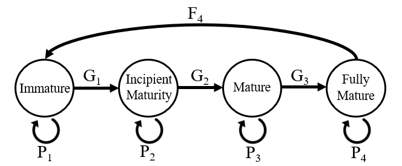
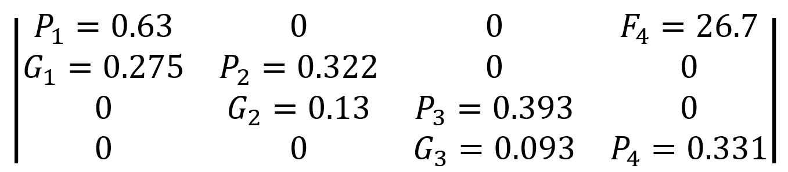

---
output:
  bookdown::pdf_document2:
    fig_caption: yes
    toc: no
    lof: yes
    lot: yes
    keep_tex: yes
  pdf_document:
    toc: no
  bookdown::html_document2:
    fig_caption: yes
    toc: no
  word_document: default
geometry: margin=1in
fontsize: 12pt
bibliography:
- Thesis_Citations.bib
- R_Citations.bib
csl: apa_1.csl
header-includes: \usepackage{setspace} \usepackage{lineno} \usepackage{placeins} \usepackage[nottoc,notlof,notlot]{tocbibind} \renewcommand{\contentsname}{} \renewcommand{\listfigurename}{} \renewcommand{\listtablename}{} \usepackage{sectsty} \sectionfont{\centering}
---

\doublespacing

\pagenumbering{gobble}

\begin{center}
	
\textbf{\Large Mechanistic models of human decision-making and ecological dynamics in small-scale fisheries}
	
\textsc{BY \\ Sophie Wulfing}
\vspace{3 mm}

\textsc{B.S., Colorado College, 2019 \\ }
\vspace{3 mm}
\textsc{THESIS}

\vspace{3 mm}
\textsc{Submitted to the University of New Hampshire \\ in Partial Fulfillment of \\ the Requirements of the Degree of \\ Master of Science \\ in \\ Marine Biology \\ September 2023}

\end{center}

\thispagestyle{empty}
\pagenumbering{roman}

\newpage

This thesis has been examined and approved in partial fulfillment of the requirements for the
degree of Master of Science in Marine Biology by:

\vspace{3.5 mm}

\begin{tabbing}

\hspace{30pt}\=\hspace{30pt}\=\kill

\> Thesis Director, \textbf{Dr. Easton White,} Assistant Professor  \\
\> Biological Sciences, University of New Hampshire  \\
\> \textbf{Dr. Elizabeth Fairchild,} Research Associate Professor \\
\> Biological Sciences, University of New Hampshire  \\
\> \textbf{Dr. Julia Novak Colwell,} Lecturer  \\
\> Natural Resources and the Environment, University of New Hampshire \\

\end{tabbing}

<!-- \vspace{2 mm} -->

\begin{tabbing}

\hspace{30pt}\=\hspace{30pt}\=\kill

\> Defense on May 15, 2023

\end{tabbing}

\vspace{3 mm}

Approval signatures are on file with the University of New Hampshire Graduate School

```{r setup, include=FALSE}
knitr::opts_chunk$set(echo = FALSE, warning = FALSE, message = FALSE, dev="cairo_pdf")
#knitr::write_bib look into

setwd("C:/Users/sophi/Documents/GitHub/UNH_Docs/Proposal")

```

```{r, include=FALSE}
options(tinytex.verbose = TRUE)
```

\newpage
\setlength\parindent{24pt}

# ACKNOWLEDGEMENTS

I would first like to thank my advisor, Dr. Easton White. Thank you for answering a cold-call email from a random lab tech in Louisiana who wasn’t even asking about the position you were posting for. I didn’t think grad school was the right move for me at the time, and I could not have been more wrong. This opportunity has been exactly what I needed and I am so thankful for the constant enthusiasm and encouragement. I would also like to thank my committee members, Dr. Julia Novak Colwell and Dr. Elizabeth Fairchild for their expertise and making sure my research didn’t go too far into the theoretical rabbit hole and kept me in the real world.


I of course have to give a huge thank you to my collaborators on my first chapter. Ahilya, your background research was essential to this project, thank you so much. And thank you to Mez Baker-Médard. Your expertise in this fishery gave us key real-world context for the research we were conducting.


And then thank you so much to my fellow labmates in the Quantitative Marine Ecology Lab. Especially Ana, Drew, Barbara, Julia, and Wilton. During my time as a grad student, I needed your support and humor more than you know. Whether I needed a movie night, a quick coffee break, or just someone to joke around in the office with, you all were there for all of it. Y’all make me laugh so much and I hope we keep in touch moving forward.


I have had the wonderful opportunity to live in many amazing places and meet so many people that I can write a whole other thesis about how these experiences have shaped me. Thank you to all my friends in Washington, Colorado, Colombia, Louisiana, and everywhere else. Thank you to Hannah, for always answering the phone even after all this time. I can talk to you about anything. Thank you to all my teachers both in and outside the classroom. Thank you, thank you, thank you to Melissa Head. This was my first internship in fisheries as well as my first exposure to coding and data science. You wanted to make sure that internship was a valuable experience for me and it ended up changing my life. You gave me such a unique perspective into all sides of the fishing industry. You even have let me come back to volunteer from time to time, and working with you is so much fun. I hope we continue to do so in the future.


I would also like to thank the Department of Biological Sciences here at UNH. I know this department has been through a lot of changes over the past few years, but I also have felt nothing but love and support from both the graduate students and faculty here. Thank you all so much. And a special shoutout to Caitlin Shanahan for all your advice and providing countless resources regarding Madagascar’s fisheries. 


I of course have to give a huge thanks to everyone in my family (and yes, I’m going to give a shoutout to every sibling). Rina, thank you for always checking in and making sure I’m eating/sleeping/living well. Bridget, it has been so great living close to you again. Hanging out with you as adults has been so much fun. Joe, you never fail to make me laugh and I am so inspired by your resilience. Caroline, my partner in crime, my evil twin. I know I can always joke around with you and thank you for sharing your music taste. Adam, I am so proud of you. I love it when you call on a Sunday just to watch football, play minecraft, whatever. All of that got me through the pandemic. I love you all so so so much. I am surrounded by so much love all the time and I’m so proud of all of you.


And finally to my mom and my dad. All my friends who know me well know that I draw so much of my personality from the combination of the two of you, and I think that goes for who I am as a scientist as well. Dad, you taught me so much about the love of science and discovery. I love whenever I find a math video that makes my jaw drop, I can always shoot an email to someone who understands how beautiful and amazing the world of math really is. And my mom. We always talk about how some of our fondest memories are working in the garden together when I was young. I don’t say this enough, but I think that was such a formative time for me and I think that’s why I’ve always had a love for the environment and always knew I would spend my life trying to preserve it. 

\newpage

# TABLE OF CONTENTS

\vspace{-1cm}
\tableofcontents

\newpage

## LIST OF FIGURES

\vspace{-1.5cm}
\listoffigures

\newpage

## LIST OF TABLES

\vspace{-1.5cm}
\listoftables

\newpage

# ABSTRACT

Small-scale fisheries are essential to the livelihoods of 40 million people worldwide. They are key sources of nutrients and income for these communities that rely on them. However, due to their abundance, understanding the status of these fisheries requires in-depth data collection, often in remote areas. Further, each small-scale fishery is very individualized, and external groups attempting to impose fishing restrictions are often met with low compliance or are unsuccessful in their efforts to conserve fish stocks due to a lack of understanding of either fishing culture or the ecology of the harvested species. In this thesis, I employ various mechanistic models to small-scale fisheries in order to better understand their underlying dynamics. In Chapter 1, I fit a Lefkovitch matrix population model to blue octopus data in the small-scale fishery of Southwestern Madagascar in order to assess their life history and population health. In Chapter 2, I create a socio-ecological model with replicator dynamics and incorporated social hierarchy and space. Here, we found that collaboration between groups of people will be ineffective if only the financial gain of fishing is communicated, not the fishing strategies used to achieve high yields. Further, we found that fish movement was an extremely important parameter in these models. This work serves to exemplify the mathematical tools available when assessing small-scale fisheries and highlight the need for a more substantive understanding of the status of the world's small-scale fisheries.

\newpage

\pagenumbering{arabic}

# INTRODUCTION

The definition of small-scale fisheries is an evolving concept, but is characterized by subsistence fishing, community management, and traditional technologies [@smithDefiningSmallScaleFisheries2019]. 40 million people worldwide make their living off small-scale fisheries, which employs about 90% of all fishers globally. [@millsUnderreportedUndervaluedSmallscale2011; @faoStateWorldFisheries2020] This metric does not include the 200-300 million people who are estimated to be employed in the processing chain of small-scale fisheries, often informally [@millsUnderreportedUndervaluedSmallscale2011]. As many of these systems have transformed into industrial and recreational fishing, small-scale fisheries are becoming increasingly associated with developing countries [@misundFishCaptureDevices2002]. These systems are an essential source of nutrition for these groups [@theworldbankHIDDENHARVESTTheGlobal2012; @chuenpagdeeTransformingGovernanceSmallscale2018; @faoStateWorldFisheries2020]. Small-scale fisheries have been shown to be a significant avenue of poverty alleviation through food security [@chuenpagdeeTransformingGovernanceSmallscale2018; @faoStateWorldFisheries2020]. The number of fishers employed in small-scale fisheries is rapidly increasing, indicating the growing importance of this sector [@jentoftPovertyMosaicsRealities2011].

Despite the prominence of small-scale fisheries and their importance to the people who rely on them, they face many threats as they are highly susceptible to climate change [@allisonVulnerabilityNationalEconomies2009], coastal urbanization [@kadfakInvestigatingWaterfrontEntangled2017], and overfishing [@cinnerBuildingAdaptiveCapacity2018]. Because fishers are more directly reliant on these subsistence fisheries, people are more directly affected by these challenges than in large industrial fishing [@allisonVulnerabilityNationalEconomies2009; @jentoftPovertyMosaicsRealities2011]. The issue of overfishing is also often exacerbated by large-scale industrial fishing occurring in places near small-scale fisheries [@bavinckMegaengineeringOceanFisheries2011]. Governance of small-scale fisheries is also typically difficult as different small-scale fisheries often require different management styles in order to be successful [@gutierrezLeadershipSocialCapital2011]. Further, they are often characterized by a close connection between the ecology of the fishery and the culture of those who fish there. This means that each small-scale fishery is very individualized and so there exists no “one size fits all” conservation strategy for every one. Instead, a deep understanding of both the biology of the fish being harvested and the socio-economic factors that affect fishing activity is required in order to institute effective and equitable conservation in small-scale fisheries [@theworldbankSavingFishFishers2004; @kosamuConditionsSustainabilitySmallscale2015].

However, this in depth understanding is difficult to achieve as small-scale fisheries are drastically understudied [@misundFishCaptureDevices2002; @millsUnderreportedUndervaluedSmallscale2011; @faoStateWorldFisheries2020]. This can be partially attributed to the fact that small-scale fisheries employ a large number of people over a large spatial distribution, and governments are often financially limited when surveying these sectors [@misundFishCaptureDevices2002; @gutierrezLeadershipSocialCapital2011]. Because a lot of employment in small-scale fisheries is informal, it's difficult to understand exactly how many people are reliant on small-scale fisheries, and existing metrics are likely to be underestimations [@millsUnderreportedUndervaluedSmallscale2011]. Data collection in small-scale fisheries can be difficult and resource-consuming as they often exist in remote places [@chuenpagdeeGlobalInformationSystem2019]. Also, effective conservation requires an understanding of the practices and culture of fishers. Fishers in certain areas can sometimes come from different ethnicities and speak different languages [@pomeroyFishWarsConflict2007; @barnes-mautheInfluenceEthnicDiversity2013; @sariMonitoringSmallscaleFisheries2021], making cross-cultural cooperation difficult. Further, conservationists have often ignored social hierarchies in small-scale fisheries, and by doing so, have actually further entrenched these inequalities [@baker-medardGenderingMarineConservation2017]. The existence of social structures is extremely prevalent in human societies and this alters how people interact with the environment.

Community management of fisheries is one of the most effective forms of small-scale fishery conservation while employing traditional knowledge and empowering local communities [@pomeroyHowYourMPA2004; @gelcichIncentivizingBiodiversityConservation2015]. Small-scale fisheries are typically characterized by tight social structures and strong reliance on the environment, therefore, the intersection of culture and environment is extremely important in maintaining their sustainability [@graftonSocialCapitalFisheries2005; @thampiSocioecologicalDynamicsCaribbean2018; @barnesSocialecologicalAlignmentEcological2019]. Community management allows for reaching ecological goals while simultaneously maintaining the livelihood and economic and cultural goals of fishers [@govanStatusPotentialLocallymanaged2010; @barnes-mautheInfluenceEthnicDiversity2013]. On the other hand, outsider institutions have typically ignored these cultural components to fisheries and either further entrenched inequalities in the community or conservation efforts have been met with low compliance [@bodinRoleSocialNetworks2009; @katikiroChallengesFacingLocal2015; @kosamuConditionsSustainabilitySmallscale2015; @salasViabilitySustainabilitySmallScale2019; @princeSpawningPotentialSurveys2021].

Mechanistic models are one way in which we can study small-scale fisheries despite challenges in data collection. Mechanistic models mathematically describe the underlying biological and physical processes that make up an ecological system [@grimmPatternOrientedModelingAgentBased2005; @andreModellingClimatechangeinducedNonlinear2010; @briggs-gonzalezLifeHistoriesConservation2016]. Therefore, these models do not require the extensive data collection needed to construct a statistical model [@crouseStageBasedPopulationModel1987; @nowlisShortLongtermEffects2000; @gharouniSensitivityInvasionSpeed2015] and are a prominent tool used in fishery assessments [@leeBenefitsRisksIncorporating2018; @freeBloodStonePerformance2020]. In the following chapters, we utilize mechanistic models to better understand small-scale fisheries and what social and ecological challenges these fisheries face.

\newpage
	
# CHAPTER I: Using Mechanistic Models to Assess Temporary Closure Strategies for Small-Scale Fisheries


```{r setup1, include=FALSE}
#knitr::opts_chunk$set(echo = FALSE, warning = FALSE, message = FALSE, dev="cairo_pdf")
#knitr::write_bib look into
#setwd("C:/Users/sophi/Documents/GitHub/UNH_Docs/Proposal/Mtx_Model")

library(tinytex)
library(matlib)
library(ggplot2)
library(quadprog) #cite
library(gridtext)
library(popbio) #cite
library(knitr)
library(gridExtra)
library(RColorBrewer) 
#library(rPref) #Double check what this is doing. Maybe cite?
library(tidyr)
library(dplyr)
library(ggpubr)
library(bookdown)
library(kableExtra)
library(Rage)


# #Raw data n supplemental. ASK
# in-stage bar graph goes in paper
# in stage management scenarios will definitely be supplemental
# Check out ecological modelling journal
# Write about stable stage cause I don't think you do
# Citations! Also check ahilya table
# APPENDIX!
# MAKE FIG CAPS FOR EVERYTHING AND EDIT FIGS.


observedData <- as.matrix(data.frame(read.csv("RaberinaryBenbow2012Calcs.csv")))
observedStageMatrix <- observedData[1:13, 2:5]
```

```{r, include=FALSE}
options(tinytex.verbose = TRUE)
```

```{r FXNoverallsurvive}
survivability <- function(increase){
    #Calculate survivability for each stage and increase by x%
    NewMtx <- (A * increase) + A
    
    for(i in 1:ncol(NewMtx)-1){
      if(sum(NewMtx[,i]) > 1 | NewMtx[4,4] > 1){
        return(NA)
      }}
    return(NewMtx)
}


#This is stupid but it just forces R to stop writing things as complex numbers
f <- function(x) {
   if (all(Im(z <- zapsmall(x))==0)) as.numeric(z) else x
}

real_check <- function(mtx){
  if(sum(mtx[,1]) > 1 | sum(mtx[,2]) > 1 | sum(mtx[,3]) > 1 | mtx[4,4] > 1){
    return(NA)
  }
  else{return(mtx)}
}

```

```{r FXNmatrixprint, results = 'asis'}
write_matex <- function(x) {
  begin <- "$$\\begin{bmatrix}"
  end <- "\\end{bmatrix}$$"
  X <-
    apply(x, 1, function(x) {
      paste(
        paste(x, collapse = "&"),
        "\\\\"
      )
    })
  writeLines(c(begin, X, end))
}

```

## ABSTRACT
Mechanistic models are particularly useful for understanding and predicting population dynamics in data deficient species. Data deficiency is a relevant issue in small-scale fisheries as they are generally under studied and underrepresented in global fishing datasets. As overfishing remains a global issue, especially in small-scale fisheries, one commonly utilized conservation method is temporary closures. The blue octopus (*Octopus cyanea*) fishery off the southwest coast of Madagascar is one such system that uses temporary closures, yet lacks sufficient data collection to assess the viability of the population. This fishery is a key economic resource for the local community as blue octopus catch is sold by local fishers to international and local export markets and is a major component of fisher income. To assess the sustainability of blue octopus, we parameterize a Levkovitch population matrix model using existing catch data. In this study, we show that this population was declining 1.8% per month at the time of data collection. To sustain the existing population of blue octopus, our model indicates that the fishery would need to close for at least three months annually, a length of closure that is currently being used by the local community. Increasing the length of closure is predicted to significantly increase the octopus population at these sites. We show that if implemented correctly, temporary closures could be used to restore this population. The local communities of Madagascar have implemented various fishing restrictions to ensure sustainable fishing, indicating a need for further research into the effectiveness of these fishing closures. Therefore, our study provides insight into the underlying population dynamics of this fishery and provides survivability estimates of this species.  

 Keywords: *Octopus Cyanea*, matrix model, small-scale fisheries, Madagascar, temporary closures

## INTRODUCTION
Mechanistic models in ecology explicitly account for species life histories, behavioral, or other mechanisms to describe how a population or community may change over time [@andreModellingClimatechangeinducedNonlinear2010; @briggs-gonzalezLifeHistoriesConservation2016]. Mechanistic models can be important in situations without existing long-term data, when future conditions may not be similar to the past, and when different scenarios or actions need to be assessed [@crouseStageBasedPopulationModel1987; @nowlisShortLongtermEffects2000; @gharouniSensitivityInvasionSpeed2015]. Thus, mechanistic models play a critical role in making informed conservation decisions, such as the management of small-scale fisheries.

Worldwide, 32 million fishers make their livelihood in small-scale fisheries, a subsector in which 90 to 95% of catch is distributed for local consumption. These marine products are a vital source of nutrition for these communities [@theworldbankHIDDENHARVESTTheGlobal2012]. The southwest region of Madagascar is one such area where subsistence fishing is an essential component to the diet and income of the local community. The ocean environments off the southwest coast of Madagascar are home to a wide variety of marine life as sand beds, seagrass beds, and coral reefs are all prominent biomes in the area. Madagascar has been calculated as a country that would benefit greatly from marine conservation given its economic reliance on marine harvests and the fact that it is a refuge to many marine species [@larocheReefFisheriesSurrounding1997]. In the early 2000’s, however, Madagascar began to move from local, subsistence fishing to also selling catch to export markets [@humberSeasonalClosuresNoTake2006]. There is evidence that up to 75% of all marine products caught in select villages is now sold to outside entities for international export [@baker-medardGenderingMarineConservation2017]. This has resulted in reports of overfishing, threatening food security in the area as small scale fisheries have been shown to have a direct impact on protien availability in the region [@humberSeasonalClosuresNoTake2006; @wallner-hahnLinkingSeagrassEcosystem2022]

Locally-managed marine areas (LMMAs) are defined as coastal and near-shore fisheries in which resources are managed almost entirely by local communities and fishery stakeholders that live in the region. Because management is conducted by those directly affected by the fishery, goals typically include maintaining the livelihood and economic and cultural goals of the local community along with environmental goals [@govanStatusPotentialLocallymanaged2010]. LMMAs have grown in popularity among conservationists in small-scale fisheries due to this empowerment of local fishers. Because of this, LMMAs tend to have greater local participation and compliance from stakeholders when compared to top-down regulation from governing bodies [@katikiroChallengesFacingLocal2015]. LMMAs have been shown to improve both fisheries and fisher livelihoods in Kenya [@kawakaDevelopingLocallyManaged2017], Pacific Islands [@govanStatusPotentialLocallymanaged2010], and in Madagascar [@mayolMadagascarNascentLocally2013]. In Madagascar, the use of LMMAs has increased significantly since 2004, and, as a result,  fishers in the country have seen significant improvements to fish stocks as well as have experienced economic benefits [@benbowManagingMadagascarOctopus2011; @gilchristReefFishBiomass2020]. In order to protect fishing resources, Madagascar has instituted various conservation programs. Marine Protected Areas (MPAs) are regions in the ocean identified as being biologically important and fishing protections are therefore enforced. Globally, MPAs use a wide variety of classifications and management strategies depending on region and target species for protection [@hortaecostaRegulationbasedClassificationSystem2016]. Before their establishment in Madagascar, governmental bodies had bans on certain types of fishing gear, implemented seasonal fishing regulations, and criminalized the harvest of endangered species. However, these strategies proved ineffective in execution and in their conservation goals [@humberSeasonalClosuresNoTake2006]. Both the government and nongovernmental organizations have since pledged to drastically increase the number of regions dedicated as MPAs through temporary fishing closures [@cinnerInstitutionsCommunitybasedManagement2009; @oliverPositiveCatchEconomic2015; @baker-medardGenderingMarineConservation2017]. These efforts have also begun to incorporate community action and the allowance of traditional fishing practices in their policies [@benbowLessonsLearntExperimental2014; @westermanRoleWomenCommunitybased2014; @baker-medardGenderingMarineConservation2017; @baker-medardClassedConservationSocioeconomic2021].

One such class of MPAs that are currently being used in Madagascar are seasonal closures. These types of reserves have a long history of use and have been successful in stock rehabilitation [@campEvaluatingShortOpenings2015; @gnanalingamFlexibilityTemporaryFisheries2015]. For example, seasonal closures have been shown to be an effective conservation strategy in increasing the biomass of the Atlantic sea scallop (*Placopecten magellanicus*) fishery in the United States [@bethoneyComparisonDropCamera2019], restored natural trophic interactions in coral reef fisheries in Kenya [@mcclanahanResponseCoralReef2008], and successfully restored the striped marlin (*Kajikia audax*) stocks in Baja California [@jensenLocalManagementHighly2010]. This method is flexible, logistically simple for fishers and managers to understand, and mitigates the financial loss from the fishery that can be seen with permanent closures [@nowlisShortLongtermEffects2000; @humberSeasonalClosuresNoTake2006; @cohenSustainingSmallscaleFisheries2013; @campEvaluatingShortOpenings2015; @gnanalingamFlexibilityTemporaryFisheries2015; @oliverPositiveCatchEconomic2015]. However, seasonal closures are not always effective in their goal of replenishing stocks and this can depend on a wide range of factors. Ecological considerations about the life history of the target species, Allee effects, and changes to community structure and species interactions all play a role in how well the seasonal closure will protect the fishery [@russNaturalFishingExperiments1998; @cohenSustainingSmallscaleFisheries2013; @gnanalingamFlexibilityTemporaryFisheries2015; @gilchristReefFishBiomass2020; @grorud-colvertMPAGuideFramework2021]. Further, the characteristics of the fishery itself has been seen to influence fishery recovery. Fishing method, where the effort will be redistributed to, and fishing activity upon reopening have all been factors in negating the recovery made during the closure [@hiddinkPredictingEffectsArea2006; @humberSeasonalClosuresNoTake2006; @cohenSustainingSmallscaleFisheries2013]. Therefore, assessments of each seasonal closure are essential to ensuring that they are effective in replenishing fish stocks. Mechanistic modeling allows us to simulate different fishery scenarios and assess how populations will respond to these changes in fishing pressure.

Since 2003, when marine resources in Madagascar first began to globalize with the arrival of these international markets, cephalopods have become one of the largest classes of exports [@humberSeasonalClosuresNoTake2006; @ainaManagementOctopusFishery2009; @barnes-mautheTotalEconomicValue2013]. This has since added significant fishing pressure to Madagascar’s cephalopod populations and yield from this fishery has decreased in regions such as the southwest Andavadoaka region [@humberSeasonalClosuresNoTake2006]. Cephalopods are a vital part of many ocean ecosystems and, compared to other marine exploited organisms, have a unique life history that can lead to distinct and variable population dynamics. Cephalopods act as both predators and prey in an ecosystem [@rodhouseRoleConsumers1996; @santosAssessingImportanceCephalopods2001a; @vaseAcetesKeystoneSpecies2021], situating them in a key role in food webs. Further, their abundance varies drastically with a wide range of ocean conditions including sea surface and bottom temperature, salinity, currents, and sediment type [@catalanSpatialTemporalChanges2006; @ibanezZoogeographicPatternsPelagic2019; @vannieuwenhoveCrypticDiversityLimited2019]. Compared to other exploited marine organisms, cephalopods have a short lifespan coupled with a fast reproduction rate and high fecundity. This explains their population’s ability to quickly bounce back when short term MPAs are introduced into their habitat [@humberSeasonalClosuresNoTake2006; @katsanevakisSeasonalPopulationDynamics2006; @benbowLessonsLearntExperimental2014]. However, once fishing resumes, populations can suddenly and rapidly decline, although in some examples, this could be attributed to heavy fishing pressure in the area right after reopening [@humberSeasonalClosuresNoTake2006]. Cephalopods are therefore extremely sensitive to both protection and harvest levels, and understanding how these volatile population dynamics will react to changes in fishing pressure is a key component to effective conservation of this resource.

*Octopus cyanea*, or blue octopus, is the most abundant cephalopod species in the western Indian Ocean and is caught in about 95% of local landings in Madagascar [@humberSeasonalClosuresNoTake2006; @oliverPositiveCatchEconomic2015]. Like other cephalopod species, very little is known about their life history including natural death rate, larval survival, and how much time this species remains in each life stage. Further, age is difficult to determine from size alone as they have variable growth rates up to sexual maturity [@wellsObservationsFeedingGrowth1970; @heukelemGrowthBioenergeticsLifespan1976; @herwigUsingAgeBasedLife2012; @raberinaryReproductiveCycleOctopus2012]. Size limits have been shown to be the most effective method of conservation for cephalopods, in general, as they ensure individuals will breed before being harvested [@nowlisShortLongtermEffects2000; @emeryManagementIssuesOptions2016]. To protect this species, size limits have been imposed on blue octopus catch in Madagascar, but these regulations are difficult in practice, as the fishing method used to harvest octopus involves spearing the octopus's den and extracting the octopus from the den. Blue octopus therefore typically die before size can be assessed, so octopus too small for market sale are typically harvested for household consumption [@humberSeasonalClosuresNoTake2006]. Further, the relationship between size and life stage is not strongly correlated [@raberinaryReproductiveCycleOctopus2012] and as a result, size restrictions would not necessarily protect individuals ready to reproduce and would be difficult to implement in the field. Therefore, temporary closures have been shown to be a more practical method of octopus conservation in that they can replenish stocks while maintaining fisher income [@benbowLessonsLearntExperimental2014]. However, this requires a deeper understanding of the characteristics of *Octopus cyanea* in this fishery in order for temporary closures to be properly instituted. Instituting effective temporary closures in octopus fisheries can be difficult due to their short lifespan, high mortality, and sensitivity to environmental conditions [@catalanSpatialTemporalChanges2006; @emeryManagementIssuesOptions2016; @ibanezZoogeographicPatternsPelagic2019; @vannieuwenhoveCrypticDiversityLimited2019]. Lack of field data and difficulty of enforcement has also been a challenge in octopus fisheries, especially in Madagascar [@emeryManagementIssuesOptions2016; @benbowLessonsLearntExperimental2014]. This indicates that a thorough understanding of the life history of *O. cyanea* and the harvest methods employed by fishers is necessary to enact meaningful fishing restrictions. Currently, the octopus fishery in this region of Madagascar is closed for the three months between June and August on a yearly basis [@benbowManagingMadagascarOctopus2011; @westermanRoleWomenCommunitybased2014] which was implemented in 2011.

In this paper, we have three goals: 1) we will fit a Levkovitch matrix to the limited available data on *Octopus cyanea* populations in southwestern Madagascar, 2) as well as create a theoretical estimation of the species’ life history traits in different stages of its development, and 3)  determine the frequency and length that temporary closures should take place to maximize population health of *O. cyanea* and maximize catch for the local community. We will compare this to the three-month closure currently being implemented.

(ref:lifegraphs) A graph representing the life history of *O. Cyanea* and the subsequent Lefkovitch matrix where i corresponds with each of the stages of maturity (Immature, Incipient Mature, Mature, and Fully Mature individuals, respectively). $P_i$ corresponds to probability of surviving and staying within a stage. $G_i$ is the probability of surviving and growing to the next stage. $F_i$ is the reproductive output of stage i.


```{r LifeGraph, echo = FALSE, fig.show="hold", out.width="45%", results = "asis", fig.cap = '(ref:lifegraphs) \\label{LifeGraph}'}




```

## METHODS

As *O. cyanea* has an extended larval phase and there are no existing data on the age structure of this population of octopus, we use a stage-based population matrix, otherwise known as a Lefkovitch matrix [@caswell2001matrix]. Here, the life history of the study organism is grouped by stages (Figure \ref{LifeGraph}), where each unit of the matrix represents a distinct period of the organism’s life where it is subject to different environments, pressures, or physical attributes that would alter the survival and reproductive output at that phase, but the amount of time between each stage is variable. This creates different inputs for the probability of remaining in the same stage, and the growth and fecundity inputs can be based on available data. Lefkovitch matrices have not yet been applied to *Octopus cyanea* populations, possibly due to limited data availability. Therefore, these matrices could be a useful methodology to understand the dynamics of this population in the western Indian Ocean to better inform fishery management strategies.

## Data
To inform our model, we used data collected by @raberinaryReproductiveCycleOctopus2012 from Madagascar landings ranging from the villages of Ampasilava in the south to Andragnombala in the north which spans about 30 kilometers of coastline. Here, fishers usually fish along both reef flats and deeper barrier reefs. Fishers bring catch onshore either for household consumption or to sell to buyers for international export. @raberinaryReproductiveCycleOctopus2012 collected landing data from February 2005 to February 2006 through daily surveying of fishers as they landed onshore within a two hour window. Octopus were separated into five age classes: immature, incipient maturity, maturity, full maturity, and post laying. In this paper we omitted stage five, post laying, from this model as blue octopus only brood once, and stage five individuals therefore do not contribute to population growth. @raberinaryReproductiveCycleOctopus2012 recorded octopus weight, weight and length of gonads, sex, and a visual assessment of maturity class by extracting and examining the gonads. A subsample of octopus was also collected for octopus length, and laboratory assessment of gonads for a confirmation of maturity class. Data were collected from a total of 3,253 octopuses. For the purposes of this study, we modeled from the 1,578 females collected by @raberinaryReproductiveCycleOctopus2012. Despite the lack of standardized catch effort in this dataset, no other maturity stage study has been conducted on this population of *O. cyanea* and, therefore, these are the best available data to fit a Lefkovitch matrix. As there is no previous estimate of the natural death rate of this population, survival estimates and growth rate calculations for the Lefkovitch model also included the influence of fishing pressure. These data are reported in the appendix.

```{r QuadProg, echo = FALSE}
#Make Z
z <- matrix(t(observedStageMatrix[2:11,]), ncol = 1, nrow = 40, byrow = TRUE)
#z

#Make M
m <- matrix(, nrow = nrow(z) , ncol = 8)
for(i in 1:(nrow(observedStageMatrix)-3)){
  m[(4 * (i-1) + 1):(4 * i),] <- matrix(c(observedStageMatrix[i,1], 0, 0, 0, 0, 0, observedStageMatrix[i,4], 0,
                                          0, observedStageMatrix[i,1], observedStageMatrix[i,2], 0, 0, 0, 0, 0,
                                          0, 0, 0, observedStageMatrix[i,2], observedStageMatrix[i,3], 0, 0, 0,
                                          0, 0, 0, 0, 0, observedStageMatrix[i,3], 0, observedStageMatrix[i,4]),
                                        nrow = 4, byrow = TRUE)
  #m
}

#Make C
c <- matrix(c(diag(8) * (-1), 
              1, 1, 0, 0, 0, 0, 0, 0,
              0, 0, 1, 1, 0, 0, 0, 0,
              0, 0, 0, 0, 1, 1, 0, 0,
              0, 0, 0, 0, 0, 0, 0, 1), nrow = 12, ncol = 8, byrow = TRUE)
#c
#Make b
b <- matrix(c(rep(0,8), rep(1,4)), nrow = 12, ncol = 1, byrow = TRUE)

#Make P
#p <- matrix(, nrow = 8, ncol = 1, byrow = TRUE) #vector(p1, g1, p2, g2, p3, g3, f4, p4)

#Make mtx G and vector x
g <- t(m) %*% m
f_t <- -(t(-z) %*% m)

qp <- solve.QP(Dmat = g, dvec = f_t, Amat = -t(c), bvec = -t(b))#, factorized = FALSE)


A <- matrix(c(qp$solution[1], 0, 0, qp$solution[7],
                 qp$solution[2], qp$solution[3], 0, 0,
                 0, qp$solution[4], qp$solution[5], 0,
                 0, 0, qp$solution[6], qp$solution[8]), byrow = TRUE, nrow = 4, ncol = 4)
#A
```

(ref:writemtxrounded) Stage-based population matrix calculated using Wood's quadratic programming method and parameterized using data from @raberinaryReproductiveCycleOctopus2012. 

```{r WriteMtxRounded, results = 'asis', echo = FALSE, out.width="100%", fig.cap = '(ref:writemtxrounded) \\label{WriteMtxRounded}'}

A_round <- matrix( , byrow = TRUE, nrow = 4, ncol = 4)

for (i in 1:length(A)){
  A_round[i] <- round(A[i], 3)
}

# A_round <- matrix(-1*c(qp_round[1], 0, 0, qp_round[7],
#               qp_round[2], qp_round[3], 0, 0,
#               0, qp_round[4], qp_round[5], 0,
#               0, 0, qp_round[6], qp_round[8]), byrow = TRUE, nrow = 4, ncol = 4)

round_A <- matrix(A_round, 4, 4)

round_A[1] <- paste0("P1 = ", round_A[1])
round_A[13] <- paste0("F4 = ", round_A[13])
round_A[2] <- paste0("G1 = ", round_A[2])
round_A[6] <- paste0("P2 = ", round_A[6])
round_A[7] <- paste0("G2 = ", round_A[7])
round_A[11] <- paste0("P3 = ", round_A[11])
round_A[12] <- paste0("G3 = ", round_A[12])
round_A[16] <- paste0("P4 = ", round_A[16])


#write_matex(round_A)
```

### Model Parameterization
In order to parameterize this model, we used Wood’s Quadratic Programming method [@caswell2001matrix]. Other methods required longer time series than were available to us, were extremely sensitive to noise in the data, or simply resulted in matrices that had no reasonable biological interpretation [@caswell2001matrix]. We estimated a preliminary stage-based matrix model (Figure  \ref{WriteMtxRounded}) based on @raberinaryReproductiveCycleOctopus2012 data and calculated using the quadprog package in R [@quadprog]. Model accuracy was assessed by comparing life history values inferred from the matrix with existing literature on *O. cyanea* life history (Table \ref{LifeHistory}). As all of our values calculated from the matrix fell within the known attributes of this species, we were confident that this model gave an accurate mechanistic description for this population’s underlying dynamics.

## Model Analysis
Eigenvalues ($\lambda$) were then calculated from the matrix and future populations predicted by multiplying a population vector to incrementally higher powers of our matrix where the power of the matrix corresponds to the time length of the projection. We performed sensitivity analysis on the population matrix and eigenvalues using the R package popbio [@popbio]. Further, as all of the parameters are scaled to a value between 0 and 1, except $F_4$, a unit change in these parameters had a greater proportional effect on the eigenvalue than $F_4$. To address this, we also conducted elasticity analysis using the popbio package [@popbio]. This allowed us to identify the groups within this octopus population whose protection will most benefit population growth, essentially creating focus points of conservation. The results of sensitivity and elasticity analysis are included in the supplementary material. Other life history traits that can be calculated from this matrix are stable stage distribution, reproductive value of each stage, and per-stage survivability. We used the R package Rage [@rage] to calculate the age in each stage, life expectancy and longevity, the age and probability of reaching maturity, and generation time of this population. We then used the rage package in R to analyze various life history traits of this matrix, the output of which is included in the supplementary material.

Finally, we calculated the minimum survivability increase necessary per stage to result in an increase of the overall population. We did this by increasing the $P_i$ and $G_i$ parameters by increasing percentages in each stage i until the overall eigenvalue ($\lambda$) became greater than one.

### Management Scenarios
In order to determine optimal conservation strategies, we altered the survivability of *O. cyanea* by different rates from 0-10%. Then, we simulated different closure scenarios for each survival increase by altering the length of annual closures by month, as *O. cyanea* are estimated to have a post-larval lifespan of 9-18 months [@ainaManagementOctopusFishery2009]. Futher, closures are currently instituted on monthly timescales [@benbowManagingMadagascarOctopus2011; @westermanRoleWomenCommunitybased2014]. We then multiplied higher powers of the original matrix during months that were simulated to be "open fishing" and then when a closure was simulated, the matrix with increased survival was multiplied to the population for that month. We simulated these different scenarios in order to analyze all combinations of conservation strategies that resultd in stable *O. cyanea* populations including the three month closure that is currently being instituted.  

```{r LifeHistory, results = 'asis', echo = FALSE}

ages <- data.frame(matrix(data = NA, nrow = 4, ncol = 3))
colnames(ages) <- c("Stage", "Duration_New", "Variance")
for(i in 1:nrow(A)){
  ages$Stage[i] <- i
  ages$Duration_New[i] <- 1/(1-A[i,i])
  ages$Variance[i] <- A[i,i]/(1-A[i,i])^2
}

Life <- read.csv("OcyaneaLifeHistory.csv")

LifeHistory <- Life[,1:2]
LifeHistory$New <- c(NA, NA, ages[,2], NA, NA )
LifeHistory$Var <- c(NA, NA, ages[,3], NA, NA )

colnames(LifeHistory) <- c("Stage", "Existing Estimate", "Estimate from Lefkovitch Matrix", "Variance")

#LifeHistory

#Nowcombine LifeHistory[1:2]


knitr::kable(LifeHistory, format = "latex", booktabs = TRUE, caption = "(ref:lifehistory) \\label{LifeHistory}", col.names = c("Stage", "Existing Estimated Duration", "Estimate from Lekfovitch Matrix (Months)", "Variance of Estimate (Months)")) %>%
  column_spec(2:4, width = "4.5cm") %>%
  kable_styling(latex_options="scale_down")

```


(ref:lifehistory) Existing research and information on the per-stage duration of *O. cyanea*. All existing estimates are from @heukelemGrowthLifeSpan1973, @heukelemGrowthBioenergeticsLifespan1976, @guardArtisanalFisheryOctopus2003, @humberSeasonalClosuresNoTake2006, @ainaManagementOctopusFishery2009. Note: @heukelemGrowthBioenergeticsLifespan1976 estimate the time to maturity to be 10-13 months (i.e. stages 1-3 combined).


## RESULTS

The resulting eigenvalue of our matrix was 0.982, indicating a decline of 1.8% per month in *O. cyanea* populations with fishing pressure included (Figure \ref{projection}). The stable stage distribution (Table \ref{lifetable}) shows that 65% of this population is composed of immature individuals, while actively breeding individuals (fully mature) only account for less than 1% of the naturally occurring population. However, the reproductive output per stage (Table \ref{lifetable}) shows that on average, an individual in this fully mature population is expected to have 41 times the number of offspring as those in stage 1. Larval survivability of 0.0001328 was calculated by dividing our estimated number of larvae surviving back to stage 1 ($F_4$) by 201,000 - the average estimated reproductive output of *O. cyanea* by [@guardBiologyFisheriesStatus2009]. The life expectancy of this population was calculated by the Rage package to be 4.06 months with a variance of 5.87 months. The calculated age of maturity is 6.82 months with probability of reaching maturation of 0.022. The longevity of this population (the amount of months for only 1% of the population to remain) is 12 months with a generation time of 7.38 months.

Changing the survivability of each stage (Figure \ref{stages}) showed that immature individuals (Stage 1) would a survival increase of 5% in order to result in overall population growth. Stage 4, on the other hand, would require a survivability increase of 25% in order to create a viable population.

Our analysis of different closure scenarios (Figure \ref{closures}) indicates closures two months in length or shorter will be ineffective in ensuring a stable population, regardless of how much these closures decreased the mortality rate of the species. Further, as our baseline growth rate was close to stable (-0.0184), it took a maximum of a 7.5% increase in the survivability of the population to ensure a sustainable population when utilizing three month closures. This analysis (Figure \ref{closures}) provides all the possible combinations of increased survival rates and frequency of closures that will result in a stable population. Suggested changes in overall survivability range from 2-7.5%, and the ranges of frequencies of closures span from permanent closure (every month) to once every three months.

(ref:projections) Projection of *O. cyanea* populations by life stage based off of our calculated Lefkovitch matrix through the present. 

```{r projection, fig.cap = "(ref:projections) \\label{projection}"}
pop <- observedStageMatrix[13,]
N <- list()


#72 mo projection
for (i in 1:216){
     N[[1]] <- pop
    N[[i+1]] <- A %*% N[[i]]
 }

modeled_data <- t(as.data.frame(do.call(cbind, N)))
colnames(modeled_data) <- c("Stage_1", "Stage_2", "Stage_3", "Stage_4")
modeled_data <- cbind(modeled_data, month = 0:216)

#write.csv(modeled_data, "testing.csv",row.names = TRUE)
modeled_data <- data.frame(modeled_data)

ggplot(modeled_data) + 
  geom_line(aes(y = Stage_1, x = month, color = "Stage 1", linetype = "Stage 1"), size = .75) + 
  geom_line(aes(y = Stage_2, x = month, color = "Stage 2", linetype = "Stage 2"), size = .75) +
  geom_line(aes(y = Stage_3, x = month, color = "Stage 3", linetype = "Stage 3"), size = .75) + 
  geom_line(aes(y = Stage_4, x = month, color = "Stage 4", linetype = "Stage 4"), size = .75) +
  scale_color_manual(name = "", values = c("Stage 1" = "#004949",
                                                "Stage 2" = "#009292",
                                                "Stage 3" = "#db6d00",
                                                "Stage 4" = "#920000")) +
  scale_linetype_manual(name = "", values = c("Stage 1" = 3,
                                                "Stage 2" = 4,
                                                "Stage 3" = 5,
                                                "Stage 4" = 1)) +
  #ggtitle("Ten year population projection") + #paste0(i, " month projection")) +
  xlab("Year") +
  ylab("No. Individuals") +
  scale_x_continuous(breaks = seq(0, 216, 24), label = seq(2006, 2024, 2)) +
  theme_bw() +
  theme(panel.border = element_blank(), panel.grid.major = element_blank(), panel.grid.minor = element_blank(), axis.line = element_line(colour = "black"))

```

```{r lifetable, results = 'asis', echo = FALSE}
#eigenvecors and vals
A_eigen <- eigen(A)
#A_eigen

#Intrinsic Rate of Increast (r): lambda = e^r
r <- log(A_eigen$values[1])
#r

#stable stage dist
A_stable_stage <-as.numeric(A_eigen$vectors[,1]/sum(A_eigen$vectors[,1]))
#A_stable_stage

#reproductive value
A_repro_value <- as.numeric(eigen(t(A))$vectors[,1]/eigen(t(A))$vectors[1,1])
#A_repro_value

#mean reproductive value- is the avg no offspring?
#A_repro_value %*% A_stable_stage

#. Vandermeer (1975, 1978)
lifetable <- data.frame(matrix(ncol = 3, nrow = 4))
#x <- c("Stage", "Stable Stage Distribution (Dominant Eigenvector)", "Reproductive Value (Left Eigenvector)")
#colnames(lifetable) <- x
#colnames(lifetable) <- stringr::str_replace_all(colnames(lifetable), "\\n", "<br>")
lifetable[1:4,1] <- c("1 Immature", "2 Incipient Maturity", "3 Mature", "4 Fully Mature")
lifetable[1:4,2] <- round(A_stable_stage,3)
lifetable[1:4,3] <- round(A_repro_value,3)
colnames(lifetable) <- c("Stage", "Stable", "Repro")

surviveTable <- data.frame(matrix(ncol = 2, nrow = 5))
y <- c("Stage", "Survivability")
colnames(surviveTable) <- y

surviveTable[1:5,1] <- c("1 Immature", "2 Incipient Maturity", "3 Mature", "4 Fully Mature", "Larval")

for(i in 1:3){
  surviveTable[i,2] <- sum(A[,i])
}
surviveTable[4,2] <- A[4,4]
surviveTable[5,2] <- A[1,4]/((375000+27000)/2)

lifetable1 <- left_join(lifetable, surviveTable, by = 'Stage')

#colnames(lifetable) <- stringr::str_replace_all(colnames(lifetable), "\\n", "<br>")

  knitr::kable(lifetable1, format = "latex", booktabs = TRUE, caption = "(ref:lifetablecap) \\label{lifetable}", col.names = c("Stage", "Stable Stage Distribution (Dominant Eigenvector)", "Reproductive Value (Left Eigenvector)", "Survivability")) %>%
  column_spec(2:3, width = "4.5cm") %>%
  kable_styling(latex_options="scale_down")

```

(ref:lifetablecap) Stable stage distribution and reproductive value of each stage of the blue octopus population matrix given in Figure \ref{WriteMtxRounded}. The survivability (i.e. the proportion of individuals who survive from stage i to stage i+1) from each stage includes death rate from fishing. Stages 1-4 survivability were calculated by summing up the proportion of individuals surviving and staying within a stage every month ($P_i$) and the proportion of individuals surviving and growing every month ($G_i$). Larval survivability of 0.0001328 was calculated by dividing the estimated number of larvae surviving back to stage 1 ($F_4$) by the average estimated reproductive output of *O. cyanea*.

```{r stages, echo = FALSE, fig.cap = "(ref:stagesurvive) \\label{stages}"}

rates <- c(0, 0, 0, 0, 0)

for(i in 1:(length(rates)-1)){
  #First need to do the stage 4 and larval differently
  if(i == 4){
    incr <- 0.01
    testMtx <- A
    testMtx[4,4] <- A[4,4] + A[4,4] * incr
    while(f(eigen(testMtx)$values[1]) < 1){
      incr <- incr + 0.01
      testMtx[4,4] <- A[4,4] + A[4,4] * incr
    }
    rates[4] <- incr
    
    incr <- 0.01
    testMtx <- A
    testMtx[1,4] <- A[1,4] + A[1,4] * incr
    while(f(eigen(testMtx)$values[1]) < 1){
      incr <- incr + 0.01
      testMtx[1,4] <- A[1,4] + A[1,4] * incr
    }
    rates[5] <- incr
  
  }
  else{
  incr <- 0.01
  testMtx <- A
  testMtx[,i] <- A[,i] + A[,i] * incr
  while(f(eigen(testMtx)$values[1]) < 1){
    incr <- incr + 0.01
    testMtx[,i] <- A[,i] + A[,i] * incr
  }
  rates[i] <- incr
  }}

rates_percent <- rates * 100

stage_break <- data.frame(matrix(data = (c("1", "2", "3", "4", "Larval", as.numeric(rates_percent))), nrow = 5, ncol = 2))
colnames(stage_break) <- c("Stage", "Percent")
stage_break$Percent <- as.numeric(stage_break$Percent)

stage_break$Stage <- factor(stage_break$Stage , levels = c("Larval", "1", "2", "3", "4"))

# barplot(rates_percent, xlab = "Stage", ylab = "Percent survival increase",
#         names.arg=c("1", "2", "3", "4", "Larval"))

colorlist <- c( "#CC79A7", "#004949", "#009292", "#db6d00", "#920000")

ggplot(stage_break, aes(x = Stage, y = Percent, fill = Stage)) +
  ylab("Percent survival increase") +
  geom_bar(stat="identity")+
  ylim(0,30) +
  scale_fill_manual(values = c("Larval" =  "#CC79A7",
                               "1" = "#004949",
                               "2" = "#009292",
                               "3" = "#db6d00",
                               "4" = "#920000")) +
  theme_bw() +
  theme(panel.border = element_blank(), panel.grid.major = element_blank(), panel.grid.minor = element_blank(), axis.line = element_line(colour = "black"))

```

(ref:stagesurvive) Minimum percent of per-stage survivability change needed to create population increase. Each stage was increased by higher percentages until the eigenvalue of the overall system became greater than zero.

```{r closurescalcs}
#Calculates new rates based on vectors of % change and frequencies of restrictions
p <- list()
modeled_data <- data.frame(matrix(ncol=8,nrow=0, dimnames=list(NULL, c("Stage_1", "Stage_2", "Stage_3", "Stage_4", "month", "pop", "Frequency", "PercentChange"))))
percentage <-rates <- c(seq(0, .1, .01)) # c(0.01, 0.05, 0.1, 0.15) 
freqs <- c(seq(1, 12)) #c(1, 2, 3, 4, 6, 12) 
#par(mfrow = c(6,4))
for(i in 1:length(freqs)){
  for(j in 1:length(percentage)){
    pop <- observedStageMatrix[13,]
    N <- list()
    for (k in 1:120){
      if(k %% 12 %in% c(seq(1, freqs[i]))){
      N[[1]] <- pop
      N[[k+1]] <- survivability(percentage[j]) %*% N[[k]]
      }
    else{
       N[[1]] <- pop
      N[[k+1]] <- A %*% N[[k]]
      }}
   
  
  new_data <- t(as.data.frame(do.call(cbind, N)))
  colnames(new_data) <- c("Stage_1", "Stage_2", "Stage_3", "Stage_4")
  new_data <- data.frame(cbind(new_data, month = 0:120, pop = rowSums(new_data[,1:4]), Frequency = freqs[i], PercentChange = percentage[j]))
  modeled_data <- rbind(modeled_data, new_data)
  }}


# Sources: https://www.webpages.uidaho.edu/wlf448/stochgro.pdf
# https://esajournals.onlinelibrary.wiley.com/doi/10.2307/1943004
```

```{r closures, fig.cap = "Analysis of different management scenarios for *O. cyanea*. The black line separates the scenarios that succeed in sustaining the population from the scenarios that do not. Green and white squares indicate theoretically successful management scenarios where red refers to the strategies that will not result in overall population growth. \\label{closures}"}

#### CALCULATE GROWTH RATE BASED ON LAST POP-FIRST POP/FIRST POP FOR EACH FREQ/PERCENT COMBINATION
growthRate <- modeled_data %>%
  select(month, pop, Frequency, PercentChange) %>%
  filter(month == 0 | month == 120) %>%
  pivot_wider(names_from = month, values_from = pop) %>%
  rename(month_0 = 3,
         month_120 = 4) %>%
  mutate(Mu_New = log(month_120/month_0)/120) %>% #See Crouse paper. From Nt = N0e^(rt)
  mutate(lambda_new = exp(Mu_New)) %>%
  select(Frequency, PercentChange, Mu_New, lambda_new)

  

#### COPY PARETTO GRAPH FROM OTHER ANALYSIS
paretospagheto <- growthRate %>% 
  filter(lambda_new >= 1) %>%
  group_by(Frequency) %>%
  filter(lambda_new == min(lambda_new))

paretospagheto$Frequency <- paretospagheto$Frequency - 0.5
paretospagheto$PercentChange <- paretospagheto$PercentChange - 0.005

mult_format <- function() {
     function(x) format(100*x,digits = 2) 
}

#Continuous Colors
ggplot(growthRate, aes(Frequency, PercentChange, fill = lambda_new)) + geom_tile(width=1) +
  scale_fill_gradient2(
  low = "red",
  mid = "white",
  high = "green",
  #limits = c(1, max(growthRate$lambda_new)),
  midpoint = 1,
  space = "Lab",
  na.value = "grey50") +
  scale_x_continuous(name = "Length of closure (months)", expand=c(0,0), breaks = c(1, 3, 6, 9, 12)) +
  scale_y_continuous(name = "Percent change in survival", expand=c(0,0), labels = mult_format()) +
  labs(fill = "Eigenvalue") +
  geom_segment(aes(x = 2.5, y = .075, xend = 2.5, yend = 0.105), size = .5, color = "#5A5A5A") +
  geom_segment(aes(x = 11.5, y = .015, xend = 12.5, yend = 0.015), size = .5, color = "#5A5A5A") +
  geom_step(data = paretospagheto , aes(x=Frequency, y=PercentChange), size = .5, color = "#5A5A5A") +
  geom_text(x=8, y=.07, label="Population Increasing") +
  geom_text(x=3.5, y=.015, label="Population Decreasing")


```

## DISCUSSION

Our calculated growth rate of -0.0184 and resulting population projection for *O. cyanea* supports previous reports of overfishing [@humberSeasonalClosuresNoTake2006; @benbowLessonsLearntExperimental2014]. Decline in population presents an economical issue for individual fishers as their catch will become less lucrative [@humberSeasonalClosuresNoTake2006; @benbowLessonsLearntExperimental2014; @oliverPositiveCatchEconomic2015]. Althought the market value of octopus worldwide is increasing [@ospina-alvarezMainActorsCephalopod2021], fishing effort for *Octopus cyanea* was also increasing in Madagascar at the time of data collection, therefore decreasing the profitability of these harvest efforts [@ainaManagementOctopusFishery2009]. Our model provides other information about the life history of this population as well, beyond its overall growth rate. As each column in the matrix represents a proportion of individuals within a stage either growing or staying within a stage (with the exception of the $F_4$ parameter), it also shows a per-stage survivability estimate (Table \ref{lifetable}) and stage duration (Table \ref{LifeHistory}), life history parameters on which there has been no previous research. However, as the immature stage has a high survivability of 90.4% and a longer duration than the other stages of 2.7 months, this could indicate that although the fishing method employed in this region does not distinguish by octopus size, fishers may not be bringing this smaller catch to landing due to size limits preventing them from selling immature individuals [@humberSeasonalClosuresNoTake2006]. Therefore, this challenges our assumption of the data being properly stratified by size. Further, as *O. Cyanea* have an approximately one to two month larval stage [@guardArtisanalFisheryOctopus2003], the fecundity parameter does not indicate the overall reproductive output of mature individuals, but the number of hatched offspring that will survive its larval stage and into the immature stage. This gives an estimation for larval survivability as female octopus have a fecundity ranging between 27,000 and 375,000 eggs [@guardBiologyFisheriesStatus2009], our model indicates that only an average of 27 individuals will survive back into immaturity, which indicates a survivability of 0.0001328. There is no other larval survivability estimation that currently exists for this species, which would be a useful further study as this could indicate a recruitment rate for this population. Further, an average lifespan of 4.06 months and an age of maturation of 6.82 months indicates that most individuals die before reaching maturation given the fishing pressure that was occurring at the time of data collection.

Based on our calculations of growth rates over different closure scenarios, any closure less than three months will not be effective in preserving blue octopus stocks, but the strictness of the closure (i.e. allowing some limited fishing) can be altered depending on how frequently these restricted fishing periods are implemented. There is no literature on the survivability of *O. cyanea* throughout their lifetime, particularly in this region. Therefore, the changes to survivability suggested by our analysis is in relation to their overall death rate, not fishing rate, indicating a need for further research on the natural mortality rate of *O. cyanea* before concluding if the three month closure is effective in sustaining fish stocks. Three month closures began to be implemented in the region in 2011 as this length of time was shown to improve octopus yield and had limited negative effects on fisher income because the financial gain due to increased octopus abundance after the closure was significant enough to offset financial losses during the closure [@benbowManagingMadagascarOctopus2011]. Further, while these closures were in their trial phases, fishers were able to continue activity outside of the closure areas [@humberSeasonalClosuresNoTake2006; @benbowManagingMadagascarOctopus2011]. Further, there may be other factors driving the high mortality rate of this population. As ocean waters are warming under global climate change, the effect this will have on the sustainability of blue octopus stocks is unknown, so we cannot say for certain that overfishing is the sole contributor to the decline of fish stocks or if water temperature (which affects octopus egg development in cephalopods) is playing a role as well [@rodhouseEnvironmentalEffectsCephalopod2014]. Further, trophic interactions, currents, and ocean acidification also affect cephalopod survival [@rodhouseEnvironmentalEffectsCephalopod2014]. As we do not have a current assessment of *Octopus cyanea* stocks in this fishery, there is a need to understand how effective these closures are in changing overall blue octopus survivability and preserving the blue octopus of this region. Our analysis of different closure scenarios suggests a range of the simplest actions needed in order to ensure stability of this population. As all combinations of survivability increase and frequency of closure suggested by the analysis will result in stable *O. cyanea* populations, the specific strategy chosen should be decided based on which is most convenient and economically feasible to the local fisher community of southwest Madagascar. Among conservationists, there is a growing understanding that decision making is best left to those directly involved with resource extraction and implementing fishing restrictions upon a community without understanding their cultural practices can have detrimental effects upon the community, as well as be less effective in actually protecting natural resources [@humberSeasonalClosuresNoTake2006; @baker-medardGenderingMarineConservation2017]. @gardnerDecadeHalfLearning2020 found that LMMA's in Madagascar were most successful when there was a continuous presence of NGOs collecting data, but the decision making was left to the resource-users.

When implemented deliberately, establishing periodic closures is an effective and commonly-used strategy in sustainable fishing practices [@humberSeasonalClosuresNoTake2006; @oliverPositiveCatchEconomic2015]. As Madagascar has been committed to protecting its marine natural resources through increasing the number of marine parks, this study serves to highlight some of the available strategies to make population predictions and conservation strategies with limited data sources [@westlundMarineProtectedAreas2017]. Implementing fishing restrictions without regard for social norms can undermine cultural practices and in turn be detrimental to both the people and fishery, and halts the dissemination of traditional ecological knowledge [@okafor-yarwoodSurvivalRichestNot2022]. For this reason, both the Madagascar government and scientific community have found a new emphasis on studying the complex social structures within the community in question in order to more effectively preserve resources along with peoples’ livelihoods [@billeIntegratedCoastalManagement2002; @baker-medardClassedConservationSocioeconomic2021]. This has been shown to increase participation in conservation practices, therefore making them more effective. 

The mechanistic methods used in this study allowed us to gain a baseline understanding of the growth rate and mortality of this population despite the limited data used to parameterize the model. Limitations of this study include the data collection process. Even though daily collections occurred daily within a two-hour window, catch was not standardized by effort and therefore there could be catch fluctuations between months that are not captured in the data. As stage 1 had a high survival rate yet low duration, this challenges the assumption that the octopus caught are an accurate ratio of the octopus at each stage in the wild. Further, matrix population models will converge or diverge based on their dominant eigenvalue, regardless of the initial population inputted in the model. Therefore, we can still conclude that the population at this time was in an overall decline, despite not knowing the exact number of individuals in this population. Another shortcoming of this study is that the only available stage data for this species and region were collected in 2006, and the community of southwest Madagascar has been implementing closures since that time to improve the sustainability of their fish stocks in the region [@humberSeasonalClosuresNoTake2006; @raberinaryReproductiveCycleOctopus2012]. Due to the time of data collection, this study does not reflect the current status of *Octopus cyanea*, but outlines the underlying population dynamics at that time. The current status of this fishery is unknown, with indications that these closures have been generally effective in protecting stocks, but increased fishing since 2018 may be resulting in current overexploitation [@roa-uretaStockAssessmentOctopus2022]. This indicates the need to repeat this survey by @raberinaryReproductiveCycleOctopus2012 in order to create a more current assessment of *O. cyanea* stocks in the region, and reevaluate current conservation strategies. We also did not consider the economic aspects of this fishery, as fish prices are generally influenced by catch scarcity [@tveterasFishFoodFAO2012], fishing rate in this community may have shifted due to changes in profitibility. Further, as climate change threatens our oceans, there is a lot of uncertainty as to how this will affect *O. cyanea* populations [@rodhouseEnvironmentalEffectsCephalopod2014], therefore this repeated study could shed light onto how the blue octopus will fare under changing ocean conditions. Blue octopus stocks can also exhibit hyper-stability, which shows that different sampling methods may be more accurate in assessing fishery practices [@roa-uretaStockAssessmentOctopus2022].

Finally, as we are using a Lefkovitch matrix to simulate population fluctuations, these models inherently make simplifying assumptions about the biology of the study species. For example, these models assume that all individuals within a stage are subject to the same growth and mortality rates. As this study uses data collected from a large geographic range [@raberinaryReproductiveCycleOctopus2012], different individuals nesting in different regions may be subject to different selective pressures. Further, this population of blue octopus has been shown to exhibit spatial variability depending on their life stage. Younger individuals tend to live in the shallow inner zone of the reef and larger individuals, which are able to withstand stronger currents better, move to deeper waters for more suitable habitats for nesting [@raberinaryPeriodePontePoulpe2007]. Despite these limitations, the data provided are the best data available for fitting a Lefkovitch matrix to this species. Future extensions of this work could include exploring the dynamics of both sexes in the population [@gerberTwosexMatrixModels2014] as male octopus have different growth rates and spatial dynamics [@heukelemGrowthBioenergeticsLifespan1976]. Further, a better understanding of the seasonal breeding dynamics of this population of blue octopus could give better insight into the health of this fishery [@whiteSeasonalityEcologyProgress2020]. Cephalopod juveniles (a key life stage in understanding future population dynamics) often have two seasonal peaks per year, indicating biannual spawning periods [@humberSeasonalClosuresNoTake2006; @katsanevakisSeasonalPopulationDynamics2006]. This is related to seasonal fluctuations in temperature, as cephalopod growth is related to environmental temperature [@heukelemGrowthLifeSpan1973; @domainGrowthOctopusVulgaris2000]. However, this relationship is subject to a lot of variation [@heukelemGrowthBioenergeticsLifespan1976; @herwigUsingAgeBasedLife2012]. Further, as Madagascar is a tropical climate, this trend may be different in our region of study, as suggested by @raberinaryReproductiveCycleOctopus2012, where all life stages of *O. cyanea* were observed year round, suggesting continuous breeding.

With a short generation time, cephalopod species respond more quickly to new management strategies. Future work on other fished species in the region is necessary to understand the effectiveness of temporary closures. This study also highlights the need for further research into the life history patterns of *Octopus cyanea*. Specifically, studies on the natural mortality rate of this species, both in the larval and benthic stages, could better inform both our model and the greater understanding of how populations of this species grow. Further, a more contemporary study on the status of the octopus fishery of southwest Madagascar will paint a more accurate picture of how this population is faring under the current fishing pressure. These studies can also be used to build off of this one as more in depth data collection could be used to add spatial variability to our model, where we then can evaluate the accuracy of the assumption that every individual within a stage is subject to the same selective pressure. Finally, as the people of southwestern Madagascar are actively taking steps to preserve the health of their fisheries, we hope that studies such as these can serve to facilitate informed decision making when choosing how and when to impose fishing restrictions.

*Acknowledgements* - The authors would like to thank the National Science Foundation for the funding on this project [grant number 1923707]. We would also like to thank Dr. Sophie Benbow for not only collecting the data on which paper was written, but also her help in contextualizing research and answering questions about data collection.

*Data Availability* - All supplemental material and code for this project are available at https://github.com/swulfing/OCyanea. All data used to parameterize this model were collected in @raberinaryReproductiveCycleOctopus2012.

\newpage

# CHAPTER II: Social-Ecological Models With Social Hierarchy and Space Applied to Small-Scale Fisheries

```{r setup2, include=FALSE}
knitr::opts_chunk$set(echo = FALSE, warning = FALSE, message = FALSE, dev="cairo_pdf", cache = TRUE)

library(deSolve)
library(tidyverse)
library(ggplot2)
library(gridExtra)
library(kableExtra)
library(FME)
library(ggpubr)

#setwd("C:/Users/sophi/Documents/GitHub/UNH_Docs/Proposal/Soc_Ecol_Model")

```

```{r, include=FALSE}
options(tinytex.verbose = TRUE)
```


## ABSTRACT

Socio-ecological models combine ecological systems with human social dynamics in order to better understand human interactions with the environment.  One such model of human behavior is replicator dynamics. Replicator dynamics are derived from evolutionary game theory and model how societal influence and financial costs can change opinions about resource extraction. Previous research on replicator dynamics have shown how evolving opinions on conservation can change how humans interact with their environment and therefore change population dynamics of the harvested species. However, these models have all assumed that human societies are homogeneous with no social structure. Using co-managed fisheries as a case study, we develop a two-patch socio-ecological model with social hierarchy in order to study the effect that social inequity has on decision making. We also analyzed the spatial components of this two-patch model and observed the effect of fish movement on decision making and fish population dynamics. We found that, contrary to our hypothesis, high levels of social learning between groups resulted in collapsed fish stocks. We also found that fish movement across patches was a major driver of changes to population dynamics. This indicates the importance of including spatial components to socio-ecological models. Further, this study highlights the importance of understanding species movements when making conservation decisions.

Keywords: two-patch model, replicator dynamics, social hierarchy, socio-ecological model, species movement

## INTRODUCTION

The study of social ecological models is a growing field in ecology as they treat human behavior as a variable as opposed to a set parameter. This allows for the study of how human decision making can change in response to environmental factors and in turn, change how humans interact with resources and profits [@bauchImitationDynamicsPredict2005; @ostromGeneralFrameworkAnalyzing2009; @innesImpactHumanenvironmentInteractions2013a; @orabyInfluenceSocialNorms2014; @bauchEarlyWarningSignals2016; @sigdelCompetitionInjunctiveSocial2017a; @thampiSocioecologicalDynamicsCaribbean2018]. As human societies grow increasingly intricate and interconnected, these models can help us to analyze how our social structures can influence the environment around us [@liuCoupledHumanNatural2007]. These models provide important insight not only into how human decision making can influence ecological patterns but they can also show hidden processes, reveal regime shifts that would otherwise be hidden, and identify vulnerabilities of systems that do not exist within the purely social or ecological models [@liuCoupledHumanNatural2007; @youngSolvingCrisisOcean2007; @ostromGeneralFrameworkAnalyzing2009; @ladeRegimeShiftsSocialecological2013]. Socio-ecological models have even showed different dynamics at different scales and different amounts of human connectivity [@cummingNewDirectionsUnderstanding2017]. They can also be used in systems where data are difficult to collect, as parameters can be changed in order to analyze different hypothetical scenarios. Socio-ecological models can also inform effective policy decisions. Conservation plans often do not reach their conservation goals, and these setbacks are often attributed to a lack of stakeholder participation [@cronaWhatYouKnow2006; @salasViabilitySustainabilitySmallScale2019; @princeSpawningPotentialSurveys2021]. This can be due to an emergence of conflict for stakeholders, where the conservation plan in place directly hinders their practices, therefore deterring them from participating in the restorative efforts. Socio-ecological models can identify where these areas of potential conflict can arise, compromises that can be made in the system, and alternative conservation practices that encourages participation from all stakeholder groups [@banSocialEcologicalApproach2013]. Further, as these models are simulations of human and environmental interactions, they allow flexibility in that they can be adapted to fit the specific system of study and improve place-based management practices [@youngSolvingCrisisOcean2007; @liuCoupledHumanNatural2007; @felipe-luciaConceptualizingEcosystemServices2022]

Due to their adaptability, socio-ecological models can use a wide range of strategies to represent human decision making. One such method is replicator dynamics, which model human decision making where an individual makes conservation choices based on weighing the perceived benefits of conservation with the costs, as well as the social pressure to conform to the group's stance on conservation. Individuals will therefore "replicate" the behavior of their peers by changing their harvest practices based on the opinion of the majority [@bauchEvolutionaryGameTheory2012]. Models that employ replicator dynamics have been used to show how this social learning is a key component to vaccination uptake in public health, and preexisting social norms can actually suppress vaccine uptake despite frequent disease outbreaks [@bauchEvolutionaryGameTheory2012; @orabyInfluenceSocialNorms2014]. They can also have conservation applications as pest invasion models have shown ways to simultaneously mitigate pest outbreaks and the cost to address them in the timber industry [@barlowModellingInteractionsForest2014]. Further, land use changes have been modeled to have completely different dynamics when human decision making was added to these models [@innesImpactHumanenvironmentInteractions2013a]. However, all previous models of human behavior have assumed that human societies are homogeneous, and all people are subject to the same social influence and ecological dynamics. No existing replicator-dynamics model has incorporated social hierarchy, despite the fact the most human societies have varying levels of social order within them.

Contrary to this assumption made by previous models that human groups are homogeneous, the vast majority of real-world societies exhibit some form of hierarchy or inequality. Societies with different social subgroups can often exhibit an “us vs. them” mentality and compete for resources [@borgattiNetworkParadigmOrganizational2003]. This is because social status can greatly alter peoples’ interaction with the environment. Competition over resources has been shown to be exacerbated by social hierarchies and ‘top-down’ regulation whereas when social connectivity is considered in management plans, management outcomes are not only improved, but costs are reduced as well [@krackhardtInformalNetworksOrganizational1988; @graftonSocialCapitalFisheries2005; @bodinRoleSocialNetworks2009]. Further, members of social networks have been shown to have varying levels of connectivity with others in their groups based on attributes such as ethnicity, and this can in turn alter an individual’s relationship with the environment and their views on conservation [@barnes-mautheTotalEconomicValue2013; @sariMonitoringSmallscaleFisheries2021]. @barnes-mautheTotalEconomicValue2013 showed that fishing communities can exhibit homophily, which is the tendency for people to obtain information and opinions from those who are similar to themselves before seeking views from those who are perceived as different. Therefore, people in different social groups may be receiving different information and opinions about conservation and acting accordingly [@mcphersonBirdsFeatherHomophily2001]. For example, in Kenya, communication among fishers has been shown to stay within groups using the same gear type which has inhibited successful regulation of the whole fishery [@cronaWhatYouKnow2006]. Further, in the southwest Madagascar octopus fishery, fishing method and location typically falls along gendered lines. When fishing restrictions were imposed on tidal flats, this affected fishing access for women while maintaining this livelihood for male fishers, who typically fished in deeper waters [@baker-medardGenderingMarineConservation2017]. In Thailand, ethnicity has been shown to be a source of fishing conflict which has exacerbated resource depletion [@pomeroyFishWarsConflict2007]. The existence of social structures is extremely prevalent in human societies and this has been shown to alter how people interact with the environment. However, there has been no previous replicator dynamics study that considers how social hierarchies alter harvest practices.

Small-scale fisheries are a particularly relevant system to apply replicator dynamics as fishing practices and policies are often made by communal decision makers. Research on small-scale fisheries is a growing and essential field as they are drastically understudied yet affect many people around the globe. Worldwide, about 32 million fishers make their livelihood in small-scale fisheries, a subsector in which 90 to 95% of harvest is distributed for local consumption. These marine products are a vital source of nutrition for these communities [@theworldbankHIDDENHARVESTTheGlobal2012]. Due to tight social structures, community decision making and strong reliance on the environment, small-scale fisheries are systems that are well represented by socio-ecological models and replicator dynamics [@graftonSocialCapitalFisheries2005; @thampiSocioecologicalDynamicsCaribbean2018; @barnesSocialecologicalAlignmentEcological2019]. Governmental bodies or third parties instituting conservation efforts in small-scale fisheries have often been unsuccessful, especially when the social and economic components of the industry have been ignored [@salasViabilitySustainabilitySmallScale2019; @princeSpawningPotentialSurveys2021]. However, even when human interactions and decision making have been considered, socio-ecological models have often treated individuals in human societies equal in their social standing. As human societies are often complex and hierarchical, this simplifying assumption that everyone interacts with the environment and within their community equally can lead to lack of participation in conservation by some groups within a community [@barnes-mautheTotalEconomicValue2013; @cummingNewDirectionsUnderstanding2017]. Mismanagement of fisheries have even been shown to exacerbate these inequalities [@cinnerComanagementCoralReef2012; @baker-medardGenderingMarineConservation2017]. Further, the specific dynamics of the fishery in question have been shown to be important components to models, as models with multiple patches can actually mitigate overfishing if there is high movement of the harvested species between patches [@cressmanIdealFreeDistributions2004].

Instituting effective conservation strategies can be especially difficult if the organism being protected has a migratory pattern that crosses over multiple management jurisdictions such as country borders [@ogburnAddressingChallengesApplication2017; @garrone-netoUsingSameFish2018; @ramirez-valdezAsymmetryInternationalBorders2021]. Borders can also create challenges when gathering population data that require extensive fieldwork [@cozziAfricanWildDog2020; @hebblewhiteWolvesBordersTransboundary2020]. The fragmentation of management can also result in a mismatch of conservation strategies that become ineffective when these management bodies do not coordinate efforts [@siddonsBordersBarriersChallenges2017]. Research on the importance of coordinated research efforts has been conducted on many terrestrial species with large migratory ranges and have consistently shown that cooperation among government bodies is essential to protecting the health of highly migratory species or species whose native ranges expand across multiple countries [@plumptreTransboundaryConservationGreater2007; @gervasiCompensatoryImmigrationCounteracts2015; @meisingsetSpatialMismatchManagement2018]. Because fish are generally migratory, this issue is especially relevant in international waters or waters where different government bodies share jurisdiction [@mchichDynamicsFishStock2000]. For this reason, research on two-patch fishing models is a commonly used method as different management strategies can be modeled in each patch. Previous research on two-patch fishing models has shown that movement rates between patches can affect population stability when there are different fishing pressures in each patch [@mchichDynamicsFishStock2000; @caiModelingAnalysisHarvesting2008]. Economic output can also be maximized in multi-patch fishing models as high dispersal can result in a higher overall yield of the system than the yield of each patch combined [@augerIncreaseMaximumSustainable2022]. High dispersal across patches is commonly found to be an essential component to maximizing population health and economic gain from fishing [@freedmanMathematicalModelsPopulation1977; @moellerEconomicallyOptimalMarine2015; @augerIncreaseMaximumSustainable2022]. Two-patch models help us to understand the population dynamics of fish species better who face different pressures in each patch and have even resolved conflicts between fishing groups [@mchichDynamicsFishStock2000]. However, no previous research has combined two-patch fishing models with a hierarchical human decision making model in order to study how space and social dynamics affect fishery dynamics. 

In this study, we couple a human-decision replicator dynamics model with social hierarchies with a two-patch fishing model in order to understand how decision making is affected by spatial and hierarchical factors. The objectives of this study were: 1) to compare the output of this model with that of previous replicator dynamics studies without spatial or social hierarchical components, 2) find the effects of social hierarchies in decision making and how that affects fishing dynamics, and 3) determine the significance of fish dispersal in our two-patch model. We hypothesized that higher cooperation between groups would benefit fish stocks overall and that increased fish movement would increase the health of fish populations.

## METHODS

```{r Conceptual, echo = FALSE, results = "asis", fig.cap = '(ref:conceptual) \\label{Conceptual}', out.width = "100%"}


```

(ref:conceptual) A conceptual representation of our model as a two-patch extension of @bauchEarlyWarningSignals2016. Here, each fish population ($F_i$) in each patch $i$ increase through natural growth and movement of fish into the patch. Fish populations are decreased through emigration out of the patch and fishing mortality. The number of fishers ($X_i$) in each patch $i$ change in response to fish population levels, the cost of stopping fishing activity, and the opinions of those in the patch and those in the other patch.

### Model Construction

We build on the work of @bauchEarlyWarningSignals2016 by extending their approach to a two-patch model (Figure \ref{Conceptual}). The fish population models from @bauchEarlyWarningSignals2016 are as follows:

\begin{equation} 
  \frac{dF_i}{dt} = r_iF_i(1-F_i)-\frac{h_i*F_i}{F_i + s_i} - m_jF_i + m_iF_j
  (\#eq:fish1)
\end{equation}

where the change in fish populations $F_i$ is dependent on $r_i$, the net population growth of each patch $i$, and both populations follow logistic growth. The second term: $\frac{h_i*F_i}{F_i + s_i}$, denotes fish lost to human activity. $h_i$ is the harvesting efficiency of the respective human population and $s_i$ controls the supply and demand of the fishery. Because we extend this to a two-patch model, the $m_i$ parameter denotes the movement of fish out of patch $i$ and into patch $j$. In this study, we assume a closed population between the two patches. Therefore, fish move directly from patch to patch and do not disperse elsewhere, nor are they immigrating from outside areas.

For the model of human activity and opinion, we use replicator dynamics from evolutionary game theory to simulate societal influence on an individual’s opinion. Humans in this population can either be harvesters (therefore participating in fishing activity) or conservationists (who do not partake in fishing), but can change from their current opinion to the other based on the perceived values and costs of each stance. Social dynamics are represented by the proportion of conservationists in a population ($X$) and the proportion of harvesters ($1-X$). These two groups interact with one another using the term $(X)(1-X)$ which simulates individuals “sampling” the opinions other individuals in the population. If one opinion dominates in the population (i.e. $X >> (1-X)$ or $(1-X) >> X$), the rate of changing opinions will be slow as the power of societal pressure makes it challenging for the other opinion to gain traction. However, if $X$ and ($1-X$) are close, the rate of change in opinion will be fast as society has a split opinion on conservation versus harvest, so individuals will be quick to take up the opinions of others. In this model, each person holds an opinion (conservation or harvest) by weighing the benefits of conservation ($U_A$) against the benefits of harvest ($U_B$). This gives the replicator equation:

\begin{equation} 
\frac{dX_i}{dt} = k_iX_i(1-X_i)[U_{A,i} - U_{B,i}]
  (\#eq:rep1)
\end{equation}

\begin{equation} 
\frac{dX_i}{dt} = k_iX_i(1-X_i)[\Delta U_i]
  (\#eq:rep2)
\end{equation}

where $k_i$ refers to the rate of interaction within a group. As individuals “sample” the opinions of others in their group, they can switch from A to B if $U_B$ > $U_A$ and vice versa. In our model, we adapted $U_A$, the percieved benefit of conservation, from @bauchEarlyWarningSignals2016 with the added influence of the other population's opinion. $U_A$ is therefore given by:

\begin{equation} 
U_{A,i} = \frac{1}{(F_i + c_i)} + d_iX_i + \rho_i X_j
  (\#eq:pros1)
\end{equation}

where $\frac{1}{(F_i + c_i)}$ represents the perceived rarity of fish populations within a patch. As $F_i$ and $c_i$ (the rarity valuation parameter) decrease, this term will increase, therefore adding to the perceived benefit of protecting fish populations. $d_i$ refers to the social influence that each population has on itself, and as an individual encounters a conservationist in their own population ($X_i$), the social benefit of also being a conservationist is shown in $d_i$. $\rho_i$ has this similar effect, but denotes the social effect of the opposite population on decision making ($X_j$). Individuals in each population $i$ are receiving information about the conservation practices of the other population $j$, and the influence that this has on each population is encapsulated by $\rho_i$.

$U_B$ (the perceived benefits of harvest) is:

\begin{equation} 
U_{B,i} = \omega_i + d_i(1-X_i) + \rho_i(1-X_j)
  (\#eq:cons1)
\end{equation}

where $\omega_i$ is the cost of conservation (i.e. revenue lost by not fishing) where now, $d_i$ is the within-population social benefit of switching to harvesting ($1-X_i$) and $\rho_i$ is the other population's ($1-X_j$) ability to change the opinion of an individual to be a harvester.

Plugging equations \@ref(eq:pros1) and \@ref(eq:cons1) into equation \@ref(eq:rep1) gives:

\begin{equation} 
\frac{dX_1}{dt} =  k_1X_1(1-X_1) [\frac{1}{F_1+c_1} - \omega_1 + d_1(2X_1 - 1) + \rho_1(2X_2 - 1)]
  (\#eq:social1)
\end{equation}

\begin{equation} 
\frac{dX_2}{dt} = k_2X_2(1-X_2)  [\frac{1}{F_2+c_2} - \omega_2 + d_2(2X_2 - 1) +  \rho_2(2X_1 - 1)]
  (\#eq:social2)
\end{equation}

where specifics of the derivation are outlined in the supplementary material. Coupling the fish population and human opinion models gives:

\begin{equation}
\frac{dF_1}{dt} = r_1F_1(1-F_1)-\frac{h_1*F_1(1-X_1)}{F_1 + s_1} -m_2F_1 + m_1F_2
  (\#eq:FishWhole1)
\end{equation}

\begin{equation}
\frac{dF_2}{dt} = r_2F_2(1-F_2)-\frac{h_2*F_2(1-X_2)}{F_2 + s_2} -m_1F_2 + m_2F_1
  (\#eq:FishWhole2)
\end{equation}

\begin{equation}
\frac{dX_1}{dt} =  k_1X_1(1-X_1) [\frac{1}{F_1+c_1} - \omega_1 + d_1(2X_1 - 1) + \rho_1(2X_2 - 1)]
  (\#eq:SocWhole1)
\end{equation}

\begin{equation}
\frac{dX_2}{dt} = k_2X_2(1-X_2)  [\frac{1}{F_2+c_2} - \omega_2 + d_2(2X_2 - 1) +  \rho_2(2X_1 - 1)]
  (\#eq:SocWhole2)
\end{equation}

where the fishing pressure is now a function of the number of harvesters in a population ($\frac{h_iF_i(1-X_i)}{F_i + s_i}$). Further, the opinion of each population will shift based on the perceived fish stock health of their respective patch weighed against the costs and benefits of conservation. As fish stocks decrease, individuals will sway more toward conservation, thereby relieving this fishing pressure. However, we now have an external influence in this model: the opinions of people in population $j$. The strength of this external influence is $\rho$, and in this study, we plan to simulate inequalities in human societies with this parameter.

(ref:dispersionparamtable) Parameter values used to simulate sustainable fishing practices in patch 1 and overfishing in patch 2.

```{r DispersionParamTable, results = 'asis', echo = FALSE}


# params_dispersal <- data.frame(r_1 = 0.40, s_1 = 0.8, h_1 = 0.25, k_1 = 1.014, w_1 = 0.2, c_1 = 1.5, d_1 = 0.5, m_1 = 0.2, rho_1 = 0.1,
#                                r_2 = 0.35, s_2 = 0.8, h_2 = 0.5, k_2 = 1.014, w_2 = 0.35, c_2 = 1.5, d_2 = 0.5, m_2 = 0.2, rho_2 = 0.5)

params_dispersal <- data.frame(r_1 = 0.40, s_1 = 0.8, h_1 = 0.25, k_1 = 1.014, w_1 = 0.2, c_1 = 1.5, d_1 = 0.5, m_1 = 0.2, rho_1 = 0.5,
                               r_2 = 0.35, s_2 = 0.8, h_2 = 0.5, k_2 = 1.014, w_2 = 0.35, c_2 = 1.5, d_2 = 0.5, m_2 = 0.2, rho_2 = 0.1)

giveparams <- data.frame(matrix(, nrow = 9, ncol = 4))
colnames(giveparams) <- c("Parameter", "Population_1", "Population_2", "Definition")

giveparams$Parameter <- c("r", "s", "h", "k", "$\\omega$", "c", "d", "m", "$\\rho$")
giveparams$Population_1 <- c(params_dispersal[1:9])
giveparams$Population_2 <- c(params_dispersal[10:18])
colnames(giveparams) <- c("Parameter", "Population 1", "Population 2", "Definition")

giveparams$Definition <- c("Fish net growth",
                    "Supply and demand",
                    "Harvesting efficiency",
                    "Rate of sampling opinions or social interaction",
                    "Conservation cost",
                    "Rarity valuation",
                    "Strength of social influence (within population)",
                    "Fish movement (from opposite patch)",
                    "Strength of social influence (opposite population)")

knitr::kable(giveparams, format = "pandoc", booktabs = TRUE, caption = "(ref:dispersionparamtable) \\label{DispersionParamTable}")

```

### Fish Parameters

For our basic analysis, we choose to model a two-patch fishery where the harvested fish species has a mid-range growth rate and regularly diffuses across the two patches, such as the parrot fish modeled in @thampiSocioecologicalDynamicsCaribbean2018. The default population growth rate of both patches is 0.35 fish per year.  For the harvesting efficiency, we choose a maximal fishing rate of 0.5. These numbers were adapted from a coral reef fishing model @thampiSocioecologicalDynamicsCaribbean2018 where $r = 0.35$ and $h = 0.5$ are the mid-level growth rate and max fishing rates analyzed by this paper. For the movement parameters $m$, we chose 0.2 for each as these are the values used in the two-patch fishing model described in @caiModelingAnalysisHarvesting2008. We used the $s$ parameter described in the @bauchEarlyWarningSignals2016 model of $s = 0.8$. For the purposes of this study, we are assuming a constant net growth rate of fish populations and that reproduction happens locally within each patch.

### Human Parameters

The rate at which humans interact with one another is described by the parameter $k$. In our default model, we use $k = 1.014$ as adapted from the @thampiSocioecologicalDynamicsCaribbean2018 default model. Here, they calculated this parameter by fitting conservation opinion data in the United States from 1965 to 1990 to coral health data at that time [@@thampiSocioecologicalDynamicsCaribbean201]. We used the default rarity valuation parameter $c$ from @thampiSocioecologicalDynamicsCaribbean2018 where $c = 1.68$. The cost of conservation default parameter is $\omega = 0.35$ from @bauchEarlyWarningSignals2016. Further, as our default model has no human social hierarchy, we set $d = \rho = 0.5$ for our social norm strengths as adapted from @bauchEarlyWarningSignals2016 which models social decision making regarding deforestation.

Based off of this default model, we then change parameters such that patch 1 is fished sustainably, meaning the fish population in patch 1 is able to persist regardless of the fishing pressure from human population 1. We then set patch 2 to be overfished, meaning human patch 2 is fishing at too high a rate for the fish population to survive over time (Table \ref{DispersionParamTable}). Further, we add a social hierarchical component where patch 2 has a higher social influence on patch 1.

```{r params_Default, echo = FALSE}

param_names <- c("r_1", "s_1", "h_1", "k_1", "w_1", "c_1", "d_1", "m_1", "rho_1",
                 "r_2", "s_2", "h_2", "k_2", "w_2", "c_2", "d_2", "m_2", "rho_2")

params_default <- data.frame(r_1 = 0.35, s_1 = 0.8, h_1 = 0.5, k_1 = 1.014, w_1 = 0.35, c_1 = 1.5, d_1 = 0.5, m_1 = 0.2, rho_1 = 0.5,
                             r_2 = 0.35, s_2 = 0.8, h_2 = 0.5, k_2 = 1.014, w_2 = 0.35, c_2 = 1.5, d_2 = 0.5, m_2 = 0.2, rho_2 = 0.5)

starting_defaultparams <- c(F_1 = 0.406, F_2 = 0.406, X_1 = .24, X_2 = .24)
timespan <- seq(from = 0, to = 100, by = .1)

```

### Analyses

First, we compare the model from @bauchEarlyWarningSignals2016 to that of our model by setting our parameters $m_1 = m_2 = \rho_1 = \rho_2 = 0$ and comparing the results. We then run different simulations of this model with different parameterizations in order to understand how fish population dynamics are affected by two-patch socio-ecological models with social hierarchy. Next, we incrementally increase the parameters $m$ and $\rho$ and simulated this system for 100 years in order to assess how increasing each new parameter would affect the overall dynamics of the system. Sensitivity analysis is conducted with the R package FME on these parameters [@FME]. Finally, we create parameter planes of each pair of variables in order to assess how altering two parameters at a time would affect the system.

## RESULTS

### Model Comparisons

We first compared the output of our model to that of @bauchEarlyWarningSignals2016 in order to see how the addition of social hierarchy and two-patch fishing affects the replicator dynamics of a fishery. We found that, while the model in @bauchEarlyWarningSignals2016 had multiple states where oscillations occurred (Figure \ref{uncoupledFishModel} a), there were no scenarios with our model in which we tested that resulted in oscillatory behavior (Figure \ref{uncoupledFishModel} b).

(ref:fishUncoupled) a) Oscillatory behavior of the model in @bauchEarlyWarningSignals2016 where $r = 0.06$, $s = 0.8$, $h = 0.1$, $k = 0.17$, $\omega = 1$, $c = 0.6$, $d = 0.3$. This is compared to our model, b) which used the same parameter values with the addition of $m = 0.2$, $\rho = 0.3$.

```{r uncoupledFishModel, results = 'asis', echo = FALSE, fig.show = "hold", out.width = "50%", fig.cap = '(ref:fishUncoupled) \\label{uncoupledFishModel}'}
Bauch.Coupled <- function (t, y, params) {
  ## first extract the state variables
  F_1 <- y[1] #Fish Pop var
  F_2 <- y[2] #Fish Pop var
  X_1 <- y[3] #conservationist var
  X_2 <- y[4] #conservationist var

  #TT <- y[5]
  
  ## now extract the parameters
  r_1 <- params["r_1"] # Net growth/fecundity
  s_1 <- params["s_1"] # supply and demand
  h_1 <- params["h_1"] # Harvesting efficiency
  k_1 <- params["k_1"] # Social learning rate
  w_1 <- params["w_1"] # conservation costs
  c_1 <- params["c_1"] # rarity valuation param
  d_1 <- params["d_1"] # social norm strength
  
  r_2 <- params["r_2"] # Net growth/fecundity
  s_2 <- params["s_2"] # supply and demand
  h_2 <- params["h_2"] # Harvesting efficiency
  k_2 <- params["k_2"] # Social learning rate
  w_2 <- params["w_2"] # conservation costs
  c_2 <- params["c_2"] # rarity valuation param
  d_2 <- params["d_2"] # social norm strength 
  
  m_1 <- params["m_1"] # Inflow of fish from pop 2 to pop 1
  m_2 <- params["m_2"] # Inflow of fish from pop 1 to pop 2
  rho_1 <- params["rho_1"] # Influence of pop 2 on pop 1
  rho_2 <- params["rho_2"] # Influence of pop 1 on pop 2
  
  ## now code the model equations
  dF_1dt <-  r_1 * F_1 * (1-F_1) - (h_1 * F_1 * (1-X_1))/(F_1+s_1) - m_2 * F_1 + m_1 * F_2
  dF_2dt <-  r_2 * F_2 * (1-F_2) - (h_2 * F_2 * (1-X_2))/(F_2+s_2) - m_1 * F_2 + m_2 * F_1
  
  dX_1dt <- k_1 * X_1 * (1-X_1) *(1/(F_1 + c_1) - w_1 + d_1*(2*X_1 - 1) + rho_1 * (2*X_2 - 1))
  dX_2dt <- k_2 * X_2 * (1-X_2) *(1/(F_2 + c_2) - w_2 + d_2*(2*X_2 - 1) + rho_2 * (2*X_1 - 1))
  
  ## combine results into a single vector
  dydt <- c(dF_1dt, dF_2dt, dX_1dt, dX_2dt)
  ## return result as a list!
  
  list(dydt)
}


params_BauchCycles <- data.frame(r_1 = 0.06, s_1 = 0.8, h_1 = 0.1, k_1 = 0.17, w_1 = 1, c_1 = 0.6, d_1 = 0.3, m_1 = 0, rho_1 = 0,
                                 r_2 = 0.06, s_2 = 0.8, h_2 = 0.1, k_2 = 0.17, w_2 = 1, c_2 = 0.6, d_2 = 0.3, m_2 = 0, rho_2 = 0) #USE!!!!!

params_noCycles <- data.frame(r_1 = 0.06, s_1 = 0.8, h_1 = 0.1, k_1 = 0.17, w_1 = 1, c_1 = 0.6, d_1 = 0.3, m_1 = 0.2, rho_1 = 0.3,
                              r_2 = 0.06, s_2 = 0.8, h_2 = 0.1, k_2 = 0.17, w_2 = 1, c_2 = 0.6, d_2 = 0.3, m_2 = 0.2, rho_2 = 0.3) #USE!!!!!

times <- seq(from = 0, to = 1000, by = 1)
xstart <- starting_defaultparams

ode(
  func=Bauch.Coupled,
  y=xstart,
  times=times,
  parms=params_BauchCycles
) %>% as.data.frame() -> out_cycles

out_cycles %>%
  gather(variable,value,-time) %>%
  ggplot(aes(x=time,y=value,color=variable))+
  geom_line(size=1)+
  theme_classic()+
  ggtitle('a)') +
  labs(x='Time (Year)',y='Population') + #theme(plot.title = element_text(vjust = - 10)) #Add if you need to adjust title
  theme(legend.position = "none")
  
ode(
  func=Bauch.Coupled,
  y=xstart,
  times=times,
  parms=params_noCycles
) %>% as.data.frame() -> out_nocycles

out_nocycles %>%
  gather(variable,value,-time) %>%
  ggplot(aes(x=time,y=value,color=variable))+
  geom_line(size=1)+
  theme_classic()+
  ggtitle('b)') +
  labs(x='Time (Year)',y='Population') +
  theme(legend.title=element_blank()) +
  scale_colour_discrete(labels=c(expression('F'[1]), expression('F'[2]), expression('X'[1]), expression('X'[2])))
# 
# params_Bauch2 <- params_default
# 
# times <- timespan
# xstart <- starting_defaultparams # See supplemental data for other starting params
# 
# ode(
#   func=Bauch.Coupled,
#   y=xstart,
#   times=times,
#   parms=params_Bauch2
# ) %>%
#   as.data.frame() -> out_Coupled
# 
# out_Coupled %>%
#   gather(variable,value,-time) %>%
#   ggplot(aes(x=time,y=value,color=variable))+
#   geom_line(size=1)+
#   theme_classic()+
#   ggtitle('c)') +
#   labs(x='time (yr)',y='pop')

```

### Model Analysis

We then modeled a hypothetical scenario where patch 1 is fished sustainably whereas patch 2 is experiencing overfishing and has a higher social sway than patch 1. We did this by altering fish new growth rates (r), harvesting efficiencies (h), costs of conservation ($\omega$), and external social norm strengths ($\rho$) (Table \ref{DispersionParamTable}). Here, the unsustainable practices of human population 2 are so exploitative, that both fish populations eventually collapse (Figure  \ref{DispersionScenario}). We used this parameterization for the rest of the analysis, however the conclusions from each analyses are consistent with the other parameterizations we tested.

(ref:dispersionscenario) Representation of the dynamics of both the fish populations ($F_i$) and human conservationists ($X_i$) in each patch with default parameters from table \ref{DispersionParamTable} after 1000 years. 

```{r DispersionScenario, fig.cap = '(ref:dispersionscenario) \\label{DispersionScenario}'}

ode(
  func=Bauch.Coupled,
  y=xstart,
  times=times,
  parms=params_dispersal
) %>%
  as.data.frame() -> out_dispersion

out_dispersion %>%
  gather(variable,value,-time) %>%
  ggplot(aes(x=time,y=value,color=variable))+
  geom_line(size=1)+
  theme_classic()+
  labs(x='Time (Year)',y='Population') +
  theme(legend.title=element_blank()) +
  scale_colour_discrete(labels=c(expression('F'[1]), expression('F'[2]), expression('X'[1]), expression('X'[2])))

#Social inequity scenario where rho_1 = 0.25 and h_1 = 1

```

Next, we ran our model with incrementally higher external social influence values ($\rho$) in both populations and observed how this affected the final population of each fish patch (Figure  \ref{rhoExploreGraph}). We found that under different parameterizations, $\rho$ rarely had an effect on the final fish populations. However, there were some instances where $\rho$ acted as a tipping point for population dynamics where instead of continuously changing the final fish populations, the $\rho$ parameter either resulted in stable fish populations or both stocks collapsed once $\rho$ increased past this point.


```{r rhoExplore, cache = TRUE}

param_seq <- seq(0, 1, by = .01)
finalDynamics <- data.frame(matrix(, nrow = (length(param_seq)), ncol = 3))
colnames(finalDynamics) <- c("Parameter_New", "F1", "F2")

for(i in 1:length(param_seq)){
  #Run momdel with each new param combo
  
  # params_test <- params_dispersal  
  # params_test$m_1 <- param_seq[i]
  # params_test$m_2 <- param_seq[i]
  
  
  params_test <- params_dispersal
  params_test$rho_1 <- param_seq[i]
  params_test$rho_2 <- param_seq[i]
  
  finalDynamics$Parameter_New[i] <- param_seq[i]

  ode(
    func=Bauch.Coupled,
    y=starting_defaultparams,
    times=timespan,
    parms=params_test
  ) %>%
    as.data.frame() -> out_Coupled

  #Compile output into Dataframe
  finalDynamics$F1[i] <- out_Coupled[nrow(out_Coupled), 2]
  finalDynamics$F2[i] <- out_Coupled[nrow(out_Coupled), 3]

}

```

(ref:rhoexploregraph) Final fish populations after 100 years in the two-patch fishing model where the $F_1$ population in patch 1 is fished sustainably but human population 1 has a lower social influence than humans in patch 2, where $F_2$ is being fished unsustainably. Both $\rho_1$ and $\rho_2$ were increased simultaneously.

```{r rhoExploreGraph, fig.cap = '(ref:rhoexploregraph) \\label{rhoExploreGraph}'}

patchcolors <- c("#0096FF", "#ff4040")

finalDynamics_long <- gather(finalDynamics, plot, Population, F1:F2, factor_key=TRUE)

finalDynamics_long %>%
  ggplot(aes(Parameter_New, Population, color=plot)) +
  geom_line() +
  geom_point(alpha=0.5, size=1) +
  scale_color_manual(values = patchcolors) +
  labs(y="Final Fish Population", x="\u03C1 Value") +
  theme_classic() +
  theme(legend.title=element_blank()) +
  scale_colour_manual(values = patchcolors, labels=c(expression('F'[1]), expression('F'[2])))


```

We then ran the same analysis with the fish dispersal parameter, $m$, by changing $m_1$ and $m_2$ individually. Contrary to the effect external social influence ($\rho$) had on the model, dispersal had a more direct and continuous effect on the final population of fish in each patch. For example, as fish movement from patch 2 to patch 1 increased (i.e. from the unsustainable patch to the sustainable patch), this actually maintained low fish populations the sustainable patch, but resulted in crashed populations in the unsustainable (Figure  \ref{mExploreGraph} a). However, if the fish movement was increased from patch 1 to patch 2 (from the sustainable fishing to unsustainable), both patches eventually collapsed to zero (Figure  \ref{mExploreGraph} b).

```{r mExplore, cache = TRUE}

param_seq <- seq(0, 1, by = .01)
finalDynamics1 <- data.frame(matrix(, nrow = (length(param_seq)), ncol = 3))
colnames(finalDynamics1) <- c("Parameter_New", "F1", "F2")

for(i in 1:length(param_seq)){
  #Run momdel with each new param combo
  
  params_test <- params_dispersal
  params_test$m_1 <- param_seq[i]
  
  finalDynamics1$Parameter_New[i] <- param_seq[i]

  ode(
    func=Bauch.Coupled,
    y=starting_defaultparams,
    times=timespan,
    parms=params_test
  ) %>%
    as.data.frame() -> out_Coupled

  #Compile output into Dataframe
  finalDynamics1$F1[i] <- out_Coupled[nrow(out_Coupled), 2]
  finalDynamics1$F2[i] <- out_Coupled[nrow(out_Coupled), 3]

}

finalDynamics2 <- data.frame(matrix(, nrow = (length(param_seq)), ncol = 3))
colnames(finalDynamics2) <- c("Parameter_New", "F1", "F2")

for(i in 1:length(param_seq)){
  #Run momdel with each new param combo
  
  params_test <- params_dispersal
  params_test$m_2 <- param_seq[i]
  
  finalDynamics2$Parameter_New[i] <- param_seq[i]

  ode(
    func=Bauch.Coupled,
    y=starting_defaultparams,
    times=timespan,
    parms=params_test
  ) %>%
    as.data.frame() -> out_Coupled

  #Compile output into Dataframe
  finalDynamics2$F1[i] <- out_Coupled[nrow(out_Coupled), 2]
  finalDynamics2$F2[i] <- out_Coupled[nrow(out_Coupled), 3]

}

```

(ref:mExploregraph)  Final fish populations after 100 years in the two-patch fishing model where patch 1 ($F_1$) is fished sustainably but human population 1 has a lower social influence than patch 2, where $F_2$ is being fished unsustainably. a) shows how increases in fish movement into patch 1 ($m_1$) affect final populations and b) shows how increases in fish movement into patch 2 ($m_2$) affect final populations.

```{r mExploreGraph, results = 'asis', echo = FALSE, fig.show = "hold", out.width = "50%", fig.cap = '(ref:mExploregraph) \\label{mExploreGraph}'}

patchcolors <- c("#0096FF", "#ff4040")

finalDynamics1_long <- gather(finalDynamics1, plot, Population, F1:F2, factor_key=TRUE)

finalDynamics1_long %>%
  ggplot(aes(Parameter_New, Population, color=plot)) +
  geom_line() +
  geom_point(alpha=0.5, size=1) +
  scale_color_manual(values = patchcolors) +
  ggtitle('a)') +
  labs(y="Final Fish Population", x="m Value") +
  theme_classic() +  
  theme(legend.position = "none")

#Scatter plot

patchcolors <- c("#0096FF", "#ff4040")

finalDynamics2_long <- gather(finalDynamics2, plot, Population, F1:F2, factor_key=TRUE)

finalDynamics2_long %>%
  ggplot(aes(Parameter_New, Population, color=plot)) +
  geom_line() +
  geom_point(alpha=0.5, size=1) +
  ggtitle('b)') +
  labs(y="Final Fish Population", x="m Value") +
  theme_classic() +
  theme(legend.title=element_blank()) +
  scale_colour_manual(values = patchcolors, labels=c(expression('F'[1]), expression('F'[2])))

# finalDynamics2_long %>%
#   ggplot(aes(Parameter_New, Population, color=plot)) +
#   geom_line() +
#   geom_point(alpha=0.5, size=1) +
#   ggtitle('b)') +
#   labs(y="Final Population", x="m Value") +
#   theme_classic() +
#   theme(legend.title=element_blank()) +
#   scale_colour_discrete(labels=c(expression('F'[1]), expression('F'[2])))


```

We then conducted sensitivity analysis on the movement ($m$) and external social influence ($\rho$) parameters to confirm the conclusions from the previous two analyses and further test if the fish diffusion parameter has a higher influence on fish population dynamics than the outside social influence parameter (Table \ref{Sensitivity}). We used the R package FME [@FME] and found that $F_1$ and $F_2$ dynamics are consistently more sensitive to perturbations in the $m$ parameter than to perturbations in the $\rho$ parameter. This table shows the L1 sensitivity as it is less sensitive to outliers, however all measures of sensitivity taken showed that the $F_1$ and $F_2$ variables are more sensitive to the $m$ parameters than the $\rho$.

(ref:sensitivity) L1 Sensitivity analysis of the $m$ and $\rho$ parameters on $F_1$ and $F_2$ variables.

```{r Sensitivty, results = 'asis', echo = FALSE}
BauchSensitivity <- function(pars){
  derivs <- function (t, state, pars) {
  
  with (as.list(c(state, pars)), {
  ## now code the model equations
  dF_1dt <-  r_1 * F_1 * (1-F_1) - (h_1 * F_1 * (1-X_1))/(F_1+s_1) - m_2 * F_1 + m_1 * F_2
  dF_2dt <-  r_2 * F_2 * (1-F_2) - (h_2 * F_2 * (1-X_2))/(F_2+s_2) - m_1 * F_2 + m_2 * F_1
  
  dX_1dt <- k_1 * X_1 * (1-X_1) *(1/(F_1 + c_1) - w_1 + d_1*(2*X_1 - 1) + rho_1 * (2*X_2 - 1))
  dX_2dt <- k_2 * X_2 * (1-X_2) *(1/(F_2 + c_2) - w_2 + d_2*(2*X_2 - 1) + rho_2 * (2*X_1 - 1))
  
      return(list(c(dF_1dt, dF_2dt, dX_1dt, dX_2dt)))
    })
  }
  state   <- starting_defaultparams
  tout    <- timespan
  ## ode solves the model by integration ...
  return(as.data.frame(ode(y = state, times = tout, func = derivs,
    parms = pars)))
}


SnsBact <- sensFun(func = BauchSensitivity, parms = params_default, sensvar = c("F_1", "F_2"), senspar = c("m_1", "m_2", "rho_1", "rho_2"), varscale = 1)

sensegraph <- data.frame(matrix(,nrow = 4, ncol = 2))
colnames(sensegraph) = c("Parameter", "Sensitivity")

sense <- summary(SnsBact)

sensegraph$Parameter <- c("m\\textsubscript{1}", "m\\textsubscript{2}", "$\\rho$\\textsubscript{1}", "$\\rho$\\textsubscript{2}")
sensegraph$Sensitivity <- sense$L1

# ggplot(data=sensegraph, aes(x=Parameter, y=Sensitivity)) +
#   geom_bar(stat="identity", fill = c("#0066FF", "#89B8FF", "#FF0101", "#FF8989")) +
#   #scale_color_manual(values = c("#0066FF", "#89B8FF", "#FF0101", "#FF8989")) +
#   scale_x_discrete(labels = c(expression('i'[1]), expression('i'[2]), expression(rho[1]), expression(rho[2]))) +
#   theme_bw() +
#   theme(panel.border = element_blank(), panel.grid.major = element_blank(), panel.grid.minor = element_blank(), axis.line = element_line(colour = "black"))

# plot(SnsBact, type = "b", pch = 15:19, col = 2:6, 
#      main = "Sensitivity all vars")

 knitr::kable(sensegraph, format = "pandoc", booktabs = TRUE, caption = '(ref:sensitivity) \\label{Sensitivity}')

```

```{r FXNparamplane}

paramplane <- function(paramx, paramy, maxx, maxy){
  #Create empty dataframe to fill
  paramlist <- c("r", "s", "h", "k", "\u03C9", "c", "d", "m", "\u03C1")
  outcomes <- data.frame(matrix(ncol = 4, nrow = 0))
  colnames(outcomes) <- c("XParameter", "YParameter", "Fish1", "Fish2")
  
  #Dumb but it throws an error if S = 0
  startx <- 0
  starty <- 0
  if(paramx == 2){startx <- .001}
  if(paramy == 2){starty <- .001}
  
  # 
  # #Can comment this part out if using other H vals
  # if(paramx == 3){maxx = 0.1}
  # if(paramy == 3){maxy = 0.1}
  
  #Create list of all combinations of the two parameters
  paramcombos <- expand.grid(x_parameter = seq(from = startx, to = maxx, length.out = 11),
                        y_parameter = seq(from = starty, to = maxy, length.out = 11))
  
  for(i in 1:nrow(paramcombos)){
  params_Default <- params_dispersal
  #Change params to be the 
  params_Default[paramx] <- paramcombos$x_parameter[i]
  params_Default[(paramy + 9)] <- paramcombos$y_parameter[i]
  # 
  params_new <- c(r_1 = params_Default$r_1, s_1 = params_Default$s_1, h_1 = params_Default$h_1, k_1 = params_Default$k_1,
                      w_1 = params_Default$w_1, c_1 = params_Default$c_1, d_1 = params_Default$d_1, m_1 = params_Default$m_1,
                      rho_1 =  params_Default$rho_1,
                      r_2 = params_Default$r_2, s_2 = params_Default$s_2, h_2 = params_Default$h_2, k_2 = params_Default$k_2,
                      w_2 = params_Default$w_2, c_2 = params_Default$c_2, d_2 = params_Default$d_2, m_2 = params_Default$m_2,
                      rho_2 = params_Default$rho_2)

  times <- timespan
  starting_params <- starting_defaultparams #See supplemental for other starting params
    
    ode(
      func=Bauch.Coupled,
      y=starting_params,
      times=times,
      parms=params_new
    ) %>%
      as.data.frame() -> out_Diff
    
    finalstatus <- out_Diff[nrow(out_Diff),]
      # out_Diff %>%
      # filter(times == 100)
    
    outcomes[i,] <- c(paramcombos$x_parameter[i], paramcombos$y_parameter[i], finalstatus$F_1, finalstatus$F_2)
  }
  
  finalDynamics <- outcomes %>%
    mutate(Result = case_when(
    Fish1 >= .2 & Fish2 >= .2 ~ "Both Patches Sustainable",
    Fish1 >= .2 & Fish2 < .2 ~ "Only Patch 1 Sustainable",
    Fish1 < .2 & Fish2 >= .2 ~ "Only Patch 2 Sustainable",
    Fish1 < .2 & Fish2 < .2 ~ "Neither Patch Sustainable"))
  
cols <- c("green", "orange", "yellow", "black")

# finalDynamics$Result <- as.character(finalDynamics$Result)
finalDynamics$Result <- factor(finalDynamics$Result, levels = c("Both Patches Sustainable", "Only Patch 1 Sustainable", "Only Patch 2 Sustainable", "Neither Patch Sustainable"))

#Binned Colors
ggplot(finalDynamics, aes(XParameter, YParameter)) +
  geom_tile(aes(fill = Result), width=1) +
  scale_fill_manual(
  values = c("Both Patches Sustainable" = "green",
             "Only Patch 1 Sustainable" = "orange",
             "Only Patch 2 Sustainable" = "yellow",
             "Neither Patch Sustainable" = "black"),
  name = "",
    # values = c("green", "orange", "yellow", "black"), 
    # labels = c("Both", "Only Pop1", "Only Pop2", "Neither"),
  drop = FALSE) +
  xlab(paramlist[paramx]) +
  ylab(paramlist[paramy]) +
  scale_x_continuous(limits = c(0,1), expand = c(0,0)) +
  scale_y_continuous(limits = c(-0.05,1.05), expand = c(0,0)) +
  # scale_x_continuous(expand = c(0,0), breaks = seq(from = 0, to = 1, length.out = 11)) +
  # scale_y_continuous(expand = c(0,0),  breaks = seq(from = 0, to = 1, length.out = 11)) +
  # xlim(0, 1) +
  # ylim(0, 1) +
  theme_bw() + theme(panel.border = element_blank(), panel.grid.major = element_blank(),
panel.grid.minor = element_blank(), axis.line = element_blank(), axis.title.y=element_text(angle=0))
}


paramplane_testing <- function(boop){

  pl <- list()
  param_tests <- expand.grid(firstParam = seq(from = 1, to = 9, length.out = 9),
                        secondParam = seq(from = 1, to = 9, length.out = 9))

  param_tests <- param_tests %>%
    filter(firstParam != secondParam) %>%
    filter(firstParam == boop)

  for(i in 1:nrow(param_tests)){
    pl[[i]] <- paramplane(param_tests$firstParam[i], param_tests$secondParam[i], 1, 1)
  }
  
  #do.call("grid.arrange", c(pl,  ncol=2))
  
  ggarrange(plotlist = pl, ncol = 2, nrow = 4, legend = "right", common.legend = TRUE)
}

```

Finally, to confirm that $\rho$ has a smaller effect than $m$ on the overall dynamics of the fish population model, we generated a series of parameter planes, which show how dynamics change based on variations of two different parameters (Figure  \ref{rhoParamPlane}). Each axis represents a new value for parameter and then the final dynamics of the system were analyzed. If the final fish population was greater than 0.2, this was considered stable whereas below 0.2 was considered population collapse [@pinskyUnexpectedPatternsFisheries2011]. The result of this analysis showed that continuous changes in $\rho$ had a less direct effect on the final fish population’s sustainability than $m$.

(ref:rhoparamplane) Parameter plans of perturbations of each parameter compared to perturbations in $\rho$. Changes in $\rho$ were compared to changes in, fish net growth (r), supply and demand (s), harvesting efficiency (h), social interaction rate (k), conservation cost ($\omega$), rarity valuation (c), social influence strength (d), and fish movement (m). Each fish population was evaluated after 100 years and if the final population was under 0.2, this patch's stocks were considered to be collapsed. The corresponding color in the graph represents how each patch fared after 100 years under each parameter combination, with green referring to both patches being sustained above a 0.2 population, orange and yellow show scenarios where only patch 1 or patch 2 are sustainable, respectively, and black is when both patches are considered collapsed after 100 years.

```{r rhoParamPlane, warning = FALSE, fig.cap = '(ref:rhoparamplane) \\label{rhoParamPlane}'}

paramplane_testing(9)

```


## DISCUSSION


We extended previous models on replicator dynamics to two-patch fishing scenarios with social hierarchy in the human population. Firstly, we compared the results of our model to previous replicator equation models such as @thampiSocioecologicalDynamicsCaribbean2018 and @bauchEarlyWarningSignals2016  (Figure \ref{uncoupledFishModel} a). Mainly, both models found oscillations under certain parameterizations. This is in contrast to our model, where we found no scenarios that exhibit this behavior (Figure \ref{uncoupledFishModel} b).  This is likely due to the fact that the linear aspects of the fish dispersal term eventually overpowers  the non-linear components of the model. Further, because of the outside human influence term, $\rho_i$, people are not responding directly to their respective fishing patch, but also to the conservation opinion of the other group. This indicates that the inclusion of the immigration term from each patch overcame the non-linear components of the model because this is a linear term that had a major effect on the dynamics of the model. This shows that adding a spatial component to socio-ecological models can greatly change their dynamics and therefore how people are expected to act under certain environmental conditions. In our model, this shows that the dispersion of fish populations must be well understood in order to institute effective conservation practices. This is also because any decision made by one group of people to conserve resources may be rendered ineffective if this species is highly migratory and the other group of harvesters is using unsustainable conservation practices. Further, because of the outside influences from the other human patch, fishers are no longer responding directly to fish levels in their respective patch, $i$, but are also influenced by the proportion of fishers in the other patch, $j$. In a scenario where fish is abundant in one patch, this will also encourage fishing in the other patch because this will increase the incentive to fish from the outside influence parameter. Past research has exemplified how multi-patch models and the addition of spatial components change the dynamics of systems, especially in fisheries [@mchichDynamicsFishStock2000; @caiModelingAnalysisHarvesting2008; @moellerEconomicallyOptimalMarine2015; @augerIncreaseMaximumSustainable2022]. This highlights the importance of including spatial components to socio-ecological models. 


For the remainder of the analyses, we simulated a scenario where patch 1 was being fished sustainably and patch 2 was experiencing overfishing, and also included social hierarchy by increasing $\rho_1$, or the social influence that human population 2 has on the human population in the first patch. This resulted in the whole system experiencing collapse (Table \ref{DispersionParamTable} and Figure  \ref{DispersionScenario}). Next, we tested the effect of external social influence ($\rho$) on this model and how increasing social influence between human groups would influence the model's dynamics. Contrary to our hypothesis, increasing this parameter did not result in higher fish populations (Figure  \ref{rhoParamPlane}). Figure \ref{rhoExploreGraph} shows how fish population dynamics typically crashed when $\rho$ passed a tipping point, showing that high levels of cooperation between groups actually overharvested both populations of fish. This is because in this model, the only information being shared with the outside group is the general opinion regarding fishing versus conservation instead of what sustainable fishing practices were used in order to achieve this benefit. As a result, when one patch $i$ is overfished and the other patch $j$ is fished sustainably, the group $i$ will continue to overfish their own resources because the opposite patch $j$ is influencing this group to continue fishing through the high external social influence ($\rho$). Instead of modeling a cohesive system where communication fostered effective conservation, we created a scenario where each community raced to fish each patch as opposed to coming to common understanding of sustainable fishing practices. Therefore, this further highlights that the content of the information being disseminated matters in successful conservation [@grayModelingIntegrationStakeholder2012]. This confirms previous research on co-management strategies where despite the fact they are a growing method in meeting social and ecological goals in small-scale fisheries, they are prone to fail and groups can come to management decisions that are unsuccessful, especially with ineffective conservation [@cinnerComanagementCoralReef2012]. This aligns with previous social-ecological research that shows that social structures should be taken into consideration when the community manages a resource [@graftonSocialCapitalFisheries2005; @newmanHomophilyAgencyCreating2007; @bodinConservationSuccessFunction2014]. This is because people who interact differently with the environment or within a society have to consider different tradeoffs in conservation, and these tradeoffs must be understood in order to institute sustainable practices [@cummingNewDirectionsUnderstanding2017]. 

Instead of social norms controlling a lot of the dynamics of this model, we found that the movement of fish between patches (m) was a major driver of population sustainability or collapse (Table \ref{Sensitivity}). As we increased the movement of fish into the sustainable patch (Figure  \ref{mExploreGraph} a), this increased populations in that respective patch because humans in population 1 continued to fish sustainably. Further, as those in population 2 decreased fishing rates, this influenced population 1 to also decrease their number of fishers. As a result, population 1 maintained high fish stocks while population 2 had low stocks. On the contrary, as fish moved from the sustainable patch 1 to the unsustainable patch 2 (Figure  \ref{mExploreGraph} b), both fish populations collapsed as $m_2$ increased. This is because fish movement away from patch 1 eventually grew to be too great for human population 1 to fish sustainably and human population 2 continued to overfish in their own patch. High migration has been shown to be an essential part of maximizing economic benefit from fishing in multi-patch models [@moellerEconomicallyOptimalMarine2015]. Because fish are generally migratory and therefore can be difficult to track, constraining fishing to one group of people is more challenging [@graftonSocialCapitalFisheries2005]. This is especially important for fish species that exhibit different movement patterns based on life stage, and requires more management coordination [@siddonsBordersBarriersChallenges2017].

The decision to include the external social influence term in our model within the injunctive social norms $X(1-X)$ implies that external influence can still change an opinion for or against conservation. However, an individual’s willingness to take up a new opinion is still dictated by the overall opinion of their own population. This exemplifies homophily, a concept in sociology where humans tend to take information and the opinions from subgroups similar to them before listening to subgroups of different social standing [@brechwaldHomophilyDecadeAdvances2011]. Social network based conservation, like in our model, can replace ‘top-down’ regulation which can exclude stakeholders. However, this method of conservation has been shown to be susceptible to homophily [@newmanHomophilyAgencyCreating2007]. Conservation has been shown to be more effective when human populations are more cohesive and that those with subgroups experience more barriers to effective conservation [@bodinRoleSocialNetworks2009]. Solutions to this issue could be to institute some form of liason that serves as cross-group communicators [@guerreroAchievingCrossScaleCollaboration2015].

Further research on this model could consider an open system, where fish diffusion doesn’t necessarily have to pass between patches and could diffuse into non-fished areas. Further, extensions of this work could observe model dynamics with fish species with a long lifespan or fast reproduction rates. Also, stronger social ties have been shown to be more adaptable to environmental change [@graftonSocialCapitalFisheries2005], therefore further studies could evaluate the effect of climate change or extreme events on this social system. The specific way we chose to incorporate social hierarchy into the model could be changed as well, for example by testing a model that includes the outside social influence outside of the $X(1-X)$ term. There are many ways to model social systems so another further application of this study would be to compare different models that incorporate social hierarchy to the results of this one. Next, further work on parameterizing this model to a real-world system could help understand if this model is properly capturing the underlying dynamics of two-patch fishing systems with social hierarchy. This model is limited in that it only incorporates public opinion, fishing rates, and financial gains from fisheries as aspects that could cause fishery failure. In practice, other issues such as non-compliance to fishing regulations, hyper-stability, and regulation lag time could all be additional factors that result in fishery collapse but are not incorporated in this model [@erismanIllusionPlentyHyperstability2011; @pinskyLaggedSocialecologicalResponses2012; @belhabibFisheriesCatchMisreporting2014]. Finally, this model assumed that the uptake of opinions happens solely through social networks and weighing costs of conservation against the benefits. In reality, there may be more factors that influence one's harvesting decisions such as governing bodies or media consumption. Further research could look into the other components that form decision-making.


\newpage

# CONCLUSION

In these two chapters, we demonstrated how mechanistic modeling can be used to assess the status of small-scale fisheries when available data are limited. In chapter 1, we were able to take monthly landing data to assess the health of the small-scale blue octopus fishery in southwest Madagascar. We were also able to assess various life history traits of this species such as per-stage duration, reproductive value, survivability, as well as the stable stage distribution of this population. Finally, we showed how different closure scenarios would affect this population’s sustainability. We were able to infer more about the biology of this important species as well as provide various management scenarios that should be effective in preserving populations. In chapter 2, we created a socio-ecological model where we coupled a human decision-making system with social hierarchy with a two-patch fish model in order to understand how the addition of space and human inequality affects fishing and fishery dynamics. We found that the fish movement parameter had a large effect on the dynamics of the system and that the parameter that symbolized the social pressure from the outside group had more of a “tipping point” effect on the model where low values maintained stable fish populations but once this parameter reached a certain point, the whole system crashed. This exemplified the importance of fish movement when instituting conservation strategies. Further, this shows how the content of information being communicated must include successful fishing strategies when collaborating with other groups to make management choices, not just whether one group is successful in fishing efforts.

This work could be expanded by first collecting data to confirm or enhance the results of these studies. For example, understanding how much fishing pressure is affecting the overall mortality rate of blue octopus would allow us to better understand how these closures are affecting this population. Next, spatial variability could be an important factor in blue octopus dynamics so research into how space affects selective pressure would provide further insight into the status of this species. As for the socio-ecological model, we conducted an exploratory analysis of the underlying dynamics of this model, but future research could parameterize this model into a real-world system. This would involve assessing the biology of the harvest species in question, but also conducting user surveys about fishing perception, fishing rates, and the amount of interconnectivity between people in these groups. Data collection can also produce a valuable check into the accuracy of mechanistic models. However, mechanistic models do provide insight into ecological and social dynamics and allow us to conduct hypothetical experiments that would otherwise be impossible or costly to conduct empirically. 

\newpage

# APPENDIX

## APPENDIX I: SUPPLEMENTARY MATERIAL FOR CHAPTER I: Using Mechanistic Models to Assess Temporary Closure Strategies for Small-Scale Fisheries

```{r setup1s, include=FALSE}
knitr::opts_chunk$set(echo = FALSE, warning = FALSE, message = FALSE, dev="cairo_pdf", cache = FALSE)
#knitr::write_bib look into
#setwd("C:/Users/sophi/Documents/GitHub/UNH_Docs/Proposal/Mtx_Model")

library(tinytex)
library(matlib)
library(ggplot2)
library(quadprog) #cite
library(gridtext)
library(popbio) #cite
library(knitr)
library(gridExtra)
library(RColorBrewer) 
#library(rPref) #Double check what this is doing. Maybe cite?
library(tidyr)
library(dplyr)
library(ggpubr)
library(bookdown)
library(kableExtra)
library(grid)
library(Rage)


# #Raw data n supplemental. ASK
# in-stage bar graph goes in paper
# in stage management scenarios will definitely be supplemental
# Check out ecological modelling journal
# Write about stable stage cause I don't think you do
# Citations! Also check ahilya table
# APPENDIX!
# MAKE FIG CAPS FOR EVERYTHING AND EDIT FIGS.


observedData <- as.matrix(data.frame(read.csv("RaberinaryBenbow2012Calcs.csv")))
observedStageMatrix <- observedData[1:13, 2:5]
```

### Data

<!-- Table \ref{RabData} shows data used to parameterize matrix model from @raberinaryReproductiveCycleOctopus2012. Data was extracted from Figure 7 of this paper using WebPlotDigitizer (https://automeris.io/WebPlotDigitizer/)  -->

(ref:rabdata) Data collected in @raberinaryReproductiveCycleOctopus2012. Data were extracted from Figure 7 of this paper using WebPlotDigitizer (https://automeris.io/WebPlotDigitizer/) and were used to parameterize the matrix model.

```{r RabData, results = 'asis', echo = FALSE, fig.cap = '(ref:rabdata) \\label{RabData}'}

RaberinaryData <- read.csv("RaberinaryBenbow2012Calcs.csv")
#LifeHistory
knitr::kable(RaberinaryData, format = "latex", booktabs = TRUE, caption = "(ref:rabdata) \\label{RabData}") %>%
  kable_styling(latex_options="scale_down") %>%
   kable_styling(latex_options = "hold_position") 

```

\newpage

## APPENDIX II: SUPPLEMENTARY MATERIAL FOR CHAPTER II: Social-Ecological Models with Social Hierarchy and Space Applied to Small-Scale Fisheries

```{r setup2s, include=FALSE}
knitr::opts_chunk$set(echo = FALSE, warning = FALSE, message = FALSE, dev="cairo_pdf", cache = TRUE)

library(deSolve)
library(tidyverse)
library(ggplot2)
library(gridExtra)
library(kableExtra)
library(FME)
library(ggpubr)

#setwd("C:/Users/sophi/Documents/GitHub/UNH_Docs/Proposal/Soc_Ecol_Model")

```

```{r, include=FALSE}
options(tinytex.verbose = TRUE)
```


Equations 2), 4), and 5) are as follows:

\begin{equation}
\tag{2}
\frac{dX_i}{dt} = k_iX_i(1-X_i)[U_{A,i} - U_{B,i}]
\end{equation}

\begin{equation}
\tag{4}
U_{A,i} = \frac{1}{(F_i + c_i)} + d_iX_i + \rho_i X_j
\end{equation}

\begin{equation}
\tag{5}
U_{B,i} = \omega_i + d_i(1-X_i) + \rho_i(1-X_j)
\end{equation}

Substituting equations 4) and 5) into equation 2 Gives:

$\frac{dX_i}{dt} = k_iX_i(1-X_i)[\frac{1}{(F_i + c_i)} + d_iX_i + \rho_i X_j - \omega_i - d_i(1-X_i) - \rho_i(1-X_j)]$

$\frac{dX_i}{dt} = k_iX_i(1-X_i)[\frac{1}{(F_i + c_i)} - \omega_i + d_i(X_i-1+X_i) + \rho_i(X_j-1+X_j)]$

$\frac{dX_i}{dt} =  k_iX_i(1-X_i) [\frac{1}{F_i+c_i} - \omega_i + d_i(2X_i - 1) + \rho_i(2X_j - 1)]$

\newpage

# REFERENCES

\singlespacing

